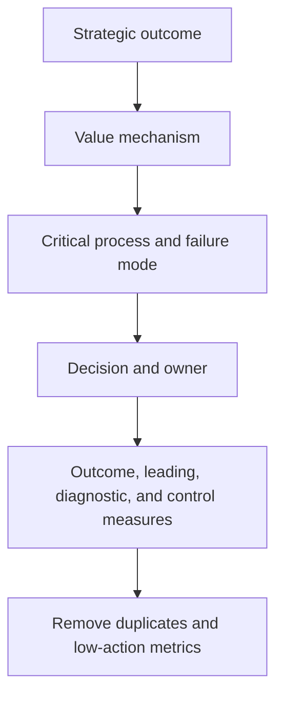

# 2. Strategy-to-Metric Selection

## Learning objectives

After this topic, you should be able to:

- derive measures from objectives and decision mechanisms;
- balance customer, flow, cost, asset, resilience, and sustainability outcomes;
- reduce metric overload; and
- select measures at the level where action occurs.

## Concept in plain English

Metric selection starts with the outcome the network is meant to create. It then identifies the operational mechanism, failure mode, and decision that can influence the outcome.

## Selection funnel

## Balanced dimensions

| Dimension | Representative question |
|---|---|
| Customer | Did the network keep the accepted promise? |
| Flow | How quickly and reliably did demand become delivery? |
| Cost and profit | What economic resources did the outcome consume or create? |
| Assets and cash | How much inventory, receivables, payables, and fixed capacity were used? |
| Resilience | Can the network absorb and recover from material change? |
| Sustainability and people | What environmental and social consequences accompany the outcome? |

## AsterWorks example

Objective: improve European service without excessive working capital.

The metric set includes:

- perfect-order rate and order cycle time;
- inventory days by product segment;
- expedite rate and delivered cost per order;
- critical-item alternate-source readiness;
- regional master-data defect rate; and
- shipment emissions intensity.

The set is compact because each measure represents a decision mechanism or important boundary.

## Metric removal test

Remove or redesign a metric when:

- no decision changes when it moves;
- another metric provides the same signal;
- the owner cannot influence it;
- data quality is below the required threshold;
- users cannot explain the definition; or
- the measure rewards behavior opposed to the objective.

## Common mistakes

- Copying an industry list without strategy context.
- Selecting only measures with easily available data.
- Using dozens of measures at executive level.
- Omitting risk and sustainability because they are harder to quantify.
- Measuring end-to-end performance only through functional averages.

## Original knowledge check

A metric is widely used in the industry but does not influence any AsterWorks decision. Must it appear on the executive scorecard?

Answer

**No.** External comparability may justify tracking it elsewhere, but executive attention should focus on measures connected to strategy and action.

## Related concepts

Continue to [dashboards, scorecards, and review cadence](03-dashboards-scorecards-and-cadence.md).
