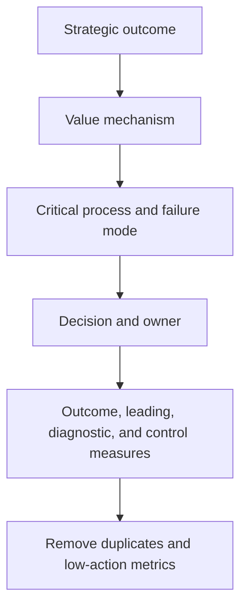

# 2. Strategy-to-Metric Selection

## Learning objectives

After this topic, you should be able to:

- derive measures from objectives and decision mechanisms;
- balance customer, flow, cost, asset, resilience, and sustainability outcomes;
- reduce metric overload; and
- select measures at the level where action occurs.

## Concept in plain English

Metric selection starts with the outcome the network is meant to create. It then identifies the operational mechanism, failure mode, and decision that can influence the outcome.

## Selection funnel

## Balanced dimensions

| Dimension | Representative question |
|---|---|
| Customer | Did the network keep the accepted promise? |
| Flow | How quickly and reliably did demand become delivery? |
| Cost and profit | What economic resources did the outcome consume or create? |
| Assets and cash | How much inventory, receivables, payables, and fixed capacity were used? |
| Resilience | Can the network absorb and recover from material change? |
| Sustainability and people | What environmental and social consequences accompany the outcome? |

## AsterWorks example

Objective: improve European service without excessive working capital.

The metric set includes:

- perfect-order rate and order cycle time;
- inventory days by product segment;
- expedite rate and delivered cost per order;
- critical-item alternate-source readiness;
- regional master-data defect rate; and
- shipment emissions intensity.

The set is compact because each measure represents a decision mechanism or important boundary.

## Metric removal test

Remove or redesign a metric when:

- no decision changes when it moves;
- another metric provides the same signal;
- the owner cannot influence it;
- data quality is below the required threshold;
- users cannot explain the definition; or
- the measure rewards behavior opposed to the objective.

## Why it matters

A metric portfolio loses value when it is inherited from available data rather than selected to test strategy and operating choices.

## Decision logic

Translate each strategic objective into an outcome, causal driver, risk, decision, measure, target, and action owner, then remove unused metrics. Do not approve the decision until mandatory conditions are feasible and the residual exposure has a named owner.

## Evidence retained through the workflow

Retain strategy-to-measure trace, causal hypothesis, definition, target basis, owner, decision cadence, balancing metric, and retirement rule. Record the decision date and the event or threshold that requires reassessment.

## Applied decision artifact

Use a one-page **strategy-to-metric selection decision record** with these fields:

- **Decision and boundary:** Translate each strategic objective into an outcome, causal driver, risk, decision, measure, target, and action owner, then remove unused metrics.
- **Required evidence:** strategy-to-measure trace, causal hypothesis, definition, target basis, owner, decision cadence, balancing metric, and retirement rule.
- **Expected result:** A metric portfolio loses value when it is inherited from available data rather than selected to test strategy and operating choices.
- **Balancing condition:** Strategic measures support alignment but may lag; operational drivers enable action but can encourage local optimization.
- **Accountability:** name the decision owner, approval date, residual exposure owner, and measurable trigger for reassessment.

The record is complete only when another practitioner can reproduce the reasoning and identify the next action without relying on meeting memory.

## Trade-offs

Strategic measures support alignment but may lag; operational drivers enable action but can encourage local optimization.

## Commonly confused with

Do not confuse a preferred decision method with a guaranteed outcome. Translate each strategic objective into an outcome, causal driver, risk, decision, measure, target, and action owner, then remove unused metrics. Validate the result with strategy-to-measure trace, causal hypothesis, definition, target basis, owner, decision cadence, balancing metric, and retirement rule; the evidence, not the method's label, determines whether the choice worked.

## Common mistakes

- Copying an industry list without strategy context.
- Selecting only measures with easily available data.
- Using dozens of measures at executive level.
- Omitting risk and sustainability because they are harder to quantify.
- Measuring end-to-end performance only through functional averages.

## Original knowledge check

A metric is widely used in the industry but does not influence any AsterWorks decision. Must it appear on the executive scorecard?

Answer and rationale

### Correct answer

**No.** External comparability may justify tracking it elsewhere, but executive attention should focus on measures connected to strategy and action.

### Why it is correct

A metric portfolio loses value when it is inherited from available data rather than selected to test strategy and operating choices. Translate each strategic objective into an outcome, causal driver, risk, decision, measure, target, and action owner, then remove unused metrics.

### Why the other answers are wrong

Alternative responses reproduce failure modes already discussed:

- Copying an industry list without strategy context.
- Selecting only measures with easily available data.
- Using dozens of measures at executive level.

They do not preserve the lesson's decision boundary or evidence. The governing trade-off remains explicit: Strategic measures support alignment but may lag; operational drivers enable action but can encourage local optimization.

## Practitioner perspective

Use strategy-to-measure trace, causal hypothesis, definition, target basis, owner, decision cadence, balancing metric, and retirement rule as the minimum review record. The artifact should let another practitioner reproduce the conclusion, identify the remaining exposure, and know which trigger reopens the decision.

## Related concepts

- [Section overview](./README.md)
- [Module 3 continuation](../../03-sourcing-strategy-product-design-supplier-execution/section-d-supplier-selection-contracting-and-procurement/02-supplier-criteria-and-scorecards.md)
Continue to [dashboards, scorecards, and review cadence](03-dashboards-scorecards-and-cadence.md).

---

[Previous: Measurement System Design](01-measurement-system-design.md) · [Next: Dashboards, Scorecards, and Review Cadence](03-dashboards-scorecards-and-cadence.md)
