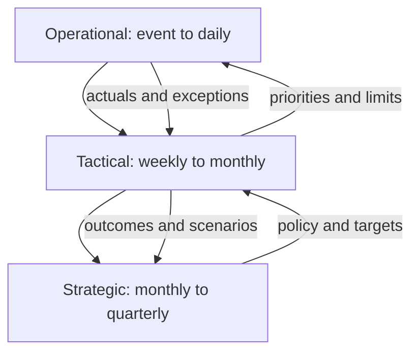

# 3. Dashboards, Scorecards, and Review Cadence

## Learning objectives

After this topic, you should be able to:

- distinguish monitoring dashboards from strategy scorecards;
- match refresh frequency to decision cadence;
- design threshold, trend, target, and drill-down views; and
- prevent visual overload and false urgency.

## Dashboard versus scorecard

| Tool | Primary use | Typical horizon | Main question |
|---|---|---|---|
| Dashboard | monitor current or recent operating state | minutes to weeks | What needs attention now? |
| Scorecard | review progress against strategic objectives | month to year | Are outcomes moving toward the plan? |

The same metric can appear in both, but its context differs. A live backlog alert supports action; a monthly backlog trend supports capacity and policy decisions.

## Review cadence

## Effective presentation

For each metric, show only what supports interpretation:

- current value and unit;
- target or acceptable range;
- direction and trend;
- comparison period;
- status based on documented logic;
- material driver or exception; and
- owner and next action.

Color should supplement meaning, not replace labels. A red measure without magnitude, cause, or ownership creates attention but not control.

## AsterWorks example

The operational dashboard refreshes shipment exceptions every fifteen minutes. The monthly network scorecard shows perfect orders, cycle time, expedites, inventory days, cost, data quality, and resilience readiness. Executives do not review every individual shipment; they review persistent causes and decisions requiring authority.

## Why it matters

A visually polished dashboard still fails when it does not distinguish status, diagnosis, decision, ownership, and timing.

## Decision logic

Match dashboard or scorecard content to the audience and cadence, highlight exceptions and trends, and connect every material signal to action. Do not approve the decision until mandatory conditions are feasible and the residual exposure has a named owner.

## Evidence retained through the workflow

Retain audience, decision and cadence, metric definitions, targets, trends, exception thresholds, drill path, owner, and action log. Record the decision date and the event or threshold that requires reassessment.

## Applied decision artifact

Use a one-page **dashboards, scorecards, and review cadence decision record** with these fields:

- **Decision and boundary:** Match dashboard or scorecard content to the audience and cadence, highlight exceptions and trends, and connect every material signal to action.
- **Required evidence:** audience, decision and cadence, metric definitions, targets, trends, exception thresholds, drill path, owner, and action log.
- **Expected result:** A visually polished dashboard still fails when it does not distinguish status, diagnosis, decision, ownership, and timing.
- **Balancing condition:** Frequent real-time views accelerate response but can create noise; slower scorecards support reflection but may miss urgent deterioration.
- **Accountability:** name the decision owner, approval date, residual exposure owner, and measurable trigger for reassessment.

The record is complete only when another practitioner can reproduce the reasoning and identify the next action without relying on meeting memory.

## Trade-offs

Frequent real-time views accelerate response but can create noise; slower scorecards support reflection but may miss urgent deterioration.

## Commonly confused with

Do not confuse a preferred decision method with a guaranteed outcome. Match dashboard or scorecard content to the audience and cadence, highlight exceptions and trends, and connect every material signal to action. Validate the result with audience, decision and cadence, metric definitions, targets, trends, exception thresholds, drill path, owner, and action log; the evidence, not the method's label, determines whether the choice worked.

## Common mistakes

- Refreshing strategic measures every minute because the tool can.
- Showing current value without target or trend.
- Using averages that hide high-priority segments.
- Displaying too many colors and gauges.
- Creating a dashboard without a review or escalation process.

## Original knowledge check

Should a quarterly facility-capacity decision use the same interface and refresh rate as live shipment recovery?

Answer and rationale

### Correct answer

Not necessarily. The decision horizons, information granularity, and urgency differ even if some underlying data overlap.

### Why it is correct

A visually polished dashboard still fails when it does not distinguish status, diagnosis, decision, ownership, and timing. Match dashboard or scorecard content to the audience and cadence, highlight exceptions and trends, and connect every material signal to action.

### Why the other answers are wrong

Alternative responses reproduce failure modes already discussed:

- Refreshing strategic measures every minute because the tool can.
- Showing current value without target or trend.
- Using averages that hide high-priority segments.

They do not preserve the lesson's decision boundary or evidence. The governing trade-off remains explicit: Frequent real-time views accelerate response but can create noise; slower scorecards support reflection but may miss urgent deterioration.

## Practitioner perspective

Use audience, decision and cadence, metric definitions, targets, trends, exception thresholds, drill path, owner, and action log as the minimum review record. The artifact should let another practitioner reproduce the conclusion, identify the remaining exposure, and know which trigger reopens the decision.

## Related concepts

- [Section overview](./README.md)
- [Module 3 continuation](../../03-sourcing-strategy-product-design-supplier-execution/section-d-supplier-selection-contracting-and-procurement/02-supplier-criteria-and-scorecards.md)
Continue to [metric hierarchies and process ownership](04-metric-hierarchies-and-process-ownership.md).

---

[Previous: Strategy-to-Metric Selection](02-strategy-to-metric-selection.md) · [Next: Metric Hierarchies and Process Ownership](04-metric-hierarchies-and-process-ownership.md)
