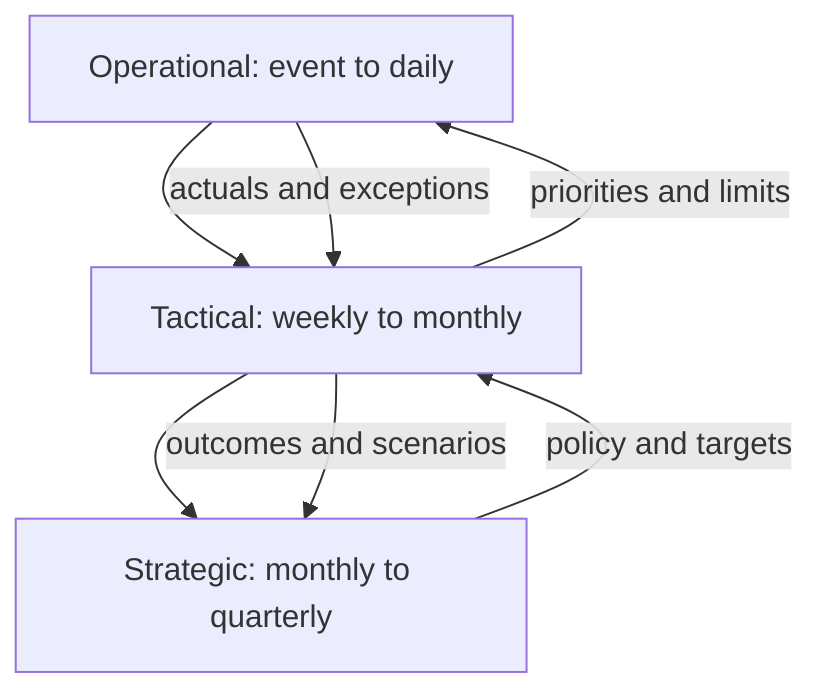

# 3. Dashboards, Scorecards, and Review Cadence

## Learning objectives

After this topic, you should be able to:

- distinguish monitoring dashboards from strategy scorecards;
- match refresh frequency to decision cadence;
- design threshold, trend, target, and drill-down views; and
- prevent visual overload and false urgency.

## Dashboard versus scorecard

| Tool | Primary use | Typical horizon | Main question |
|---|---|---|---|
| Dashboard | monitor current or recent operating state | minutes to weeks | What needs attention now? |
| Scorecard | review progress against strategic objectives | month to year | Are outcomes moving toward the plan? |

The same metric can appear in both, but its context differs. A live backlog alert supports action; a monthly backlog trend supports capacity and policy decisions.

## Review cadence

## Effective presentation

For each metric, show only what supports interpretation:

- current value and unit;
- target or acceptable range;
- direction and trend;
- comparison period;
- status based on documented logic;
- material driver or exception; and
- owner and next action.

Color should supplement meaning, not replace labels. A red measure without magnitude, cause, or ownership creates attention but not control.

## AsterWorks example

The operational dashboard refreshes shipment exceptions every fifteen minutes. The monthly network scorecard shows perfect orders, cycle time, expedites, inventory days, cost, data quality, and resilience readiness. Executives do not review every individual shipment; they review persistent causes and decisions requiring authority.

## Common mistakes

- Refreshing strategic measures every minute because the tool can.
- Showing current value without target or trend.
- Using averages that hide high-priority segments.
- Displaying too many colors and gauges.
- Creating a dashboard without a review or escalation process.

## Original knowledge check

Should a quarterly facility-capacity decision use the same interface and refresh rate as live shipment recovery?

Answer

Not necessarily. The decision horizons, information granularity, and urgency differ even if some underlying data overlap.

## Related concepts

Continue to [metric hierarchies and process ownership](04-metric-hierarchies-and-process-ownership.md).
