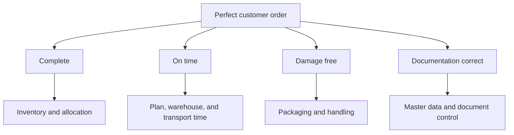

# 4. Metric Hierarchies and Process Ownership

## Learning objectives

After this topic, you should be able to:

- build a metric tree from outcome to operational drivers;
- distinguish decomposition from multiplication;
- assign end-to-end and contributing ownership; and
- prevent local measures from overriding network outcomes.

## Concept in plain English

A metric hierarchy connects an executive outcome to the operational drivers that explain and influence it. It allows leaders to see the result without placing every diagnostic measure on the executive scorecard.

## Example metric tree

The top measure is evaluated at order level: an order is perfect only when all required conditions are true. Multiplying aggregate component percentages may approximate a result under restrictive assumptions but can differ from the actual joint outcome.

## Ownership model

- **Outcome owner:** accountable for the end-to-end result and cross-functional improvement.
- **Driver owner:** accountable for a process or condition that affects the result.
- **Data owner:** accountable for definition and quality of a required data element.
- **Review owner:** ensures decisions, actions, and follow-up occur at the agreed cadence.

## AsterWorks example

Transportation owns carrier on-time delivery, but no single function owns perfect order. AsterWorks assigns an order-to-delivery process owner who coordinates planning, warehouse, transportation, quality, commercial, and data actions.

## Metric-tree rules

1. Start with one clearly defined outcome.
2. Identify mutually understandable drivers.
3. Preserve segment and time context.
4. Avoid double counting.
5. Link every driver to an owner and action.
6. Validate relationships using evidence rather than assumed causality.

## Common mistakes

- Placing hundreds of measures at one hierarchy level.
- Assuming every correlated metric causes the outcome.
- Assigning the top outcome to the function with the most data.
- Multiplying percentages without checking order-level joint performance.
- Changing a driver definition without updating the hierarchy.

## Original knowledge check

Four component rates are each 98%. Can AsterWorks conclude that exactly 92.2% of orders are perfect by multiplying them?

Answer

Not reliably. Component failures may occur on the same or different orders. Calculate the actual percentage of orders meeting all criteria when order-level data are available.

## Related concepts

Continue to [benchmarking and gap analysis](05-benchmarking-and-gap-analysis.md).
