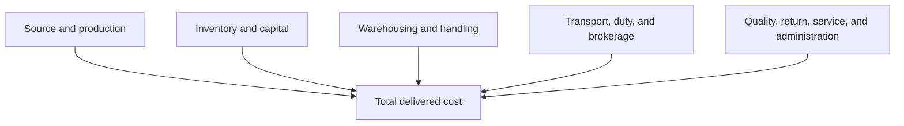

# 8. Cost, Profit, and Productivity

## Learning objectives

After this topic, you should be able to:

- distinguish spending, cost, cash flow, and profit;
- define total delivered cost and cost to serve;
- calculate productivity and operating margin; and
- avoid productivity gains that merely move work elsewhere.

## Core relationships

### Productivity

$$
\text{Productivity}=\frac{\text{useful output}}{\text{resources consumed}}
$$

If a team completes 480 correct order lines using 120 labor hours, labor productivity is 4 correct lines per hour.

### Operating margin

$$
\text{Operating margin}=\frac{\text{operating profit}}{\text{revenue}}\times100\%
$$

Definitions must align with the organization's financial policy.

## Total delivered cost

Cost to serve can be analyzed by product, customer, channel, region, or order pattern. Allocation should be transparent; an arbitrary average can make small frequent orders look more profitable than they are.

## AsterWorks example

AsterWorks’ European revenue grows 12%, but operating profit falls. Analysis identifies small urgent orders, low consolidation, premium freight, and repeated installation visits. Revenue and gross margin alone did not represent service economics.

The commercial team introduces order-frequency options and minimum delivery economics while protecting emergency-spare service.

## Productivity boundary

A local productivity improvement is credible when it does not merely:

- move labor to another function;
- increase defects or rework;
- create larger queues or inventory;
- fragment orders and increase transportation; or
- defer maintenance and risk future downtime.

Use correct, complete, or accepted output in the numerator when quality matters.

## Why it matters

Cost reduction and output growth do not create value when they reduce contribution, quality, service, or the effective use of constrained resources.

## Decision logic

Define the economic boundary, separate fixed and variable effects, connect productivity to accepted output, and test profit and service consequences. Do not approve the decision until mandatory conditions are feasible and the residual exposure has a named owner.

## Evidence retained through the workflow

Retain revenue and cost baseline, volume and mix, accepted output, resource input, constraint, margin effect, service balance, and owner. Record the decision date and the event or threshold that requires reassessment.

## Applied decision artifact

Use a one-page **cost, profit, and productivity decision record** with these fields:

- **Decision and boundary:** Define the economic boundary, separate fixed and variable effects, connect productivity to accepted output, and test profit and service consequences.
- **Required evidence:** revenue and cost baseline, volume and mix, accepted output, resource input, constraint, margin effect, service balance, and owner.
- **Expected result:** Cost reduction and output growth do not create value when they reduce contribution, quality, service, or the effective use of constrained resources.
- **Balancing condition:** Higher utilization can lower unit cost but increase queues, lead time, failure exposure, and inflexibility at constrained resources.
- **Accountability:** name the decision owner, approval date, residual exposure owner, and measurable trigger for reassessment.

The record is complete only when another practitioner can reproduce the reasoning and identify the next action without relying on meeting memory.

## Trade-offs

Higher utilization can lower unit cost but increase queues, lead time, failure exposure, and inflexibility at constrained resources.

## Commonly confused with

Do not confuse a preferred decision method with a guaranteed outcome. Define the economic boundary, separate fixed and variable effects, connect productivity to accepted output, and test profit and service consequences. Validate the result with revenue and cost baseline, volume and mix, accepted output, resource input, constraint, margin effect, service balance, and owner; the evidence, not the method's label, determines whether the choice worked.

## Common mistakes

- Treating capacity released as cash saved without a use plan.
- Allocating cost only by revenue.
- Increasing output while work-in-process and lead time worsen.
- Comparing margins with different cost inclusion.
- Calling purchase-price savings total supply-chain savings.

## Original knowledge check

Picking productivity rises 15%, but packing rework doubles. Has end-to-end productivity necessarily improved?

Answer and rationale

### Correct answer

No. Measure accepted output against total resources and downstream consequences, not one activity in isolation.

### Why it is correct

Cost reduction and output growth do not create value when they reduce contribution, quality, service, or the effective use of constrained resources. Define the economic boundary, separate fixed and variable effects, connect productivity to accepted output, and test profit and service consequences.

### Why the other answers are wrong

Alternative responses reproduce failure modes already discussed:

- Treating capacity released as cash saved without a use plan.
- Allocating cost only by revenue.
- Increasing output while work-in-process and lead time worsen.

They do not preserve the lesson's decision boundary or evidence. The governing trade-off remains explicit: Higher utilization can lower unit cost but increase queues, lead time, failure exposure, and inflexibility at constrained resources.

## Practitioner perspective

Use revenue and cost baseline, volume and mix, accepted output, resource input, constraint, margin effect, service balance, and owner as the minimum review record. The artifact should let another practitioner reproduce the conclusion, identify the remaining exposure, and know which trigger reopens the decision.

## Related concepts

- [Network and performance formula sheet](../../calculations/network-performance/formula-sheet.md)
- [Section overview](./README.md)
- [Module 3 continuation](../../03-sourcing-strategy-product-design-supplier-execution/section-d-supplier-selection-contracting-and-procurement/02-supplier-criteria-and-scorecards.md)
Continue to [cash-to-cash and working capital](09-cash-to-cash-and-working-capital.md).

---

[Previous: Speed, Reliability, and Agility Metrics](07-speed-reliability-and-agility-metrics.md) · [Next: Cash-to-Cash and Working Capital](09-cash-to-cash-and-working-capital.md)
