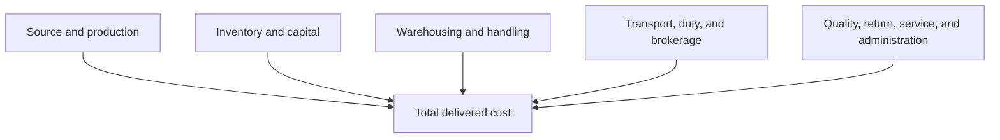

# 8. Cost, Profit, and Productivity

## Learning objectives

After this topic, you should be able to:

- distinguish spending, cost, cash flow, and profit;
- define total delivered cost and cost to serve;
- calculate productivity and operating margin; and
- avoid productivity gains that merely move work elsewhere.

## Core relationships

### Productivity

$$
\text{Productivity}=\frac{\text{useful output}}{\text{resources consumed}}
$$

If a team completes 480 correct order lines using 120 labor hours, labor productivity is 4 correct lines per hour.

### Operating margin

$$
\text{Operating margin}=\frac{\text{operating profit}}{\text{revenue}}\times100\%
$$

Definitions must align with the organization's financial policy.

## Total delivered cost

Cost to serve can be analyzed by product, customer, channel, region, or order pattern. Allocation should be transparent; an arbitrary average can make small frequent orders look more profitable than they are.

## AsterWorks example

AsterWorks’ European revenue grows 12%, but operating profit falls. Analysis identifies small urgent orders, low consolidation, premium freight, and repeated installation visits. Revenue and gross margin alone did not represent service economics.

The commercial team introduces order-frequency options and minimum delivery economics while protecting emergency-spare service.

## Productivity boundary

A local productivity improvement is credible when it does not merely:

- move labor to another function;
- increase defects or rework;
- create larger queues or inventory;
- fragment orders and increase transportation; or
- defer maintenance and risk future downtime.

Use correct, complete, or accepted output in the numerator when quality matters.

## Common mistakes

- Treating capacity released as cash saved without a use plan.
- Allocating cost only by revenue.
- Increasing output while work-in-process and lead time worsen.
- Comparing margins with different cost inclusion.
- Calling purchase-price savings total supply-chain savings.

## Original knowledge check

Picking productivity rises 15%, but packing rework doubles. Has end-to-end productivity necessarily improved?

Answer

No. Measure accepted output against total resources and downstream consequences, not one activity in isolation.

## Related concepts

Continue to [cash-to-cash and working capital](09-cash-to-cash-and-working-capital.md).
