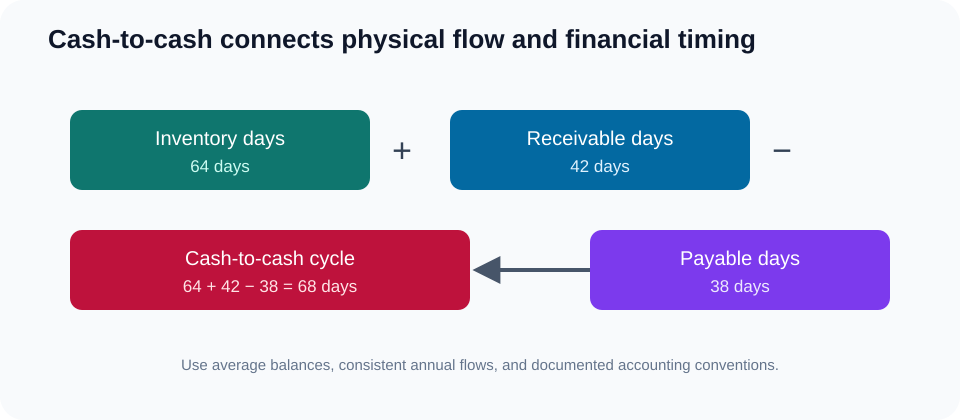

# 9. Cash-to-Cash and Working Capital

## Learning objectives

After this topic, you should be able to:

- explain inventory, receivables, and payables days;
- calculate cash-to-cash cycle time;
- connect operational changes to working capital; and
- avoid interpreting a lower number without understanding its cause.

## Core formula

$$
\text{Cash-to-cash days}=\text{inventory days}+\text{receivable days}-\text{payable days}
$$

Common approximations are:

$$
\text{Inventory days}=\frac{\text{average inventory}}{\text{annual cost of goods sold}}\times365
$$

$$
\text{Receivable days}=\frac{\text{average trade receivables}}{\text{annual credit revenue}}\times365
$$

$$
\text{Payable days}=\frac{\text{average trade payables}}{\text{annual purchases}}\times365
$$

When purchases are unavailable, some organizations use cost of goods sold as an approximation. State the convention and use it consistently.

## Worked example

From [`working-capital.csv`](../../assets/data/module-2/section-c/working-capital.csv), assume:

- inventory days = 64;
- receivable days = 42; and
- payable days = 38.

Then:

$$
64+42-38=68\text{ days}
$$

## Operating connection

## AsterWorks example

Regional stock shortens customer delivery but initially adds twelve inventory days. The design also improves invoicing accuracy and reduces receivable days by five. The working-capital effect must include both changes rather than treating inventory in isolation.

## Interpretation cautions

A lower cash-to-cash cycle may result from:

- better flow and inventory design;
- faster, more accurate invoicing and collection;
- extended supplier terms;
- delayed purchases or unpaid obligations; or
- business-mix changes.

The number improves financially only when the mechanism is sustainable and does not transfer unacceptable risk to suppliers or customers.

## Common mistakes

- Mixing end-of-period balance with average-balance formulas.
- Using revenue in inventory days when cost is required.
- Treating all inventory reduction as service-neutral.
- Extending supplier payment without assessing continuity and relationship impact.
- Comparing companies with inconsistent classifications.

## Original knowledge check

Inventory days are 50, receivable days 35, and payable days 40. What is cash-to-cash time?

Answer

`50 + 35 - 40 = 45 days`.

## Related concepts

Continue to [asset efficiency and inventory turnover](10-asset-efficiency-and-inventory-turnover.md).
