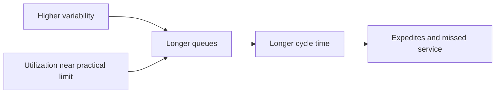

# 10. Asset Efficiency and Inventory Turnover

## Learning objectives

After this topic, you should be able to:

- calculate inventory turns and inventory days;
- interpret asset utilization with service and resilience;
- distinguish nominal from demonstrated capacity; and
- explain why maximizing utilization can reduce flow.

## Inventory turnover

$$
\text{Inventory turns}=\frac{\text{annual cost of goods sold}}{\text{average inventory at cost}}
$$

If annual cost of goods sold is $24 million and average inventory is $4 million:

$$
24/4=6\text{ turns per year}
$$

Approximate inventory days:

$$
365/6=60.8\text{ days}
$$

Use average inventory and a consistent cost basis.

## Asset view

| Measure | Decision use | Caution |
|---|---|---|
| Capacity utilization | load relative to available capacity | high values can create queues |
| Throughput per constraint hour | economic output at limiting resource | requires valid constraint identification |
| Fixed-asset turnover | revenue relative to average fixed assets | product mix affects comparison |
| Return on operating assets | operating profit relative to operating assets | define included assets and profit consistently |
| Space utilization | occupied usable capacity | density can harm access and flow |

## Utilization and waiting

## AsterWorks example

AsterWorks targets 95% average test-cell utilization. Product mix and rework are variable, so orders wait for access. Lowering planned utilization to create protective capacity can improve throughput reliability and reduce premium recovery cost.

## Inventory-turn diagnosis

Higher turns can result from better planning and flow, but also from stockouts or delayed purchasing. Pair turns with service, backlog, expedites, obsolescence, and supply reliability.

## Common mistakes

- Using year-end inventory instead of average inventory.
- Comparing turnover based on sales with turnover based on cost.
- Maximizing utilization at every resource.
- Treating all idle time as waste when some is protective capacity.
- Increasing turns by starving demand.

## Original knowledge check

Cost of goods sold is $18 million and average inventory is $3 million. What are turns and approximate days?

Answer

`18 / 3 = 6 turns`; `365 / 6 ≈ 60.8 days`.

## Related concepts

Continue to [sustainability and value-chain measures](11-sustainability-and-value-chain-measures.md).
