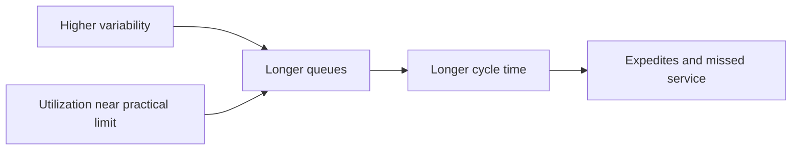

# 10. Asset Efficiency and Inventory Turnover

## Learning objectives

After this topic, you should be able to:

- calculate inventory turns and inventory days;
- interpret asset utilization with service and resilience;
- distinguish nominal from demonstrated capacity; and
- explain why maximizing utilization can reduce flow.

## Inventory turnover

$$
\text{Inventory turns}=\frac{\text{annual cost of goods sold}}{\text{average inventory at cost}}
$$

If annual cost of goods sold is $24 million and average inventory is $4 million:

$$
24/4=6\text{ turns per year}
$$

Approximate inventory days:

$$
365/6=60.8\text{ days}
$$

Use average inventory and a consistent cost basis.

## Asset view

| Measure | Decision use | Caution |
|---|---|---|
| Capacity utilization | load relative to available capacity | high values can create queues |
| Throughput per constraint hour | economic output at limiting resource | requires valid constraint identification |
| Fixed-asset turnover | revenue relative to average fixed assets | product mix affects comparison |
| Return on operating assets | operating profit relative to operating assets | define included assets and profit consistently |
| Space utilization | occupied usable capacity | density can harm access and flow |

## Utilization and waiting

## AsterWorks example

AsterWorks targets 95% average test-cell utilization. Product mix and rework are variable, so orders wait for access. Lowering planned utilization to create protective capacity can improve throughput reliability and reduce premium recovery cost.

## Inventory-turn diagnosis

Higher turns can result from better planning and flow, but also from stockouts or delayed purchasing. Pair turns with service, backlog, expedites, obsolescence, and supply reliability.

## Why it matters

High turnover can reflect efficient flow or insufficient stock, and low turnover can reflect waste or a deliberate service and resilience policy.

## Decision logic

Calculate turnover and days on a consistent cost basis, segment inventory, diagnose the operating cause, and balance asset use with service and risk. Do not approve the decision until mandatory conditions are feasible and the residual exposure has a named owner.

## Evidence retained through the workflow

Retain COGS, average inventory and other operating assets, valuation scope, segment, service and shortage data, cause, and action. Record the decision date and the event or threshold that requires reassessment.

## Applied decision artifact

Use a one-page **asset efficiency and inventory turnover decision record** with these fields:

- **Decision and boundary:** Calculate turnover and days on a consistent cost basis, segment inventory, diagnose the operating cause, and balance asset use with service and risk.
- **Required evidence:** COGS, average inventory and other operating assets, valuation scope, segment, service and shortage data, cause, and action.
- **Expected result:** High turnover can reflect efficient flow or insufficient stock, and low turnover can reflect waste or a deliberate service and resilience policy.
- **Balancing condition:** Reducing assets improves turnover and cash but can remove capacity, inventory, or recovery options needed for reliable service.
- **Accountability:** name the decision owner, approval date, residual exposure owner, and measurable trigger for reassessment.

The record is complete only when another practitioner can reproduce the reasoning and identify the next action without relying on meeting memory.

## Trade-offs

Reducing assets improves turnover and cash but can remove capacity, inventory, or recovery options needed for reliable service.

## Commonly confused with

Do not confuse a preferred decision method with a guaranteed outcome. Calculate turnover and days on a consistent cost basis, segment inventory, diagnose the operating cause, and balance asset use with service and risk. Validate the result with COGS, average inventory and other operating assets, valuation scope, segment, service and shortage data, cause, and action; the evidence, not the method's label, determines whether the choice worked.

## Common mistakes

- Using year-end inventory instead of average inventory.
- Comparing turnover based on sales with turnover based on cost.
- Maximizing utilization at every resource.
- Treating all idle time as waste when some is protective capacity.
- Increasing turns by starving demand.

## Original knowledge check

Cost of goods sold is $18 million and average inventory is $3 million. What are turns and approximate days?

Answer and rationale

### Correct answer

`18 / 3 = 6 turns`; `365 / 6 ≈ 60.8 days`.

### Why it is correct

High turnover can reflect efficient flow or insufficient stock, and low turnover can reflect waste or a deliberate service and resilience policy. Calculate turnover and days on a consistent cost basis, segment inventory, diagnose the operating cause, and balance asset use with service and risk.

### Why the other answers are wrong

Alternative responses reproduce failure modes already discussed:

- Using year-end inventory instead of average inventory.
- Comparing turnover based on sales with turnover based on cost.
- Maximizing utilization at every resource.

They do not preserve the lesson's decision boundary or evidence. The governing trade-off remains explicit: Reducing assets improves turnover and cash but can remove capacity, inventory, or recovery options needed for reliable service.

## Practitioner perspective

Use COGS, average inventory and other operating assets, valuation scope, segment, service and shortage data, cause, and action as the minimum review record. The artifact should let another practitioner reproduce the conclusion, identify the remaining exposure, and know which trigger reopens the decision.

## Related concepts

- [Network and performance formula sheet](../../calculations/network-performance/formula-sheet.md)
- [Section overview](./README.md)
- [Module 3 continuation](../../03-sourcing-strategy-product-design-supplier-execution/section-d-supplier-selection-contracting-and-procurement/02-supplier-criteria-and-scorecards.md)
Continue to [sustainability and value-chain measures](11-sustainability-and-value-chain-measures.md).

---

[Previous: Cash-to-Cash and Working Capital](09-cash-to-cash-and-working-capital.md) · [Next: Sustainability and Value-Chain Measures](11-sustainability-and-value-chain-measures.md)
