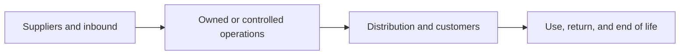

# 11. Sustainability and Value-Chain Measures

## Learning objectives

After this topic, you should be able to:

- distinguish absolute and intensity measures;
- define organizational, operational, and value-chain boundaries;
- connect environmental and social measures to supply-network decisions; and
- document estimation, quality, and comparison limits.

## Concept in plain English

Sustainability measurement evaluates environmental and social consequences alongside service and economics. A credible measure defines the boundary, unit, method, data quality, and decision it supports.

The [GHG Protocol Corporate Standard](https://ghgprotocol.org/corporate-standard) and [Corporate Value Chain Standard](https://ghgprotocol.org/corporate-value-chain-scope-3-standard) provide widely used structures for corporate and upstream/downstream greenhouse-gas accounting.

## Boundary logic

Document which activities are included, how shared operations are allocated, and where primary data are replaced by estimates.

## Measure types

| Type | Example | Use |
|---|---|---|
| Absolute | total tonnes of emissions | overall impact and target tracking |
| Intensity | emissions per delivered tonne-km | efficiency and normalized comparison |
| Circularity | percentage of returned modules recovered | material-loop effectiveness |
| Resource | water or energy per accepted unit | process efficiency |
| Social | recordable incidents or supplier corrective-action closure | people and partner outcomes |

Intensity can improve while total impact rises if volume grows. Report both when the decision needs both views.

## AsterWorks example

Ocean freight produces lower shipment emissions intensity than air freight but adds time. AsterWorks segments emergency spares from planned replenishment, improves forecasting, and moves routine volume to slower consolidated transport while preserving defined emergency service.

## Data-quality hierarchy

Prefer:

1. verified activity data tied to the actual movement or process;
2. supplier or carrier-specific factors with clear boundary;
3. recognized secondary factors matched to activity; and
4. transparent estimates when better data are unavailable.

Record method, factor version, unit conversion, allocation, and uncertainty.

## Common mistakes

- Comparing footprints with different boundaries.
- Reporting intensity without absolute impact.
- Treating estimated and measured data as equally certain.
- Optimizing one environmental measure while moving impact elsewhere.
- Selecting measures for reporting visibility rather than operational action.

## Original knowledge check

Shipment emissions per unit fall 10%, but volume rises 25%. Can total shipment emissions still increase?

Answer

**Yes.** Intensity and absolute impact answer different questions and should be evaluated together.

## Related concepts

Continue to [financial statements for supply-chain decisions](12-financial-statements-for-supply-chain.md).
