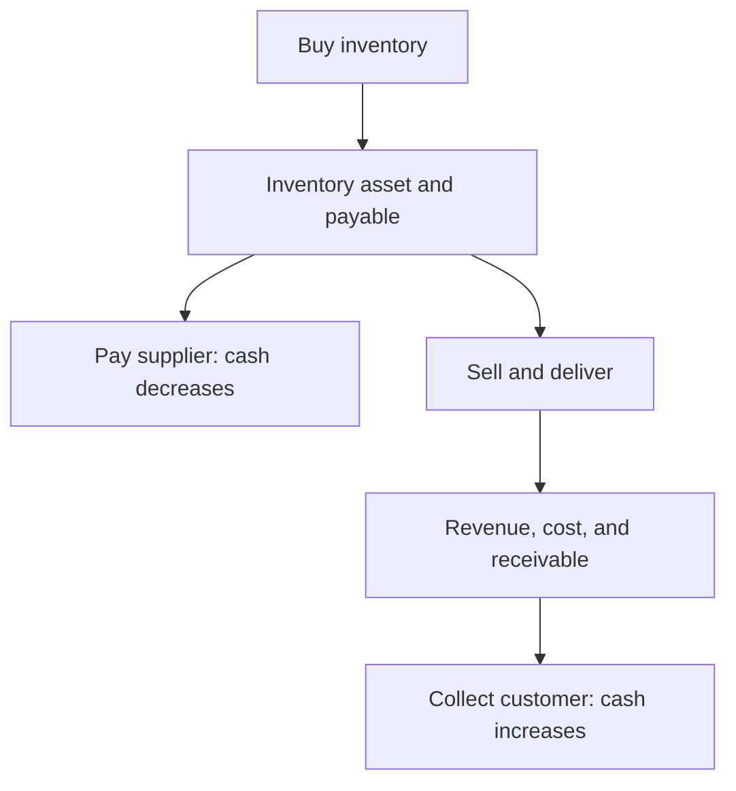

# 12. Financial Statements for Supply-Chain Decisions

## Learning objectives

After this topic, you should be able to:

- distinguish balance-sheet, income-statement, and cash-flow views;
- connect inventory, receivables, payables, assets, revenue, cost, and cash;
- explain why profit and cash are different; and
- trace an operational decision across multiple statements.

## Three views

| Statement | Time view | Supply-chain examples |
|---|---|---|
| Balance sheet | position at a point in time | inventory, receivables, payables, property and equipment |
| Income statement | performance over a period | revenue, cost of goods sold, freight, depreciation, operating profit |
| Cash-flow statement | cash movement over a period | collections, supplier payments, inventory investment, capital expenditure |

The [U.S. Securities and Exchange Commission's financial-statement guide](https://www.sec.gov/about/reports-publications/investorpubsbegfinstmtguide) explains these statements and the statement of shareholders' equity for public-company reporting.

## Connected effects

The exact timing and classification depend on accounting policy and transaction terms. Supply-chain analysis should use approved finance definitions.

## Profit versus cash

A sale can create revenue and a receivable before cash is collected. Purchasing inventory can consume cash before the inventory becomes expense through sale. Capital equipment uses cash when purchased but usually affects profit over time through depreciation.

## AsterWorks example

AsterWorks builds inventory for the regional launch. The balance sheet shows more inventory, the cash-flow statement shows cash used in operations, and the income statement may not recognize the inventory as cost until related products are sold. Saying “inventory has not affected profit yet” does not mean it has no cash consequence.

## Decision mapping

For a proposed network change, ask:

- Which one-time and recurring costs affect profit?
- Which inventory, receivable, payable, or asset balances change?
- When does cash move?
- Which benefits create actual cash versus capacity?
- Which accounting policy determines classification and timing?

## Common mistakes

- Treating profit and cash as interchangeable.
- Assuming inventory is immediately an income-statement expense.
- Ignoring depreciation when comparing capital and service options.
- Using financial statement values without average balances where required.
- Building operational business cases without finance agreement on definitions.

## Original knowledge check

AsterWorks sells on credit today and collects in 45 days. Can revenue and cash be recognized at different times?

Answer

**Yes.** The sale may create revenue and a receivable before cash collection, subject to applicable accounting policy.

## Related concepts

Continue to [standard costing and variance analysis](13-standard-costing-and-variance-analysis.md).
