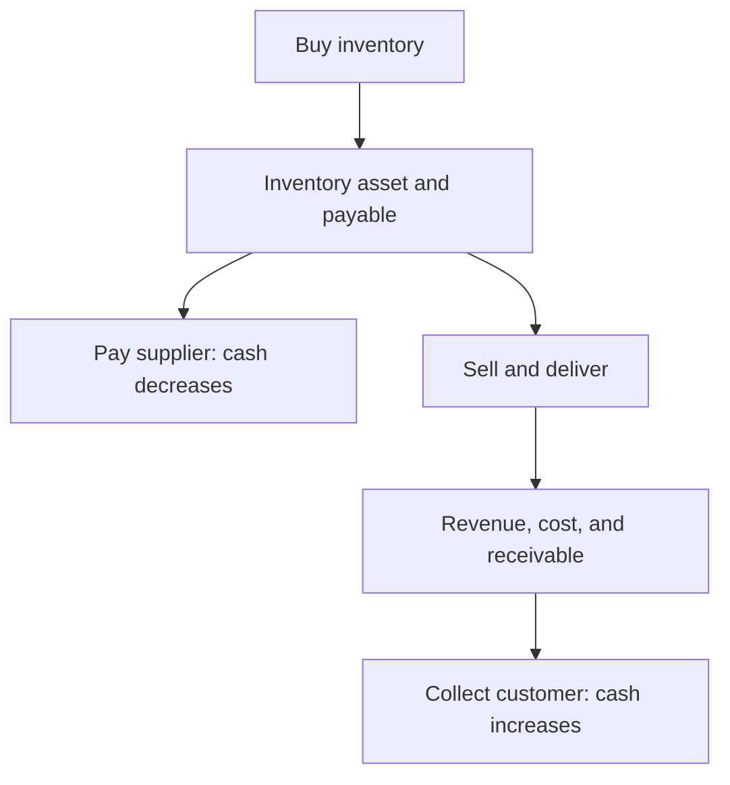

# 12. Financial Statements for Supply-Chain Decisions

## Learning objectives

After this topic, you should be able to:

- distinguish balance-sheet, income-statement, and cash-flow views;
- connect inventory, receivables, payables, assets, revenue, cost, and cash;
- explain why profit and cash are different; and
- trace an operational decision across multiple statements.

## Three views

| Statement | Time view | Supply-chain examples |
|---|---|---|
| Balance sheet | position at a point in time | inventory, receivables, payables, property and equipment |
| Income statement | performance over a period | revenue, cost of goods sold, freight, depreciation, operating profit |
| Cash-flow statement | cash movement over a period | collections, supplier payments, inventory investment, capital expenditure |

The [U.S. Securities and Exchange Commission's financial-statement guide](https://www.sec.gov/about/reports-publications/investorpubsbegfinstmtguide) explains these statements and the statement of shareholders' equity for public-company reporting.

## Connected effects

The exact timing and classification depend on accounting policy and transaction terms. Supply-chain analysis should use approved finance definitions.

## Profit versus cash

A sale can create revenue and a receivable before cash is collected. Purchasing inventory can consume cash before the inventory becomes expense through sale. Capital equipment uses cash when purchased but usually affects profit over time through depreciation.

## AsterWorks example

AsterWorks builds inventory for the regional launch. The balance sheet shows more inventory, the cash-flow statement shows cash used in operations, and the income statement may not recognize the inventory as cost until related products are sold. Saying “inventory has not affected profit yet” does not mean it has no cash consequence.

## Decision mapping

For a proposed network change, ask:

- Which one-time and recurring costs affect profit?
- Which inventory, receivable, payable, or asset balances change?
- When does cash move?
- Which benefits create actual cash versus capacity?
- Which accounting policy determines classification and timing?

## Why it matters

Supply-chain decisions affect profit, cash, and assets differently, so one favorable statement can conceal an adverse effect elsewhere.

## Decision logic

Map each operational mechanism to the income statement, balance sheet, and cash flow, separate recurring from one-time effects, and prevent double counting. Do not approve the decision until mandatory conditions are feasible and the residual exposure has a named owner.

## Evidence retained through the workflow

Retain baseline statements, operational driver, timing, recurring and one-time classification, accounting assumption, owner, and reconciliation. Record the decision date and the event or threshold that requires reassessment.

## Applied decision artifact

Use a one-page **financial statements for supply-chain decisions decision record** with these fields:

- **Decision and boundary:** Map each operational mechanism to the income statement, balance sheet, and cash flow, separate recurring from one-time effects, and prevent double counting.
- **Required evidence:** baseline statements, operational driver, timing, recurring and one-time classification, accounting assumption, owner, and reconciliation.
- **Expected result:** Supply-chain decisions affect profit, cash, and assets differently, so one favorable statement can conceal an adverse effect elsewhere.
- **Balancing condition:** Inventory reduction releases cash and assets but may not create equivalent recurring profit; capacity investment can protect service while depressing near-term cash.
- **Accountability:** name the decision owner, approval date, residual exposure owner, and measurable trigger for reassessment.

The record is complete only when another practitioner can reproduce the reasoning and identify the next action without relying on meeting memory.

## Trade-offs

Inventory reduction releases cash and assets but may not create equivalent recurring profit; capacity investment can protect service while depressing near-term cash.

## Commonly confused with

Do not confuse a preferred decision method with a guaranteed outcome. Map each operational mechanism to the income statement, balance sheet, and cash flow, separate recurring from one-time effects, and prevent double counting. Validate the result with baseline statements, operational driver, timing, recurring and one-time classification, accounting assumption, owner, and reconciliation; the evidence, not the method's label, determines whether the choice worked.

## Common mistakes

- Treating profit and cash as interchangeable.
- Assuming inventory is immediately an income-statement expense.
- Ignoring depreciation when comparing capital and service options.
- Using financial statement values without average balances where required.
- Building operational business cases without finance agreement on definitions.

## Original knowledge check

AsterWorks sells on credit today and collects in 45 days. Can revenue and cash be recognized at different times?

Answer and rationale

### Correct answer

**Yes.** The sale may create revenue and a receivable before cash collection, subject to applicable accounting policy.

### Why it is correct

Supply-chain decisions affect profit, cash, and assets differently, so one favorable statement can conceal an adverse effect elsewhere. Map each operational mechanism to the income statement, balance sheet, and cash flow, separate recurring from one-time effects, and prevent double counting.

### Why the other answers are wrong

Alternative responses reproduce failure modes already discussed:

- Treating profit and cash as interchangeable.
- Assuming inventory is immediately an income-statement expense.
- Ignoring depreciation when comparing capital and service options.

They do not preserve the lesson's decision boundary or evidence. The governing trade-off remains explicit: Inventory reduction releases cash and assets but may not create equivalent recurring profit; capacity investment can protect service while depressing near-term cash.

## Practitioner perspective

Use baseline statements, operational driver, timing, recurring and one-time classification, accounting assumption, owner, and reconciliation as the minimum review record. The artifact should let another practitioner reproduce the conclusion, identify the remaining exposure, and know which trigger reopens the decision.

## Related concepts

- [Section overview](./README.md)
- [Module 3 continuation](../../03-sourcing-strategy-product-design-supplier-execution/section-d-supplier-selection-contracting-and-procurement/02-supplier-criteria-and-scorecards.md)
Continue to [standard costing and variance analysis](13-standard-costing-and-variance-analysis.md).

---

[Previous: Sustainability and Value-Chain Measures](11-sustainability-and-value-chain-measures.md) · [Next: Standard Costing and Variance Analysis](13-standard-costing-and-variance-analysis.md)
