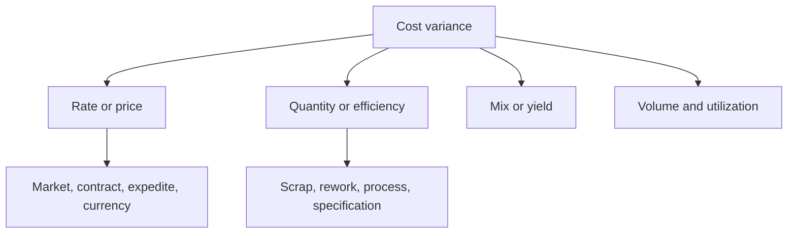

# 13. Standard Costing and Variance Analysis

## Learning objectives

After this topic, you should be able to:

- explain the purpose and limits of standard cost;
- calculate simple price and usage variances;
- separate rate, quantity, mix, and volume effects; and
- use variance as a diagnostic signal rather than automatic blame.

## Concept in plain English

A standard cost is a predetermined expected cost for a defined product, service, or activity under stated assumptions. Actual results are compared with the standard to identify differences for analysis.

## Material variances

Using the sign convention that a positive result is unfavorable:

$$
\text{Price variance}=(\text{actual price}-\text{standard price})\times\text{actual quantity}
$$

$$
\text{Usage variance}=(\text{actual quantity}-\text{standard quantity allowed})\times\text{standard price}
$$

## Worked example

AsterWorks produces 100 units. Standard material is 2.0 kg per unit at $8.00/kg. Actual usage is 215 kg at $8.40/kg.

Price variance:

$$
(8.40-8.00)\times215=\$86\text{ unfavorable}
$$

Standard quantity allowed is `100 × 2.0 = 200 kg`.

Usage variance:

$$
(215-200)\times8.00=\$120\text{ unfavorable}
$$

Total material variance is $206 unfavorable, which also equals actual cost $1,806 minus allowed standard cost $1,600.

## Diagnostic tree

## AsterWorks example

Procurement appears to have an unfavorable price variance because it used a premium regional source during a disruption. The decision avoided a production shutdown. Variance correctly identifies higher price, but business evaluation must include avoided loss and approved resilience policy.

## Common mistakes

- Mixing sign conventions without labels.
- Using outdated standards that guarantee recurring variance.
- Treating every unfavorable variance as poor performance.
- Assigning usage variance only to production without checking material quality or design.
- Ignoring volume and mix when comparing periods.

## Original knowledge check

Actual price is $5.20, standard price $5.00, and actual quantity 1,000 units. Using the stated sign convention, what is price variance?

Answer

`($5.20-$5.00) × 1,000 = $200 unfavorable`.

## Related concepts

Continue to [supplier financial health and customer credit risk](14-supplier-financial-health-and-credit-risk.md).
