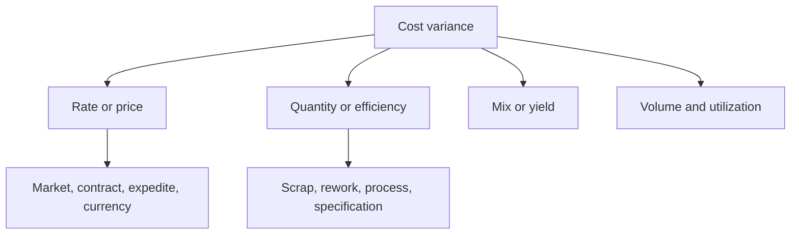

# 13. Standard Costing and Variance Analysis

## Learning objectives

After this topic, you should be able to:

- explain the purpose and limits of standard cost;
- calculate simple price and usage variances;
- separate rate, quantity, mix, and volume effects; and
- use variance as a diagnostic signal rather than automatic blame.

## Concept in plain English

A standard cost is a predetermined expected cost for a defined product, service, or activity under stated assumptions. Actual results are compared with the standard to identify differences for analysis.

## Material variances

Using the sign convention that a positive result is unfavorable:

$$
\text{Price variance}=(\text{actual price}-\text{standard price})\times\text{actual quantity}
$$

$$
\text{Usage variance}=(\text{actual quantity}-\text{standard quantity allowed})\times\text{standard price}
$$

## Worked example

AsterWorks produces 100 units. Standard material is 2.0 kg per unit at $8.00/kg. Actual usage is 215 kg at $8.40/kg.

Price variance:

$$
(8.40-8.00)\times215=\$86\text{ unfavorable}
$$

Standard quantity allowed is `100 × 2.0 = 200 kg`.

Usage variance:

$$
(215-200)\times8.00=\$120\text{ unfavorable}
$$

Total material variance is $206 unfavorable, which also equals actual cost $1,806 minus allowed standard cost $1,600.

## Diagnostic tree

## AsterWorks example

Procurement appears to have an unfavorable price variance because it used a premium regional source during a disruption. The decision avoided a production shutdown. Variance correctly identifies higher price, but business evaluation must include avoided loss and approved resilience policy.

## Why it matters

A variance names a difference but does not identify the operational cause, controllability, or best response.

## Decision logic

Calculate price, quantity, rate, and efficiency effects using the approved standard, then trace material differences to process evidence and ownership. Do not approve the decision until mandatory conditions are feasible and the residual exposure has a named owner.

## Evidence retained through the workflow

Retain standard version and basis, actual price and quantity, allowed quantity, volume and mix, variance calculation, cause, owner, and corrective action. Record the decision date and the event or threshold that requires reassessment.

## Applied decision artifact

Use a one-page **standard costing and variance analysis decision record** with these fields:

- **Decision and boundary:** Calculate price, quantity, rate, and efficiency effects using the approved standard, then trace material differences to process evidence and ownership.
- **Required evidence:** standard version and basis, actual price and quantity, allowed quantity, volume and mix, variance calculation, cause, owner, and corrective action.
- **Expected result:** A variance names a difference but does not identify the operational cause, controllability, or best response.
- **Balancing condition:** Stable standards support accountability, while outdated standards create large but uninformative variances and poor decisions.
- **Accountability:** name the decision owner, approval date, residual exposure owner, and measurable trigger for reassessment.

The record is complete only when another practitioner can reproduce the reasoning and identify the next action without relying on meeting memory.

## Trade-offs

Stable standards support accountability, while outdated standards create large but uninformative variances and poor decisions.

## Commonly confused with

Do not confuse a preferred decision method with a guaranteed outcome. Calculate price, quantity, rate, and efficiency effects using the approved standard, then trace material differences to process evidence and ownership. Validate the result with standard version and basis, actual price and quantity, allowed quantity, volume and mix, variance calculation, cause, owner, and corrective action; the evidence, not the method's label, determines whether the choice worked.

## Common mistakes

- Mixing sign conventions without labels.
- Using outdated standards that guarantee recurring variance.
- Treating every unfavorable variance as poor performance.
- Assigning usage variance only to production without checking material quality or design.
- Ignoring volume and mix when comparing periods.

## Original knowledge check

Actual price is $5.20, standard price $5.00, and actual quantity 1,000 units. Using the stated sign convention, what is price variance?

Answer and rationale

### Correct answer

`($5.20-$5.00) × 1,000 = $200 unfavorable`.

### Why it is correct

A variance names a difference but does not identify the operational cause, controllability, or best response. Calculate price, quantity, rate, and efficiency effects using the approved standard, then trace material differences to process evidence and ownership.

### Why the other answers are wrong

Alternative responses reproduce failure modes already discussed:

- Mixing sign conventions without labels.
- Using outdated standards that guarantee recurring variance.
- Treating every unfavorable variance as poor performance.

They do not preserve the lesson's decision boundary or evidence. The governing trade-off remains explicit: Stable standards support accountability, while outdated standards create large but uninformative variances and poor decisions.

## Practitioner perspective

Use standard version and basis, actual price and quantity, allowed quantity, volume and mix, variance calculation, cause, owner, and corrective action as the minimum review record. The artifact should let another practitioner reproduce the conclusion, identify the remaining exposure, and know which trigger reopens the decision.

## Related concepts

- [Network and performance formula sheet](../../calculations/network-performance/formula-sheet.md)
- [Section overview](./README.md)
- [Module 3 continuation](../../03-sourcing-strategy-product-design-supplier-execution/section-d-supplier-selection-contracting-and-procurement/02-supplier-criteria-and-scorecards.md)
Continue to [supplier financial health and customer credit risk](14-supplier-financial-health-and-credit-risk.md).

---

[Previous: Financial Statements for Supply-Chain Decisions](12-financial-statements-for-supply-chain.md) · [Next: Supplier Financial Health and Customer Credit Risk](14-supplier-financial-health-and-credit-risk.md)
