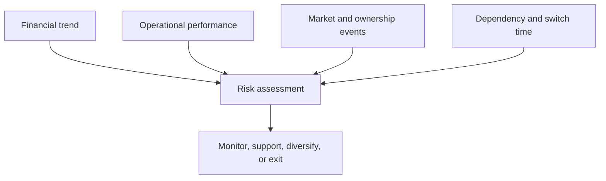

# 14. Supplier Financial Health and Customer Credit Risk

## Learning objectives

After this topic, you should be able to:

- calculate basic liquidity, leverage, and coverage ratios;
- interpret ratios as signals rather than conclusions;
- combine financial and operational evidence; and
- apply risk-tiered monitoring and escalation.

## Important caution

Financial assessment supports—not replaces—qualified finance, legal, procurement, and credit judgment. Ratios vary by industry, accounting policy, season, and business model.

## Basic ratios

### Current ratio

$$
\text{Current ratio}=\frac{\text{current assets}}{\text{current liabilities}}
$$

### Quick ratio

$$
\text{Quick ratio}=\frac{\text{cash}+\text{marketable securities}+\text{receivables}}{\text{current liabilities}}
$$

### Debt-to-equity

$$
\text{Debt-to-equity}=\frac{\text{interest-bearing debt}}{\text{shareholders' equity}}
$$

### Interest coverage

$$
\text{Interest coverage}=\frac{\text{earnings before interest and taxes}}{\text{interest expense}}
$$

Use [`supplier-health.csv`](../../assets/data/module-2/section-c/supplier-health.csv) for an illustrative comparison.

## Evidence model

## AsterWorks example

A small critical supplier has adequate current assets but falling cash, rising debt, extended lead times, and requests accelerated payment. No single signal proves failure. Together they justify a structured conversation, capacity validation, payment-control review, and qualified contingency.

Customer credit risk should also be connected to order promise, exposure, payment terms, collateral, and collection. Commercial growth that creates uncollectible receivables is not healthy network performance.

## Monitoring design

- risk-tier by dependency and consequence;
- compare trends, not only one period;
- normalize definitions and one-time events;
- combine external and operational signals;
- document thresholds and decision rights;
- avoid actions that unnecessarily worsen supplier distress; and
- maintain lawful, ethical information use.

## Why it matters

A financially weak supplier or customer can interrupt material, service, investment, collection, and the viability of the network design.

## Decision logic

Combine ratios, trends, payment behavior, dependency, qualitative evidence, and scenario exposure, then define proportionate monitoring and mitigation. Do not approve the decision until mandatory conditions are feasible and the residual exposure has a named owner.

## Evidence retained through the workflow

Retain financial statements and period, ratio definitions, trend, payment evidence, dependency, scenario exposure, mitigation, owner, and trigger. Record the decision date and the event or threshold that requires reassessment.

## Applied decision artifact

Use a one-page **supplier financial health and customer credit risk decision record** with these fields:

- **Decision and boundary:** Combine ratios, trends, payment behavior, dependency, qualitative evidence, and scenario exposure, then define proportionate monitoring and mitigation.
- **Required evidence:** financial statements and period, ratio definitions, trend, payment evidence, dependency, scenario exposure, mitigation, owner, and trigger.
- **Expected result:** A financially weak supplier or customer can interrupt material, service, investment, collection, and the viability of the network design.
- **Balancing condition:** Tighter credit or sourcing controls reduce loss exposure but can constrain sales, supply options, or a partner's recovery.
- **Accountability:** name the decision owner, approval date, residual exposure owner, and measurable trigger for reassessment.

The record is complete only when another practitioner can reproduce the reasoning and identify the next action without relying on meeting memory.

## Trade-offs

Tighter credit or sourcing controls reduce loss exposure but can constrain sales, supply options, or a partner's recovery.

## Commonly confused with

Do not confuse a preferred decision method with a guaranteed outcome. Combine ratios, trends, payment behavior, dependency, qualitative evidence, and scenario exposure, then define proportionate monitoring and mitigation. Validate the result with financial statements and period, ratio definitions, trend, payment evidence, dependency, scenario exposure, mitigation, owner, and trigger; the evidence, not the method's label, determines whether the choice worked.

## Common mistakes

- Applying one ratio threshold to every industry.
- Treating a model score as certain failure.
- Monitoring direct supplier finance while ignoring critical sub-tiers.
- Extending customer credit without total exposure visibility.
- Responding to supplier distress only by delaying payment.

## Original knowledge check

A supplier's current ratio improves because obsolete inventory rises. Has liquidity necessarily improved?

Answer and rationale

### Correct answer

No. Ratio composition and asset quality matter; obsolete inventory may not convert to cash when needed.

### Why it is correct

A financially weak supplier or customer can interrupt material, service, investment, collection, and the viability of the network design. Combine ratios, trends, payment behavior, dependency, qualitative evidence, and scenario exposure, then define proportionate monitoring and mitigation.

### Why the other answers are wrong

Alternative responses reproduce failure modes already discussed:

- Applying one ratio threshold to every industry.
- Treating a model score as certain failure.
- Monitoring direct supplier finance while ignoring critical sub-tiers.

They do not preserve the lesson's decision boundary or evidence. The governing trade-off remains explicit: Tighter credit or sourcing controls reduce loss exposure but can constrain sales, supply options, or a partner's recovery.

## Practitioner perspective

Use financial statements and period, ratio definitions, trend, payment evidence, dependency, scenario exposure, mitigation, owner, and trigger as the minimum review record. The artifact should let another practitioner reproduce the conclusion, identify the remaining exposure, and know which trigger reopens the decision.

## Related concepts

- [Network and performance formula sheet](../../calculations/network-performance/formula-sheet.md)
- [Section overview](./README.md)
- [Module 3 continuation](../../03-sourcing-strategy-product-design-supplier-execution/section-d-supplier-selection-contracting-and-procurement/02-supplier-criteria-and-scorecards.md)
Continue to [strategic profit model and return on assets](15-strategic-profit-model-and-roa.md).

---

[Previous: Standard Costing and Variance Analysis](13-standard-costing-and-variance-analysis.md) · [Next: Strategic Profit Model and Return on Assets](15-strategic-profit-model-and-roa.md)
