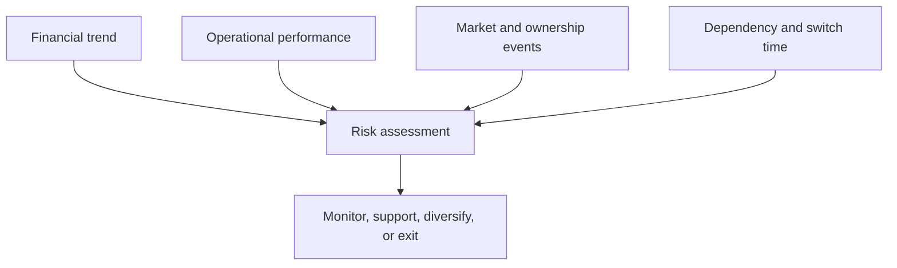

# 14. Supplier Financial Health and Customer Credit Risk

## Learning objectives

After this topic, you should be able to:

- calculate basic liquidity, leverage, and coverage ratios;
- interpret ratios as signals rather than conclusions;
- combine financial and operational evidence; and
- apply risk-tiered monitoring and escalation.

## Important caution

Financial assessment supports—not replaces—qualified finance, legal, procurement, and credit judgment. Ratios vary by industry, accounting policy, season, and business model.

## Basic ratios

### Current ratio

$$
\text{Current ratio}=\frac{\text{current assets}}{\text{current liabilities}}
$$

### Quick ratio

$$
\text{Quick ratio}=\frac{\text{cash}+\text{marketable securities}+\text{receivables}}{\text{current liabilities}}
$$

### Debt-to-equity

$$
\text{Debt-to-equity}=\frac{\text{interest-bearing debt}}{\text{shareholders' equity}}
$$

### Interest coverage

$$
\text{Interest coverage}=\frac{\text{earnings before interest and taxes}}{\text{interest expense}}
$$

Use [`supplier-health.csv`](../../assets/data/module-2/section-c/supplier-health.csv) for an illustrative comparison.

## Evidence model

## AsterWorks example

A small critical supplier has adequate current assets but falling cash, rising debt, extended lead times, and requests accelerated payment. No single signal proves failure. Together they justify a structured conversation, capacity validation, payment-control review, and qualified contingency.

Customer credit risk should also be connected to order promise, exposure, payment terms, collateral, and collection. Commercial growth that creates uncollectible receivables is not healthy network performance.

## Monitoring design

- risk-tier by dependency and consequence;
- compare trends, not only one period;
- normalize definitions and one-time events;
- combine external and operational signals;
- document thresholds and decision rights;
- avoid actions that unnecessarily worsen supplier distress; and
- maintain lawful, ethical information use.

## Common mistakes

- Applying one ratio threshold to every industry.
- Treating a model score as certain failure.
- Monitoring direct supplier finance while ignoring critical sub-tiers.
- Extending customer credit without total exposure visibility.
- Responding to supplier distress only by delaying payment.

## Original knowledge check

A supplier's current ratio improves because obsolete inventory rises. Has liquidity necessarily improved?

Answer

No. Ratio composition and asset quality matter; obsolete inventory may not convert to cash when needed.

## Related concepts

Continue to [strategic profit model and return on assets](15-strategic-profit-model-and-roa.md).
