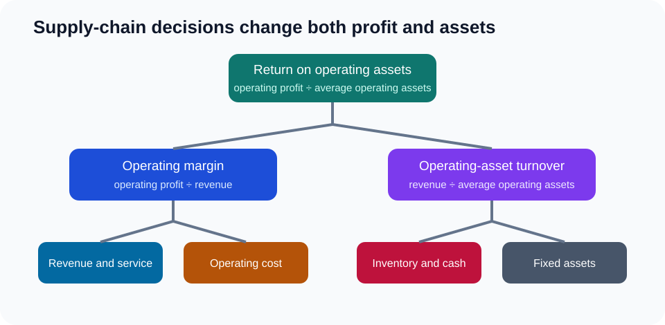
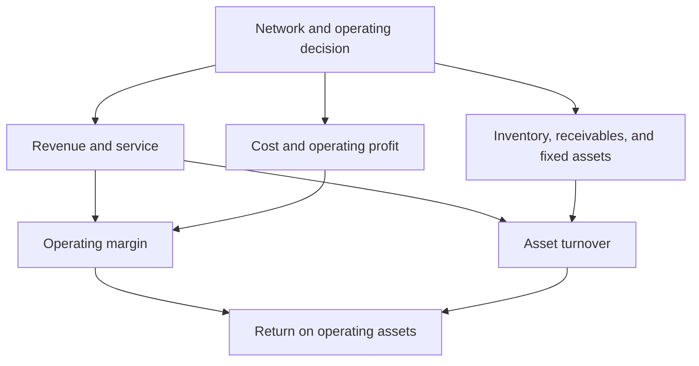

# 15. Strategic Profit Model and Return on Assets

## Learning objectives

After this topic, you should be able to:

- decompose return on operating assets into margin and turnover;
- trace supply-chain levers to profit and assets;
- calculate a worked example; and
- avoid double counting business-case effects.

## Core relationship

For an internally defined operating view:

$$
\text{Return on operating assets}=\frac{\text{operating profit}}{\text{average operating assets}}
$$

It can be decomposed as:

$$
\frac{\text{operating profit}}{\text{revenue}}\times\frac{\text{revenue}}{\text{average operating assets}}
$$

or:

$$
\text{operating margin}\times\text{operating-asset turnover}
$$

## Worked example

Assume AsterWorks has:

- revenue: $60 million;
- operating profit: $6 million; and
- average operating assets: $30 million.

Operating margin is `6 / 60 = 10%`.

Asset turnover is `60 / 30 = 2.0`.

Return on operating assets is `10% × 2.0 = 20%`, matching `6 / 30 = 20%`.

## Supply-chain levers

Examples:

- better availability may protect revenue;
- fewer expedites may reduce operating cost;
- lower inventory may reduce operating assets;
- a new facility may add fixed assets but improve revenue and service;
- faster billing and collection may reduce receivables.

## AsterWorks example

The postponement center adds $2 million of operating assets but is expected to protect margin and reduce inventory duplication compared with a full regional plant. The decision should model both numerator and denominator over time, including transition cost and ramp-up.

## Double-counting check

Do not count the same mechanism twice—for example, recording reduced inventory as both a recurring profit benefit and a full annual cash benefit. Inventory release is generally a one-time working-capital effect; carrying-cost reduction may be recurring.

## Why it matters

Supply-chain actions influence return through both operating margin and asset turnover, and counting the same benefit twice overstates value.

## Decision logic

Map each initiative to revenue, operating cost, inventory, receivables, and fixed assets, calculate ROA, and reconcile one-time and recurring effects. Do not approve the decision until mandatory conditions are feasible and the residual exposure has a named owner.

## Evidence retained through the workflow

Retain baseline revenue, profit and operating assets, initiative mechanisms, timing, one-time and recurring effects, sensitivity, and finance approval. Record the decision date and the event or threshold that requires reassessment.

## Applied decision artifact

Use a one-page **strategic profit model and return on assets decision record** with these fields:

- **Decision and boundary:** Map each initiative to revenue, operating cost, inventory, receivables, and fixed assets, calculate ROA, and reconcile one-time and recurring effects.
- **Required evidence:** baseline revenue, profit and operating assets, initiative mechanisms, timing, one-time and recurring effects, sensitivity, and finance approval.
- **Expected result:** Supply-chain actions influence return through both operating margin and asset turnover, and counting the same benefit twice overstates value.
- **Balancing condition:** Asset reduction improves turnover but may weaken service or resilience; added assets can protect growth while lowering near-term return.
- **Accountability:** name the decision owner, approval date, residual exposure owner, and measurable trigger for reassessment.

The record is complete only when another practitioner can reproduce the reasoning and identify the next action without relying on meeting memory.

## Trade-offs

Asset reduction improves turnover but may weaken service or resilience; added assets can protect growth while lowering near-term return.

## Commonly confused with

Do not confuse a preferred decision method with a guaranteed outcome. Map each initiative to revenue, operating cost, inventory, receivables, and fixed assets, calculate ROA, and reconcile one-time and recurring effects. Validate the result with baseline revenue, profit and operating assets, initiative mechanisms, timing, one-time and recurring effects, sensitivity, and finance approval; the evidence, not the method's label, determines whether the choice worked.

## Common mistakes

- Mixing profit and asset definitions from different scopes.
- Using end-of-period assets when average assets are required.
- Treating inventory reduction as both recurring cash and profit.
- Rejecting a value-creating investment solely because assets rise.
- Assuming service improvement always converts to revenue.

## Original knowledge check

Operating margin is 8% and operating-asset turnover is 2.5. What is return on operating assets?

Answer and rationale

### Correct answer

`8% × 2.5 = 20%`.

### Why it is correct

Supply-chain actions influence return through both operating margin and asset turnover, and counting the same benefit twice overstates value. Map each initiative to revenue, operating cost, inventory, receivables, and fixed assets, calculate ROA, and reconcile one-time and recurring effects.

### Why the other answers are wrong

Alternative responses reproduce failure modes already discussed:

- Mixing profit and asset definitions from different scopes.
- Using end-of-period assets when average assets are required.
- Treating inventory reduction as both recurring cash and profit.

They do not preserve the lesson's decision boundary or evidence. The governing trade-off remains explicit: Asset reduction improves turnover but may weaken service or resilience; added assets can protect growth while lowering near-term return.

## Practitioner perspective

Use baseline revenue, profit and operating assets, initiative mechanisms, timing, one-time and recurring effects, sensitivity, and finance approval as the minimum review record. The artifact should let another practitioner reproduce the conclusion, identify the remaining exposure, and know which trigger reopens the decision.

## Related concepts

- [Network and performance formula sheet](../../calculations/network-performance/formula-sheet.md)
- [Section overview](./README.md)
- [Module 3 continuation](../../03-sourcing-strategy-product-design-supplier-execution/section-d-supplier-selection-contracting-and-procurement/02-supplier-criteria-and-scorecards.md)
Continue to [operational quality, capacity, and maintenance](16-operational-quality-capacity-and-maintenance.md).

---

[Previous: Supplier Financial Health and Customer Credit Risk](14-supplier-financial-health-and-credit-risk.md) · [Next: Operational Quality, Capacity, and Maintenance](16-operational-quality-capacity-and-maintenance.md)
