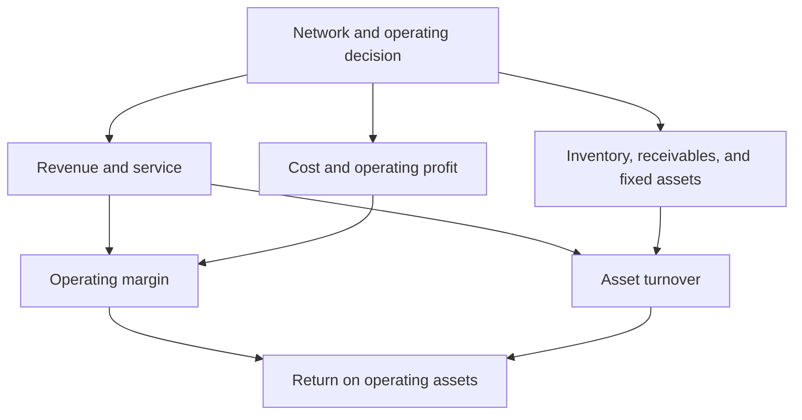

# 15. Strategic Profit Model and Return on Assets

## Learning objectives

After this topic, you should be able to:

- decompose return on operating assets into margin and turnover;
- trace supply-chain levers to profit and assets;
- calculate a worked example; and
- avoid double counting business-case effects.

## Core relationship

For an internally defined operating view:

$$
\text{Return on operating assets}=\frac{\text{operating profit}}{\text{average operating assets}}
$$

It can be decomposed as:

$$
\frac{\text{operating profit}}{\text{revenue}}\times\frac{\text{revenue}}{\text{average operating assets}}
$$

or:

$$
\text{operating margin}\times\text{operating-asset turnover}
$$

## Worked example

Assume AsterWorks has:

- revenue: $60 million;
- operating profit: $6 million; and
- average operating assets: $30 million.

Operating margin is `6 / 60 = 10%`.

Asset turnover is `60 / 30 = 2.0`.

Return on operating assets is `10% × 2.0 = 20%`, matching `6 / 30 = 20%`.

## Supply-chain levers

Examples:

- better availability may protect revenue;
- fewer expedites may reduce operating cost;
- lower inventory may reduce operating assets;
- a new facility may add fixed assets but improve revenue and service;
- faster billing and collection may reduce receivables.

## AsterWorks example

The postponement center adds $2 million of operating assets but is expected to protect margin and reduce inventory duplication compared with a full regional plant. The decision should model both numerator and denominator over time, including transition cost and ramp-up.

## Double-counting check

Do not count the same mechanism twice—for example, recording reduced inventory as both a recurring profit benefit and a full annual cash benefit. Inventory release is generally a one-time working-capital effect; carrying-cost reduction may be recurring.

## Common mistakes

- Mixing profit and asset definitions from different scopes.
- Using end-of-period assets when average assets are required.
- Treating inventory reduction as both recurring cash and profit.
- Rejecting a value-creating investment solely because assets rise.
- Assuming service improvement always converts to revenue.

## Original knowledge check

Operating margin is 8% and operating-asset turnover is 2.5. What is return on operating assets?

Answer

`8% × 2.5 = 20%`.

## Related concepts

Continue to [operational quality, capacity, and maintenance](16-operational-quality-capacity-and-maintenance.md).
