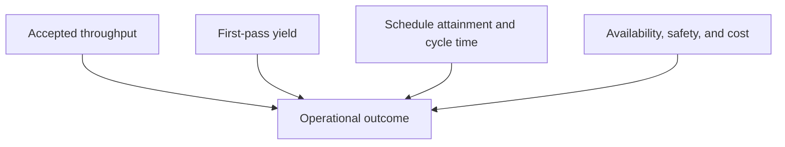

# 16. Operational Quality, Capacity, and Maintenance

## Learning objectives

After this topic, you should be able to:

- calculate first-pass yield, schedule attainment, and utilization;
- distinguish output from accepted output;
- connect maintenance reliability to capacity; and
- create a balanced operating scorecard.

## Quality

$$
\text{First-pass yield}=\frac{\text{units completing without rework}}{\text{units entering the process}}\times100\%
$$

If 940 of 1,000 units complete without rework, first-pass yield is 94%.

Quality cost should distinguish prevention, appraisal, internal failure, and external failure so that reducing inspection cost does not hide higher customer failure.

## Capacity and schedule

$$
\text{Capacity utilization}=\frac{\text{actual output or hours used}}{\text{available capacity}}
$$

$$
\text{Schedule attainment}=\frac{\text{planned orders completed within tolerance}}{\text{planned orders due}}\times100\%
$$

Define available capacity after calendar, planned maintenance, and known losses. Define the tolerance around quantity and timing.

## Maintenance reliability

Two useful measures are:

$$
\text{Mean time between failures}=\frac{\text{operating time}}{\text{number of functional failures}}
$$

$$
\text{Mean time to repair}=\frac{\text{total corrective repair time}}{\text{repair events}}
$$

Definitions of failure, operating time, and repair start/end must be controlled.

## Balanced operating view

The original consolidated data are in [`operations-scorecard.csv`](../../assets/data/module-2/section-c/operations-scorecard.csv).

## AsterWorks example

One line reports high utilization but low schedule attainment. Frequent unplanned failures and long repair time cause queues, while the utilization denominator excludes much of the lost time. AsterWorks reconciles calendar definitions and pairs utilization with availability, first-pass yield, throughput, and service.

## Why it matters

Output, quality, schedule, capacity, and reliability measures interact; improving one can hide rework, waiting, overload, or failure risk.

## Decision logic

Use accepted first-pass output, schedule attainment, capacity load, utilization, failure, repair, and availability measures as one diagnostic system. Do not approve the decision until mandatory conditions are feasible and the residual exposure has a named owner.

## Evidence retained through the workflow

Retain units and acceptance status, schedule tolerance, available and run hours, failures, repair time, capacity constraint, loss reason, and action. Record the decision date and the event or threshold that requires reassessment.

## Applied decision artifact

Use a one-page **operational quality, capacity, and maintenance decision record** with these fields:

- **Decision and boundary:** Use accepted first-pass output, schedule attainment, capacity load, utilization, failure, repair, and availability measures as one diagnostic system.
- **Required evidence:** units and acceptance status, schedule tolerance, available and run hours, failures, repair time, capacity constraint, loss reason, and action.
- **Expected result:** Output, quality, schedule, capacity, and reliability measures interact; improving one can hide rework, waiting, overload, or failure risk.
- **Balancing condition:** Higher utilization may improve apparent productivity but reduce maintenance windows, response capacity, and schedule reliability.
- **Accountability:** name the decision owner, approval date, residual exposure owner, and measurable trigger for reassessment.

The record is complete only when another practitioner can reproduce the reasoning and identify the next action without relying on meeting memory.

## Trade-offs

Higher utilization may improve apparent productivity but reduce maintenance windows, response capacity, and schedule reliability.

## Commonly confused with

Do not confuse a preferred decision method with a guaranteed outcome. Use accepted first-pass output, schedule attainment, capacity load, utilization, failure, repair, and availability measures as one diagnostic system. Validate the result with units and acceptance status, schedule tolerance, available and run hours, failures, repair time, capacity constraint, loss reason, and action; the evidence, not the method's label, determines whether the choice worked.

## Common mistakes

- Counting reworked units as first-pass output.
- Using nominal capacity as the utilization denominator.
- Improving schedule attainment by freezing an unrealistic plan late.
- Comparing failure measures with different event definitions.
- Deferring maintenance to improve short-term output.

## Original knowledge check

Nine hundred units enter a process; 855 pass without rework. What is first-pass yield?

Answer and rationale

### Correct answer

`855 / 900 = 95%`.

### Why it is correct

Output, quality, schedule, capacity, and reliability measures interact; improving one can hide rework, waiting, overload, or failure risk. Use accepted first-pass output, schedule attainment, capacity load, utilization, failure, repair, and availability measures as one diagnostic system.

### Why the other answers are wrong

Alternative responses reproduce failure modes already discussed:

- Counting reworked units as first-pass output.
- Using nominal capacity as the utilization denominator.
- Improving schedule attainment by freezing an unrealistic plan late.

They do not preserve the lesson's decision boundary or evidence. The governing trade-off remains explicit: Higher utilization may improve apparent productivity but reduce maintenance windows, response capacity, and schedule reliability.

## Practitioner perspective

Use units and acceptance status, schedule tolerance, available and run hours, failures, repair time, capacity constraint, loss reason, and action as the minimum review record. The artifact should let another practitioner reproduce the conclusion, identify the remaining exposure, and know which trigger reopens the decision.

## Related concepts

- [Network and performance formula sheet](../../calculations/network-performance/formula-sheet.md)
- [Section overview](./README.md)
- [Module 3 continuation](../../03-sourcing-strategy-product-design-supplier-execution/section-d-supplier-selection-contracting-and-procurement/02-supplier-criteria-and-scorecards.md)
Complete the [Section C review](17-section-c-review.md), then attempt the [AsterWorks capstone](../capstone/).

---

[Previous: Strategic Profit Model and Return on Assets](15-strategic-profit-model-and-roa.md) · [Section review](17-section-c-review.md)
