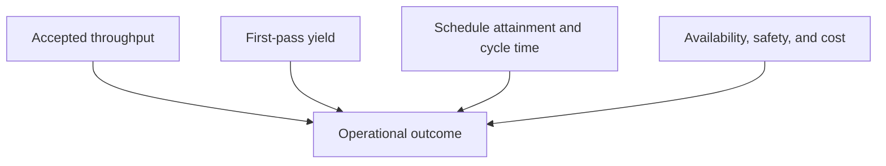

# 16. Operational Quality, Capacity, and Maintenance

## Learning objectives

After this topic, you should be able to:

- calculate first-pass yield, schedule attainment, and utilization;
- distinguish output from accepted output;
- connect maintenance reliability to capacity; and
- create a balanced operating scorecard.

## Quality

$$
\text{First-pass yield}=\frac{\text{units completing without rework}}{\text{units entering the process}}\times100\%
$$

If 940 of 1,000 units complete without rework, first-pass yield is 94%.

Quality cost should distinguish prevention, appraisal, internal failure, and external failure so that reducing inspection cost does not hide higher customer failure.

## Capacity and schedule

$$
\text{Capacity utilization}=\frac{\text{actual output or hours used}}{\text{available capacity}}
$$

$$
\text{Schedule attainment}=\frac{\text{planned orders completed within tolerance}}{\text{planned orders due}}\times100\%
$$

Define available capacity after calendar, planned maintenance, and known losses. Define the tolerance around quantity and timing.

## Maintenance reliability

Two useful measures are:

$$
\text{Mean time between failures}=\frac{\text{operating time}}{\text{number of functional failures}}
$$

$$
\text{Mean time to repair}=\frac{\text{total corrective repair time}}{\text{repair events}}
$$

Definitions of failure, operating time, and repair start/end must be controlled.

## Balanced operating view

The original consolidated data are in [`operations-scorecard.csv`](../../assets/data/module-2/section-c/operations-scorecard.csv).

## AsterWorks example

One line reports high utilization but low schedule attainment. Frequent unplanned failures and long repair time cause queues, while the utilization denominator excludes much of the lost time. AsterWorks reconciles calendar definitions and pairs utilization with availability, first-pass yield, throughput, and service.

## Common mistakes

- Counting reworked units as first-pass output.
- Using nominal capacity as the utilization denominator.
- Improving schedule attainment by freezing an unrealistic plan late.
- Comparing failure measures with different event definitions.
- Deferring maintenance to improve short-term output.

## Original knowledge check

Nine hundred units enter a process; 855 pass without rework. What is first-pass yield?

Answer

`855 / 900 = 95%`.

## Related concepts

Complete the [Section C review](17-section-c-review.md), then attempt the [AsterWorks capstone](../capstone/).
