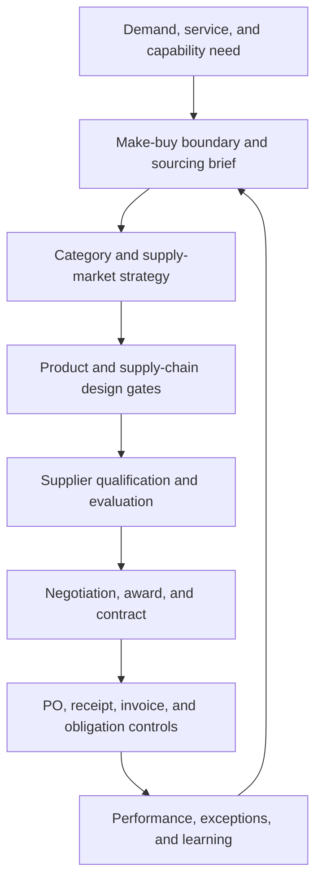

# Rivermark Integrated Sourcing and Design Capstone

## Situation

Rivermark Climate Systems must support growth in modular commercial heat pumps while reducing expedites, supplier concentration, product complexity, and lifecycle cost. Leadership wants one recommendation connecting sourcing, category strategy, product design, supplier award, contract deployment, and procure-to-pay controls.

All organizations, values, and events are fictional and independently selected for learning purposes.

## End-to-end decision flow

The capstone is one connected management process. An attractive quote cannot bypass capability strategy, a high score cannot bypass a gate, and a signed contract cannot bypass operating controls.

## Source datasets

- [Make-or-buy options](../../assets/data/module-3/section-a/make-buy-options.csv)
- [Total-cost options](../../assets/data/module-3/section-a/total-cost-options.csv)
- [Category spend](../../assets/data/module-3/section-b/category-spend.csv)
- [Category portfolio](../../assets/data/module-3/section-b/category-portfolio.csv)
- [Supplier shares](../../assets/data/module-3/section-b/supplier-shares.csv)
- [Design alternatives](../../assets/data/module-3/section-c/design-alternatives.csv)
- [Supplier evaluation](../../assets/data/module-3/section-d/supplier-evaluation.csv)
- [Open-order exceptions](../../assets/data/module-3/section-d/open-order-exceptions.csv)
- [Contract obligations](../../assets/data/module-3/section-d/contract-obligations.csv)
- [Three-way match](../../assets/data/module-3/section-d/three-way-match.csv)

## Controlled assumptions

Use the assumptions embedded in the files unless you deliberately create and label a scenario:

- the make-or-buy comparison covers 24,000 units per year for three years at a 0% discount rate;
- transition cost is one-time; unit conversion and fixed cost recur annually;
- total-cost values are USD per unit, not annual totals;
- supplier evaluation uses a 1–5 raw-score scale and the weights stated in the column headings;
- a failed mandatory gate makes a supplier ineligible until the failure is resolved and formally reapproved;
- design benefits are forecasts that require physical, technical, and operational validation;
- supplier concentration is calculated at parent-group level, not from unreconciled supplier records.

## Your assignment

Produce one decision pack that answers all nine tasks.

1. Recommend make, buy, or hybrid boundaries for control algorithms, firmware, board assembly, test design, and final release. State protected knowledge, retained controls, and transition gates.
2. Reconstruct the three-year make-or-buy economics and the local-versus-distant board cost bridge. Identify at least three assumptions that could reverse each recommendation.
3. Classify all six categories and propose relationship, supply-base, and governance actions. Calculate parent-level HHI for compressor assemblies and refrigerant sensors.
4. Compare the three design alternatives. Separate recurring benefit, one-time conversion cost, and validation risk, and define the evidence required before architecture release.
5. Recalculate all supplier weighted totals from raw scores. Apply mandatory gates before ranking and run one plausible sensitivity test.
6. Prepare a negotiation strategy and contract mechanism for compressor assemblies, including interests, BATNA, tradable variables, risk allocation, and approval boundaries.
7. Convert the obligation register into operating controls and demonstrate the treatment of one quantity mismatch and one price mismatch.
8. Prioritize the open-order exceptions using customer or production consequence, inventory cover, schedule movement, recovery choice, incremental cost, and displaced demand.
9. Present a 90-day implementation plan and a one-page executive recommendation showing decisions, economics, risk, controls, and review triggers.

## Required decision record

For each major recommendation, state:

| Field | Required content |
|---|---|
| Decision | Clear choice, scope, and accountable owner |
| Evidence | Dataset, calculation, source date, and material assumptions |
| Alternative | Strongest rejected option and why it is not preferred |
| Economics | Recurring benefit, one-time cost, timing, and confidence |
| Risk | Residual exposure, contingency, and activation trigger |
| Control | Measure, threshold, evidence owner, and review date |

## Submission quality gates

A complete submission must pass all six gates:

- every quoted number can be reproduced from a linked dataset;
- units and time horizons are explicit and comparable;
- mandatory gates are applied before weighted ranking;
- design benefits are conditional on named validation evidence;
- contractual obligations are connected to systems, owners, and responses;
- the implementation plan includes decision dates, not only activities.

## Capstone knowledge check

### Question 1

**Question.** Rivermark's $61 distant-board quote becomes $82.60 per unit on a full-cost basis. What should the team do first?

A. Award on quoted price and track the additions after launch

B. Validate the cost bridge and compare service and risk evidence

C. Exclude every distant source from the qualified market

D. Keep pipeline inventory outside the cost model and discuss it qualitatively

Answer and rationale

### Correct answer

**B. Validate the cost bridge and compare service and risk evidence**

### Why it is correct

The full comparison must be validated before selecting or rejecting an option.

### Why the other answers are wrong

A defers material evidence until after commitment, C converts one scenario into an absolute route rule, and D makes a differentiating cost incomparable.

### Question 2

**Question.** Refrigerant sensors are low spend but have one qualified parent group. Which action best fits the evidence?

A. Automate spot buying because transactional efficiency should lead the strategy

B. Protect continuity and qualify an alternate or redesign path

C. Reduce incoming inspection before source capability is demonstrated

D. Increase incumbent allocation to gain price leverage before testing recovery exposure

Answer and rationale

### Correct answer

**B. Protect continuity and qualify an alternate or redesign path**

### Why it is correct

Supply difficulty and line-stop consequence dominate the category's low financial spend.

### Why the other answers are wrong

A optimizes transaction effort, C removes a control, and D increases the dependency the action is meant to reduce.

### Question 3

**Question.** VectorTherm scores 78 but fails a mandatory gate. How should it be treated?

A. Eligible because its total is within five points of the leading supplier

B. Ineligible until the gate failure is resolved and reapproved

C. Eligible if commercial leadership accepts the residual risk after scoring

D. Eligible as a secondary source because its allocation would be smaller

Answer and rationale

### Correct answer

**B. Ineligible until the gate failure is resolved and reapproved**

### Why it is correct

Weighted value cannot compensate for a condition that makes the supplier infeasible.

### Why the other answers are wrong

A uses score proximity, while C and D change the effect of the gate after proposals are known.

### Question 4

**Question.** What is the strongest conclusion about the modular design alternative?

A. Retain the current design because it has no conversion cost, regardless of recurring performance

B. Advance the modular platform through gated validation because it leads recurring measures but carries the highest conversion cost and validation risk

C. Release the modular platform immediately because it has the lowest part count

D. Select the simplified integral design because a middle value is inherently safer

Answer and rationale

### Correct answer

**B. Advance the modular platform through gated validation because it leads recurring measures but carries the highest conversion cost and validation risk**

### Why it is correct

It preserves the recurring opportunity while explicitly controlling the $650,000 conversion commitment and 4-of-5 validation risk.

### Why the other answers are wrong

A ignores recurring lifecycle effects, C bypasses validation and uses one metric, and D substitutes a position in the table for an economic and technical case.

### Question 5

**Question.** What completes the capstone recommendation?

A. The preferred supplier name and negotiated unit price

B. A governed package of assumptions, decisions, controls, owners, measures, and contingencies

C. The design scorecard and a high-level implementation date

D. The signed contract and first purchase order

Answer and rationale

### Correct answer

**B. A governed package of assumptions, decisions, controls, owners, measures, and contingencies**

### Why it is correct

Execution quality depends on the connected decision system from requirement through performance learning.

### Why the other answers are wrong

A, C, and D each omit material upstream decisions or downstream controls.

When complete, compare your work with the [worked solution guide](solution-guide.md).
