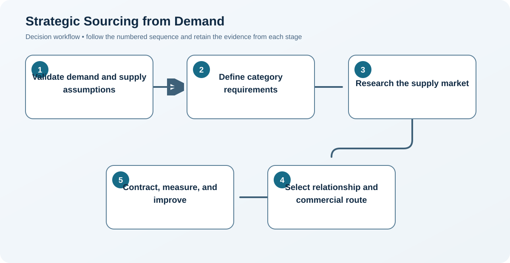
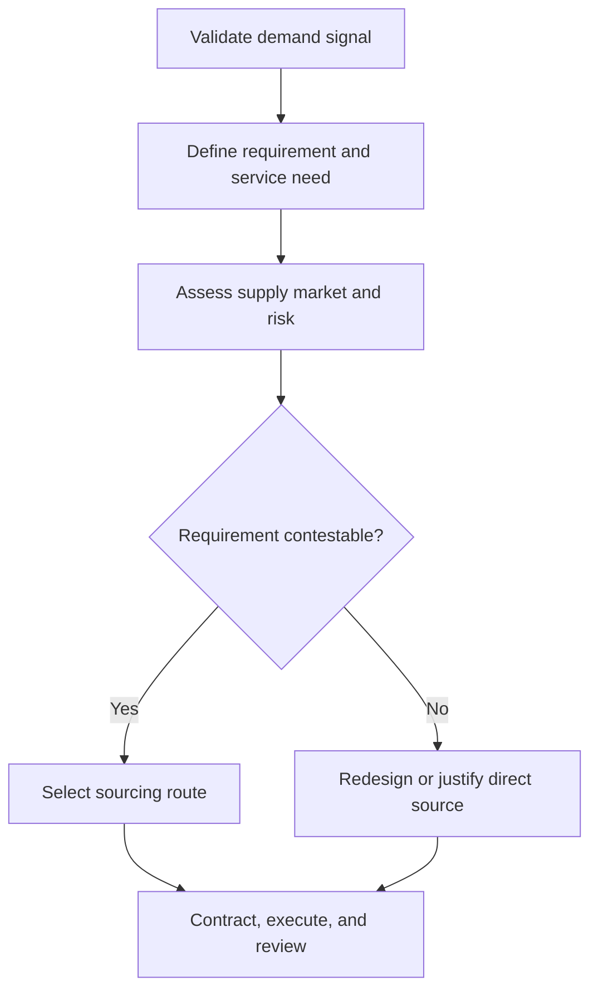

# 1. Strategic Sourcing from Demand

## Learning objectives

After this topic, you should be able to:

- connect demand and supply priorities to sourcing decisions;
- separate strategic sourcing from transactional buying;
- describe an end-to-end sourcing cycle;

## Concept in plain English

Strategic sourcing converts expected demand, customer promises, product requirements, and business constraints into a deliberate external-supply design. Purchasing then executes transactions within that design.

## Why it matters

A low purchase price cannot compensate for a source that misses the required volume, timing, quality, or resilience. Starting with demand prevents the sourcing team from optimizing a specification that no longer supports the market.

## Decision model and workflow

### Evidence retained through the workflow

| Stage | Required evidence or output |
|---|---|
| **1. Validate demand and supply assumptions** | Demand profile by segment, horizon, and service promise |
| **2. Define category requirements** | Approved technical, commercial, quality, and continuity requirements |
| **3. Research the supply market** | Supply-market map with capacity, capability, and constraint evidence |
| **4. Select relationship and commercial route** | Documented sourcing route and relationship rationale |
| **5. Contract, measure, and improve** | Contract baseline, scorecard, review cadence, and improvement backlog |

## Practical process flow

## Realistic example — Rivermark Climate Systems

Rivermark expects service-part demand to grow 28% while new-equipment volume grows 9%. Treating both streams alike would understate the response-time requirement for service compressors. The sourcing brief therefore separates planned production replenishment from urgent installed-base support.

**Decision insight.** The resulting sourcing brief sets different inventory, capacity, and response-time rules for production and service demand instead of forcing both through one average forecast.

All names and values in this example are fictional and independently selected for learning purposes.

## Applied decision artifact — demand-to-source brief

Before contacting suppliers, create a one-page brief with six controlled fields: demand quantity and timing, customer/service consequence, specification maturity, incumbent constraints, supply-market capacity, and decision owner. Record the source and date for each input.

Use a release gate: the event may begin only when the requirement is measurable, the forecast range is visible, and the chosen route is justified. If demand is volatile, issue scenarios rather than one false-precision volume. The artifact becomes the baseline for later bid comparison and prevents a sourcing event from optimizing a requirement that planning or engineering has already changed.

## Decision logic

- State the customer outcome before the supplier requirement.
- Translate volume ranges—not one-point forecasts—into capacity needs.
- Assign owners for assumptions, approvals, and recurring review.

## Trade-offs

| Choice tension | Decision implication |
|---|---|
| Central control improves leverage but can miss local knowledge | Set enterprise guardrails centrally, but require local teams to document regulatory, logistics, and service exceptions. |
| Early supplier involvement improves feasibility but requires information controls | Share only the information needed for feasibility, under clear confidentiality, access, and decision-right controls. |

## Commonly confused with

Strategic sourcing designs how a category will be supplied. Procurement and purchasing place, receive, and settle specific orders within that strategy.

## Common mistakes

- Beginning with incumbent quotations instead of business requirements.
- Using annual volume without seasonality or service demand.
- Treating the sourcing event as finished when the contract is signed.

## Original knowledge check

**Question.** Which input should frame a sourcing strategy first?

A. The lowest quote received

B. The demand, service, and supply requirements

C. The incumbent supplier's preferred capacity

D. The buyer's prior-year savings target

Answer and rationale

### Correct answer

**B. The demand, service, and supply requirements**

### Why it is correct

The source must support the operating requirement; price and savings are evaluated inside that requirement.

### Why the other answers are wrong

A, C, and D may inform the decision, but none defines what the supply solution must accomplish.

## Practitioner perspective

A one-page sourcing brief with assumptions, ranges, decision rights, and success measures is usually more valuable than a long supplier list.

## Related concepts

- [Module 3 overview](../README.md)
- [Section overview](./README.md)
- [Sourcing Requirements and Timing](./05-sourcing-requirements-and-timing.md)
- [Purchasing Flow and Selection Routes](../section-d-supplier-selection-contracting-and-procurement/01-purchasing-flow-and-selection-routes.md)

---

[Section overview](./README.md) · [Next: Make-or-Buy and Core Capability](./02-make-buy-and-core-capability.md)
