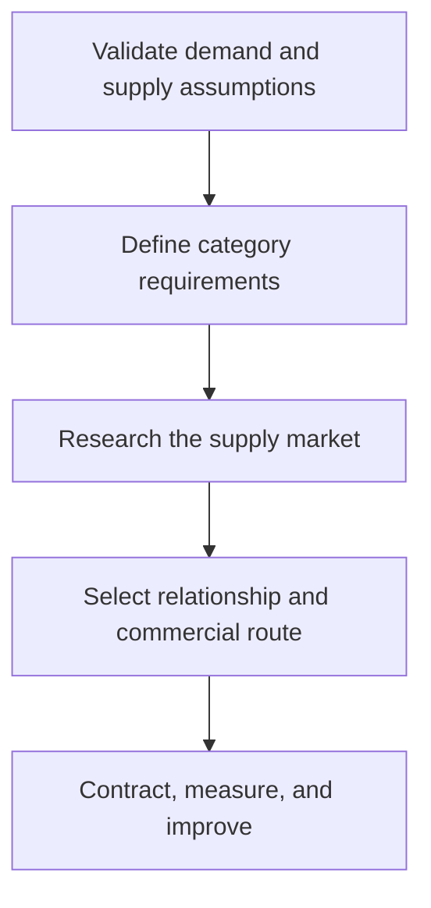

# 1. Strategic Sourcing from Demand

## Learning objectives

After this topic, you should be able to:

- connect demand and supply priorities to sourcing decisions;
- separate strategic sourcing from transactional buying;
- describe an end-to-end sourcing cycle;

## Concept in plain English

Strategic sourcing converts expected demand, customer promises, product requirements, and business constraints into a deliberate external-supply design. Purchasing then executes transactions within that design.

## Why it matters

A low purchase price cannot compensate for a source that misses the required volume, timing, quality, or resilience. Starting with demand prevents the sourcing team from optimizing a specification that no longer supports the market.

## How it works

1. **Validate demand and supply assumptions.** Confirm the decision boundary, inputs, and accountable owner before analysis begins.
2. **Define category requirements.** Use comparable evidence and keep assumptions visible as the decision develops.
3. **Research the supply market.** Use comparable evidence and keep assumptions visible as the decision develops.
4. **Select relationship and commercial route.** Use comparable evidence and keep assumptions visible as the decision develops.
5. **Contract, measure, and improve.** Record the result, evidence, residual risk, and next review trigger.

## Realistic example — Rivermark Climate Systems

Rivermark expects service-part demand to grow 28% while new-equipment volume grows 9%. Treating both streams alike would understate the response-time requirement for service compressors. The sourcing brief therefore separates planned production replenishment from urgent installed-base support.

All names and values in this example are fictional and independently selected for learning purposes.

## Decision logic

- State the customer outcome before the supplier requirement.
- Translate volume ranges—not one-point forecasts—into capacity needs.
- Assign owners for assumptions, approvals, and recurring review.

## Trade-offs

| Choice tension | Decision implication |
|---|---|
| Central control improves leverage but can miss local knowledge | Quantify the benefit and the exposure using the same scope and horizon. |
| Early supplier involvement improves feasibility but requires information controls | Set a guardrail, owner, and review trigger instead of assuming one permanent answer. |

## Commonly confused with

Strategic sourcing designs how a category will be supplied. Procurement and purchasing place, receive, and settle specific orders within that strategy.

## Common mistakes

- Beginning with incumbent quotations instead of business requirements.
- Using annual volume without seasonality or service demand.
- Treating the sourcing event as finished when the contract is signed.

## Original knowledge check

**Question.** Which input should frame a sourcing strategy first?

A. The lowest quote received

B. The demand, service, and supply requirements

C. The incumbent supplier's preferred capacity

D. The buyer's prior-year savings target

Answer and rationale

### Correct answer

**B. The demand, service, and supply requirements**

### Why it is correct

The source must support the operating requirement; price and savings are evaluated inside that requirement.

### Why the other answers are wrong

A, C, and D may inform the decision, but none defines what the supply solution must accomplish.

## Practitioner perspective

A one-page sourcing brief with assumptions, ranges, decision rights, and success measures is usually more valuable than a long supplier list.

## Related concepts

- [Module 3 overview](../README.md)
- [Section A overview](./README.md)
- [Sourcing and procurement formula sheet](../../calculations/sourcing-procurement/formula-sheet.md)

---

[Section overview](./README.md) · [Next: Make-or-Buy and Core Capability](./02-make-buy-and-core-capability.md)
