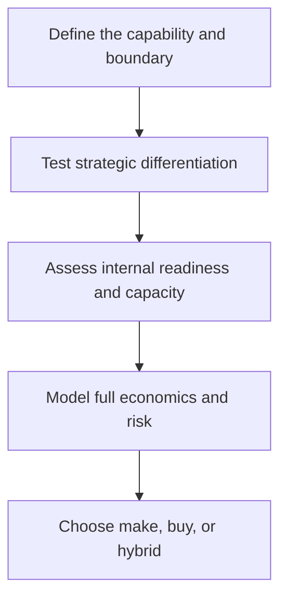

# 2. Make-or-Buy and Core Capability

## Learning objectives

After this topic, you should be able to:

- evaluate make-or-buy beyond unit price;
- test whether a capability creates defensible advantage;
- identify hybrid sourcing options;

## Concept in plain English

A make-or-buy decision chooses where a capability should reside. The decision combines economics with capacity, knowledge, quality, speed, intellectual property, control, and reversibility.

## Why it matters

Outsourcing a strategically differentiating capability can erase learning and increase dependence. Keeping a non-differentiating activity inside can consume capital and management attention better used elsewhere.

## How it works

1. **Define the capability and boundary.** Confirm the decision boundary, inputs, and accountable owner before analysis begins.
2. **Test strategic differentiation.** Use comparable evidence and keep assumptions visible as the decision develops.
3. **Assess internal readiness and capacity.** Use comparable evidence and keep assumptions visible as the decision develops.
4. **Model full economics and risk.** Use comparable evidence and keep assumptions visible as the decision develops.
5. **Choose make, buy, or hybrid.** Record the result, evidence, residual risk, and next review trigger.

## Realistic example — Rivermark Climate Systems

Rivermark keeps control-algorithm design internal because field performance and energy efficiency differentiate its products. It buys standard fan motors and uses a qualified partner for circuit-board assembly while retaining test design, firmware, and final release.

All names and values in this example are fictional and independently selected for learning purposes.

## Decision logic

- Make when the capability differentiates and can be sustained.
- Buy when capable markets exist and the activity is not strategically distinctive.
- Use a hybrid when learning, surge capacity, or continuity requires two operating paths.

## Trade-offs

| Choice tension | Decision implication |
|---|---|
| Making preserves control but ties up capital | Quantify the benefit and the exposure using the same scope and horizon. |
| Buying adds specialist scale but introduces dependency | Set a guardrail, owner, and review trigger instead of assuming one permanent answer. |

## Commonly confused with

Core capability means a capability that materially supports advantage relative to alternatives—not simply work the organization performs well today.

## Common mistakes

- Comparing supplier price with only internal variable cost.
- Ignoring stranded assets and transition costs.
- Assuming outsourcing transfers accountability to the supplier.

## Original knowledge check

**Question.** Which factor most strongly supports keeping an activity internal?

A. A supplier offers a temporary discount

B. The activity contains differentiating know-how that is difficult to rebuild

C. The internal team has always performed it

D. The purchase order process is slow

Answer and rationale

### Correct answer

**B. The activity contains differentiating know-how that is difficult to rebuild**

### Why it is correct

Hard-to-rebuild differentiating knowledge is a strategic control issue, not merely a short-term cost issue.

### Why the other answers are wrong

A is temporary, C is historical rather than strategic, and D is a process problem that does not determine the capability boundary.

## Practitioner perspective

Define the smallest capability that must remain protected. A precise boundary often reveals a better hybrid than an all-or-nothing decision.

## Related concepts

- [Module 3 overview](../README.md)
- [Section A overview](./README.md)
- [Sourcing and procurement formula sheet](../../calculations/sourcing-procurement/formula-sheet.md)

---

[Previous: Strategic Sourcing from Demand](./01-strategic-sourcing-from-demand.md) · [Next: Outsourcing, Offshoring, and Nearshoring](./03-outsourcing-offshoring-and-nearshoring.md)
