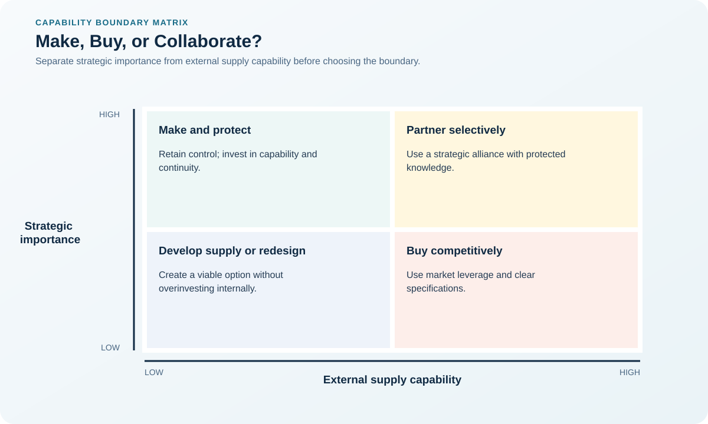

# 2. Make-or-Buy and Core Capability

## Learning objectives

After this topic, you should be able to:

- evaluate make-or-buy beyond unit price;
- test whether a capability creates defensible advantage;
- identify hybrid sourcing options;

## Concept in plain English

A make-or-buy decision chooses where a capability should reside. The decision combines economics with capacity, knowledge, quality, speed, intellectual property, control, and reversibility.

## Why it matters

Outsourcing a strategically differentiating capability can erase learning and increase dependence. Keeping a non-differentiating activity inside can consume capital and management attention better used elsewhere.

## Decision model and workflow

### Evidence retained through the workflow

| Stage | Required evidence or output |
|---|---|
| **1. Define the capability and boundary** | A precise capability boundary covering process, assets, data, and know-how |
| **2. Test strategic differentiation** | Evidence of customer value, scarcity, imitation difficulty, and strategic fit |
| **3. Assess internal readiness and capacity** | Internal capacity, capability, investment, and execution-gap assessment |
| **4. Model full economics and risk** | Comparable make, buy, and hybrid economics with transition and risk scenarios |
| **5. Choose make, buy, or hybrid** | Approved operating model with retained controls, exit conditions, and review triggers |

## Realistic example — Rivermark Climate Systems

Rivermark keeps control-algorithm design internal because field performance and energy efficiency differentiate its products. It buys standard fan motors and uses a qualified partner for circuit-board assembly while retaining test design, firmware, and final release.

**Decision insight.** This hybrid boundary protects the algorithm and validation knowledge that create advantage while using external manufacturing scale where the market is capable.

All names and values in this example are fictional and independently selected for learning purposes.

## Decision logic

- Make when the capability differentiates and can be sustained.
- Buy when capable markets exist and the activity is not strategically distinctive.
- Use a hybrid when learning, surge capacity, or continuity requires two operating paths.

## Trade-offs

| Choice tension | Decision implication |
|---|---|
| Making preserves control but ties up capital | Retain the differentiating knowledge and control points internally while testing whether selected execution steps can be partnered. |
| Buying adds specialist scale but introduces dependency | Protect continuity through qualification, data access, tooling rights, and an executable exit plan—not merely a second supplier name. |

## Commonly confused with

Core capability means a capability that materially supports advantage relative to alternatives—not simply work the organization performs well today.

## Common mistakes

- Comparing supplier price with only internal variable cost.
- Ignoring stranded assets and transition costs.
- Assuming outsourcing transfers accountability to the supplier.

## Original knowledge check

**Question.** Which factor most strongly supports keeping an activity internal?

A. A supplier offers a temporary discount

B. The activity contains differentiating know-how that is difficult to rebuild

C. The internal team has always performed it

D. The purchase order process is slow

Answer and rationale

### Correct answer

**B. The activity contains differentiating know-how that is difficult to rebuild**

### Why it is correct

Hard-to-rebuild differentiating knowledge is a strategic control issue, not merely a short-term cost issue.

### Why the other answers are wrong

A is temporary, C is historical rather than strategic, and D is a process problem that does not determine the capability boundary.

## Practitioner perspective

Define the smallest capability that must remain protected. A precise boundary often reveals a better hybrid than an all-or-nothing decision.

## Related concepts

- [Module 3 overview](../README.md)
- [Section A overview](./README.md)
- [Sourcing and procurement formula sheet](../../calculations/sourcing-procurement/formula-sheet.md)

---

[Previous: Strategic Sourcing from Demand](./01-strategic-sourcing-from-demand.md) · [Next: Outsourcing, Offshoring, and Nearshoring](./03-outsourcing-offshoring-and-nearshoring.md)
