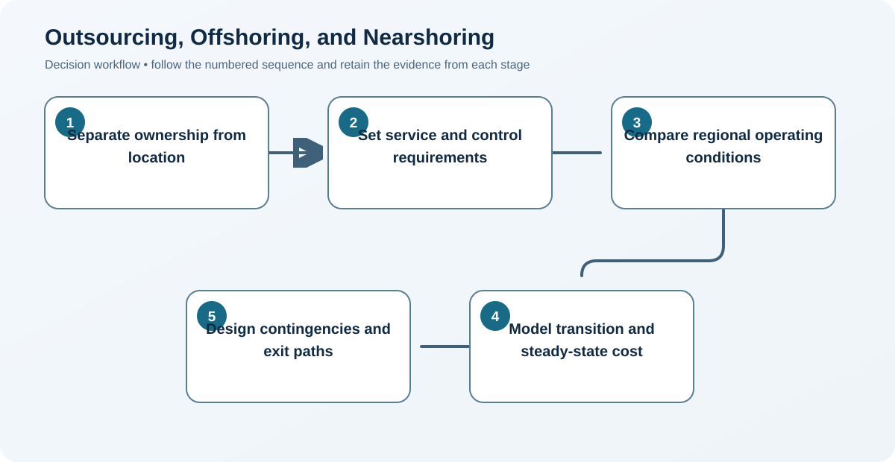

# 3. Outsourcing, Offshoring, and Nearshoring

## Learning objectives

After this topic, you should be able to:

- distinguish ownership and location choices;
- compare operating-model benefits and risks;
- avoid treating labor rate as total economics;

## Concept in plain English

Outsourcing changes who performs work; offshoring changes the country in which work occurs. They can happen separately. Nearshoring relocates work to a comparatively close country to balance cost, responsiveness, and coordination.

## Why it matters

Confusing ownership with geography hides the real decision. A company can own an offshore facility, outsource domestically, or combine external ownership with a distant location—each with different control and risk.

## Decision workflow

### Evidence retained at each stage

| Stage | Required evidence or output |
|---|---|
| **1. Separate ownership from location** | Separate decisions for ownership, operating responsibility, and physical location |
| **2. Set service and control requirements** | Minimum service, quality, data, security, and regulatory controls |
| **3. Compare regional operating conditions** | Country and region assessment covering labor, logistics, infrastructure, tax, and disruption |
| **4. Model transition and steady-state cost** | Transition and steady-state economics normalized to one horizon and currency |
| **5. Design contingencies and exit paths** | Business-continuity design with alternate routes, recovery time, and exit rights |

## Realistic example — Rivermark Climate Systems

Rivermark compares an owned U.S. assembly cell, a domestic contract manufacturer, and a nearshore partner. The nearshore option has lower conversion cost but adds border variability; the domestic partner has higher rates but can replenish service stock twice weekly.

**Decision insight.** The comparison therefore treats contract manufacturing and geography as separate choices and shows when the domestic response-time premium is justified for service parts.

All names and values in this example are fictional and independently selected for learning purposes.

## Decision logic

- Evaluate location and ownership as two independent dimensions.
- Stress-test lead time, currency, regulation, infrastructure, and geopolitical exposure.
- Retain process knowledge and a credible recovery path.

## Trade-offs

| Choice tension | Decision implication |
|---|---|
| Distance may reduce labor cost while increasing inventory and coordination | Convert distance into measurable lead-time variability, working capital, response time, and recovery exposure before claiming savings. |
| A specialist can improve scale while reducing direct control | Retain process ownership, acceptance authority, performance data, and escalation rights even when execution moves to a specialist. |

## Commonly confused with

Subcontracting usually assigns defined production work externally. Outsourcing can cover a broader activity or process previously performed internally.

## Common mistakes

- Calling every international purchase offshoring.
- Selecting a country before defining requirements.
- Assuming a contract eliminates continuity and reputation risk.

## Original knowledge check

**Question.** A company opens and operates its own plant in another country. What changed?

A. Ownership only

B. Location only

C. Both ownership and location

D. Neither

Answer and rationale

### Correct answer

**B. Location only**

### Why it is correct

The work moved across a national boundary, but the company still owns and operates the capability.

### Why the other answers are wrong

A reverses the facts, C incorrectly assumes external ownership, and D ignores the geographic change.

## Practitioner perspective

Use a two-by-two ownership/location matrix in executive discussions; it removes ambiguity before financial modeling begins.

## Related concepts

- [Module 3 overview](../README.md)
- [Section A overview](./README.md)
- [Sourcing and procurement formula sheet](../../calculations/sourcing-procurement/formula-sheet.md)

---

[Previous: Make-or-Buy and Core Capability](./02-make-buy-and-core-capability.md) · [Next: Transition Risk and Knowledge Retention](./04-transition-risk-and-knowledge-retention.md)
