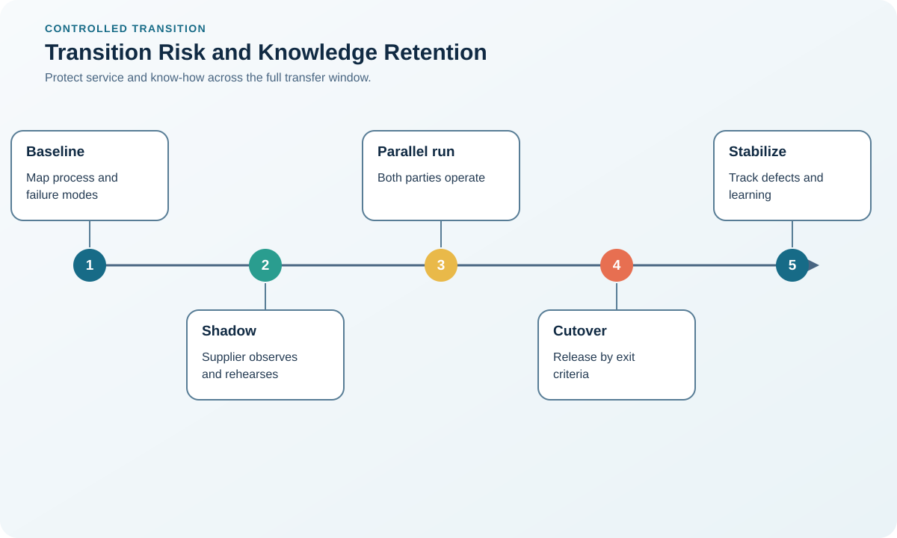

# 4. Transition Risk and Knowledge Retention

## Learning objectives

After this topic, you should be able to:

- identify risks created during a sourcing transition;
- design knowledge-retention controls;
- sequence transfer without interrupting customers;

## Concept in plain English

The riskiest period in a sourcing change is often the transfer itself. Drawings, tooling, tacit methods, approvals, data, and supplier subtiers must become operational together while existing supply continues.

## Why it matters

A financially attractive steady state can fail because the transition plan omits qualification time, duplicate capacity, inventory buffers, regulatory approvals, or knowledge transfer.

## Decision workflow

### Evidence retained at each stage

| Stage | Required evidence or output |
|---|---|
| **1. Map critical knowledge and assets** | Critical-knowledge register covering tacit skills, settings, exceptions, and ownership |
| **2. Qualify the receiving process** | Receiving-site qualification plan with people, process, tooling, and system readiness |
| **3. Run controlled parallel production** | Parallel-run plan with volume, buffer, acceptance criteria, and stop conditions |
| **4. Release by evidence** | Evidence package for quality, yield, capacity, delivery, and recovery capability |
| **5. Retire old capacity only after stability** | Controlled legacy shutdown plan with retained records, assets, and restart options |

## Realistic example — Rivermark Climate Systems

Before transferring controller assembly, Rivermark records test parameters, golden-unit results, firmware controls, tooling ownership, and approved component alternatives. Three consecutive conforming lots and a recovery drill are required before the original line is released.

**Decision insight.** The three-lot gate proves repeatability, while the recovery drill tests whether the new site can respond when equipment, material, or data fails.

All names and values in this example are fictional and independently selected for learning purposes.

## Decision logic

- Classify knowledge as transferable, retain-only, or jointly controlled.
- Set exit criteria before the transition begins.
- Fund temporary duplication where interruption consequences exceed carrying cost.

## Trade-offs

| Choice tension | Decision implication |
|---|---|
| A larger buffer protects service but increases cash and obsolescence | Size the buffer from expected disruption duration, service consequence, shelf life, and obsolescence—not an arbitrary number of weeks. |
| Fast cutover reduces duplicate cost but increases disruption exposure | Use evidence-based gates so duplicate cost ends only after the new process demonstrates stable output and a workable recovery path. |

## Commonly confused with

Transition risk concerns moving the operating capability. Supplier performance risk concerns how the established source performs after stabilization.

## Common mistakes

- Transferring documents without tacit operating knowledge.
- Ending the former source before repeatable output is proven.
- Failing to identify ownership of tools, data, and work product.

## Original knowledge check

**Question.** What is the strongest evidence that a transferred process is ready?

A. The contract was signed

B. The new line completed one sample

C. Repeatable conforming output and recovery controls are demonstrated

D. The old supplier shipped its final order

Answer and rationale

### Correct answer

**C. Repeatable conforming output and recovery controls are demonstrated**

### Why it is correct

Readiness requires demonstrated process capability and response controls, not administrative completion.

### Why the other answers are wrong

A and D are milestones, while B is insufficient evidence of repeatability.

## Practitioner perspective

The exit gate deserves the same executive attention as supplier selection. Irreversible shutdown should follow evidence, not the project calendar.

## Related concepts

- [Module 3 overview](../README.md)
- [Section A overview](./README.md)
- [Sourcing and procurement formula sheet](../../calculations/sourcing-procurement/formula-sheet.md)

---

[Previous: Outsourcing, Offshoring, and Nearshoring](./03-outsourcing-offshoring-and-nearshoring.md) · [Next: Sourcing Requirements and Timing](./05-sourcing-requirements-and-timing.md)
