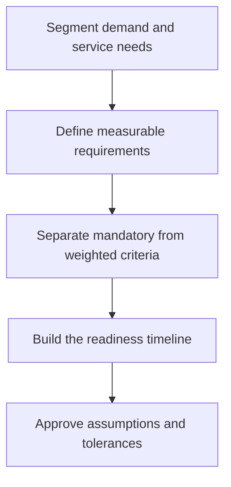

# 5. Sourcing Requirements and Timing

## Learning objectives

After this topic, you should be able to:

- build measurable sourcing requirements;
- connect time horizons to supplier readiness;
- prioritize requirements by category;

## Concept in plain English

A sourcing requirement states what the supply solution must achieve and by when. It covers volume, mix, quality, capacity, lead time, flexibility, design support, compliance, sustainability, data, and continuity.

## Why it matters

Vague requirements create incomparable proposals and late disputes. Timing must include qualification, tooling, integration, ramp-up, logistics, and approval—not just the supplier's quoted production lead time.

## How it works

1. **Segment demand and service needs.** Confirm the decision boundary, inputs, and accountable owner before analysis begins.
2. **Define measurable requirements.** Use comparable evidence and keep assumptions visible as the decision develops.
3. **Separate mandatory from weighted criteria.** Use comparable evidence and keep assumptions visible as the decision develops.
4. **Build the readiness timeline.** Use comparable evidence and keep assumptions visible as the decision develops.
5. **Approve assumptions and tolerances.** Record the result, evidence, residual risk, and next review trigger.

## Realistic example — Rivermark Climate Systems

For a refrigerant sensor, Rivermark specifies annual volume of 48,000 units, a peak month of 5,600, 12-week initial qualification, 98% delivery reliability, traceable calibration records, and a four-week surge response for a 20% increase.

All names and values in this example are fictional and independently selected for learning purposes.

## Decision logic

- Use ranges and scenarios for uncertain demand.
- Give pass/fail status only to genuine constraints.
- Define the measurement method, data source, and acceptable tolerance.

## Trade-offs

| Choice tension | Decision implication |
|---|---|
| Tighter requirements reduce risk but may reduce competition | Quantify the benefit and the exposure using the same scope and horizon. |
| Earlier commitment protects capacity but increases forecast exposure | Set a guardrail, owner, and review trigger instead of assuming one permanent answer. |

## Commonly confused with

A specification defines the item or service. A sourcing requirement includes the broader operating and commercial conditions needed to supply it.

## Common mistakes

- Publishing target volumes without peak or variability.
- Calling every preference mandatory.
- Omitting the time needed for validation and systems integration.

## Original knowledge check

**Question.** Which requirement is most decision-ready?

A. Supplier must be flexible

B. Supplier should provide good quality

C. Supplier must support 5,600 units in the peak month with 98% on-time delivery

D. Supplier should have sufficient capacity

Answer and rationale

### Correct answer

**C. Supplier must support 5,600 units in the peak month with 98% on-time delivery**

### Why it is correct

It defines quantity, period, and measured performance.

### Why the other answers are wrong

A, B, and D are directionally useful but cannot be tested consistently.

## Practitioner perspective

A requirement is complete only when two evaluators would reach the same conclusion using the same evidence.

## Related concepts

- [Module 3 overview](../README.md)
- [Section A overview](./README.md)
- [Sourcing and procurement formula sheet](../../calculations/sourcing-procurement/formula-sheet.md)

---

[Previous: Transition Risk and Knowledge Retention](./04-transition-risk-and-knowledge-retention.md) · [Next: Landed Cost and Total Cost of Ownership](./06-landed-cost-and-total-cost-of-ownership.md)
