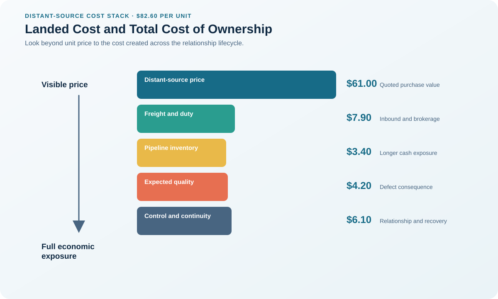

# 6. Landed Cost and Total Cost of Ownership

## Learning objectives

After this topic, you should be able to:

- distinguish price, landed cost, and total cost;
- select differentiating costs for an analysis;
- avoid false precision;

## Concept in plain English

Purchase price is the quoted item amount. Landed cost adds the cost to place the item where it is needed. Total cost of ownership adds transition, quality, inventory, administration, risk, use, service, and end-of-life consequences over the decision horizon.

## Why it matters

A distant source may win on price and lose after freight, duty, longer pipeline inventory, defects, engineering support, and disruption exposure are included.

## Decision model and workflow

### Evidence retained through the workflow

| Stage | Required evidence or output |
|---|---|
| **1. Fix the decision horizon and volume** | Common volume, horizon, location, service level, and scenario assumptions |
| **2. Identify costs that differ by option** | Cost boundary showing purchase, landed, ownership, risk, and end-of-life elements |
| **3. Normalize currency, timing, and units** | Normalized cost model with currency date, payment timing, units, and tax treatment |
| **4. Quantify uncertainty with scenarios** | Base, favorable, and adverse scenarios with named drivers and confidence ranges |
| **5. Compare cost with service and risk** | Decision view separating expected cost, cash flow, service consequence, and residual risk |

## Realistic example — Rivermark Climate Systems

A Rivermark control board costs $74 locally and $61 from a distant supplier. After freight, duty, 42 extra inventory days, expected defect cost, travel, and continuity controls, the annualized total is $79.20 locally versus $82.60 distantly.

**Decision insight.** The $21 quote advantage disappears after the options are compared at the same destination, service level, quality expectation, and continuity design.

All names and values in this example are fictional and independently selected for learning purposes.

## Decision logic

- Exclude costs identical across alternatives.
- Show expected, optimistic, and adverse cases.
- Keep hard cost, estimated exposure, and qualitative risk visibly separate.

## Trade-offs

| Choice tension | Decision implication |
|---|---|
| Broader scope improves completeness but increases uncertainty | Add a cost element only when it differs among options and can be estimated without double counting; show uncertain items as ranges. |
| Monetizing risk supports comparison but can imply unjustified precision | Report expected loss and non-financial exposure separately when monetization would suggest more certainty than the evidence supports. |

## Commonly confused with

Landed cost ends when usable supply arrives at the required location. Total cost continues through ownership, support, performance, and disposition.

## Common mistakes

- Adding only freight to purchase price.
- Double-counting risk in both expected cost and a score.
- Using one-year cost for a multi-year decision.

## Original knowledge check

**Question.** Which item belongs in total cost but not normally in landed cost?

A. Import duty

B. Inbound freight

C. Expected field-failure and warranty cost

D. Customs brokerage

Answer and rationale

### Correct answer

**C. Expected field-failure and warranty cost**

### Why it is correct

Field-failure cost occurs during ownership and use, after the item has landed.

### Why the other answers are wrong

A, B, and D are costs of bringing the item to the required location.

## Practitioner perspective

Show the cost bridge from quote to landed to total. Executives can challenge assumptions more effectively when additions are visible.

## Related concepts

- [Module 3 overview](../README.md)
- [Section A overview](./README.md)
- [Sourcing and procurement formula sheet](../../calculations/sourcing-procurement/formula-sheet.md)

---

[Previous: Sourcing Requirements and Timing](./05-sourcing-requirements-and-timing.md) · [Next: Should-Cost and the Sourcing Business Case](./07-should-cost-and-business-case.md)
