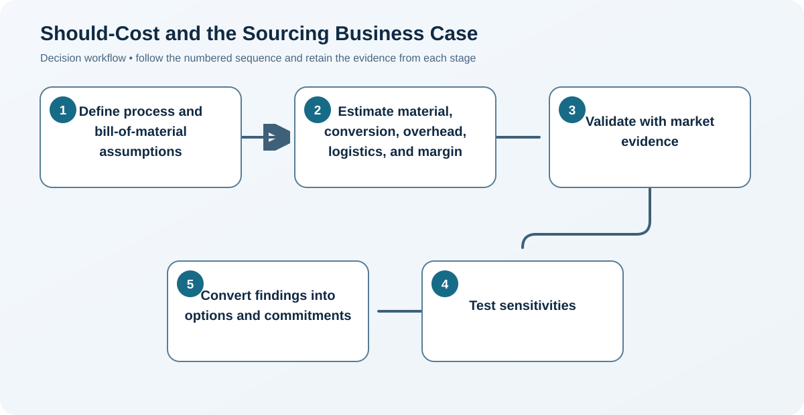

# 7. Should-Cost and the Sourcing Business Case

## Learning objectives

After this topic, you should be able to:

- construct a transparent should-cost model;
- use cost drivers in negotiation;
- build a decision-ready sourcing case;

## Concept in plain English

A should-cost model estimates what an efficient supplier would reasonably incur under stated assumptions. It is a fact base for design, negotiation, and scenario testing—not a claim that the supplier must accept one exact number.

## Why it matters

Supplier quotations may hide the economics of material yield, labor content, cycle time, overhead, logistics, and margin. A driver-based model shows where collaboration can create real value.

## Decision workflow

### Evidence retained at each stage

| Stage | Required evidence or output |
|---|---|
| **1. Define process and bill-of-material assumptions** | Process route, bill of material, yield, cycle time, lot size, and utilization assumptions |
| **2. Estimate material, conversion, overhead, logistics, and margin** | Transparent material, labor, machine, overhead, logistics, and margin cost stack |
| **3. Validate with market evidence** | Benchmarks from drawings, market indices, process experts, and supplier evidence |
| **4. Test sensitivities** | Sensitivity analysis for yield, volume, utilization, commodity, and wage changes |
| **5. Convert findings into options and commitments** | Negotiation hypotheses, improvement options, investment needs, and benefit owners |

## Realistic example — Rivermark Climate Systems

Rivermark models a sheet-metal enclosure at $88.40: $54.60 material after yield loss, $12.80 conversion, $7.00 overhead, $4.00 logistics, and $10.00 margin. A supplier quote of $96 prompts questions about scrap and changeover—not an arbitrary demand for an $88.40 price.

**Decision insight.** The model isolates scrap and changeover as the likely gap, giving buyer and supplier two operational levers to investigate before discussing margin.

All names and values in this example are fictional and independently selected for learning purposes.

## Decision logic

- Document source, date, unit, and confidence for every driver.
- Use the model to find joint improvement opportunities.
- Pair savings with implementation cost, risk, and timing.

## Trade-offs

| Choice tension | Decision implication |
|---|---|
| Detailed models improve insight but require reliable process knowledge | Use detail where it changes a decision or exposes a cost driver; mark weak assumptions rather than hiding them behind decimals. |
| Aggressive assumptions may damage credibility and relationships | Treat the model as a fact-based conversation about process choices and risk, not as proof that the supplier must accept one number. |

## Commonly confused with

Target cost starts from the market price and desired profit. Should-cost starts from the resources and process expected to deliver the requirement.

## Common mistakes

- Presenting estimates as audited supplier facts.
- Ignoring supplier-specific capital or low-volume inefficiency.
- Claiming gross savings without transition and implementation cost.

## Original knowledge check

**Question.** What is the best use of a should-cost gap?

A. Assume the supplier is overcharging

B. Demand the modeled price without discussion

C. Investigate the drivers and improvement options behind the difference

D. Replace the supplier immediately

Answer and rationale

### Correct answer

**C. Investigate the drivers and improvement options behind the difference**

### Why it is correct

The model creates questions and alternatives; it does not prove the supplier's actual cost.

### Why the other answers are wrong

A and D jump to conclusions, while B treats assumptions as facts.

## Practitioner perspective

A good model is auditable enough that finance, engineering, operations, and the supplier can disagree with a specific assumption rather than the entire analysis.

## Related concepts

- [Module 3 overview](../README.md)
- [Section A overview](./README.md)
- [Sourcing and procurement formula sheet](../../calculations/sourcing-procurement/formula-sheet.md)

---

[Previous: Landed Cost and Total Cost of Ownership](./06-landed-cost-and-total-cost-of-ownership.md) · [Section review](./08-section-a-review.md)
