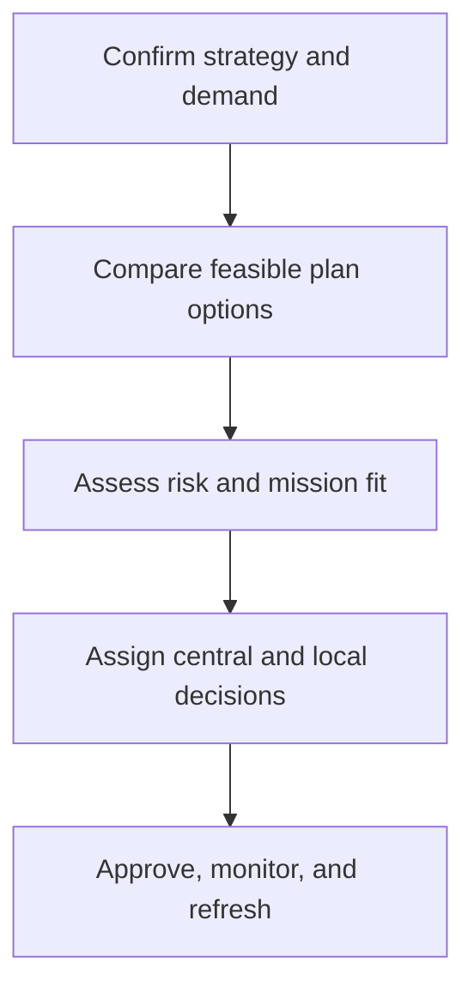

# 1. Supply-Plan Governance

## Learning objectives

After this topic, you should be able to:

- align supply plans with enterprise priorities;
- balance central leverage with local knowledge;
- test plans for growth and disruption;

## Concept in plain English

A sourcing supply plan defines how external capacity, categories, relationships, locations, and contingencies will support the business. Governance keeps the plan aligned as demand, markets, and risks change.

## Why it matters

An optimized plan can still fail if it conflicts with service commitments, culture, regulatory duties, or local operating realities.

## How it works

1. **Confirm strategy and demand.** Confirm the decision boundary, inputs, and accountable owner before analysis begins.
2. **Compare feasible plan options.** Use comparable evidence and keep assumptions visible as the decision develops.
3. **Assess risk and mission fit.** Use comparable evidence and keep assumptions visible as the decision develops.
4. **Assign central and local decisions.** Use comparable evidence and keep assumptions visible as the decision develops.
5. **Approve, monitor, and refresh.** Record the result, evidence, residual risk, and next review trigger.

## Realistic example — Rivermark Climate Systems

Rivermark centralizes semiconductor and compressor strategies but permits plants to source low-risk maintenance supplies locally within approved controls. Capacity and continuity assumptions are reviewed quarterly.

All names and values in this example are fictional and independently selected for learning purposes.

## Decision logic

- Centralize scarce, high-spend, or high-risk categories.
- Delegate decisions requiring fast local response when enterprise risk is low.
- Define escalation triggers rather than relying on informal exceptions.

## Trade-offs

| Choice tension | Decision implication |
|---|---|
| Centralization builds leverage and control | Quantify the benefit and the exposure using the same scope and horizon. |
| Autonomy improves speed and local fit but can fragment spend | Set a guardrail, owner, and review trigger instead of assuming one permanent answer. |

## Commonly confused with

A supply plan sets the external-supply design. A purchase plan schedules specific expected orders.

## Common mistakes

- Calling current suppliers the future supply plan.
- Ignoring growth and sensitivity scenarios.
- Assigning local autonomy without common data and policy.

## Original knowledge check

**Question.** Which category is the strongest candidate for centralized governance?

A. Low-value office refreshments

B. Plant-specific emergency plumbing

C. A scarce controller used across every product family

D. Occasional local landscaping

Answer and rationale

### Correct answer

**C. A scarce controller used across every product family**

### Why it is correct

Enterprise demand aggregation, scarcity, and cross-product impact justify central strategy and risk control.

### Why the other answers are wrong

A, B, and D are generally low-risk or locally specific.

## Practitioner perspective

Governance should clarify who decides, who contributes evidence, and what event forces reconsideration.

## Related concepts

- [Module 3 overview](../README.md)
- [Section B overview](./README.md)
- [Sourcing and procurement formula sheet](../../calculations/sourcing-procurement/formula-sheet.md)

---

[Section overview](./README.md) · [Next: Category Architecture and Strategy](./02-category-architecture.md)
