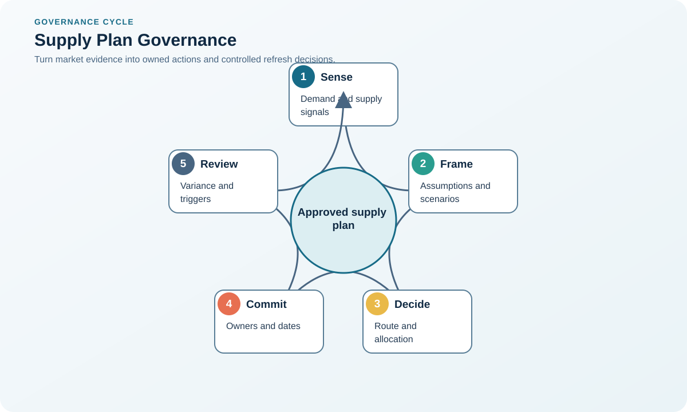
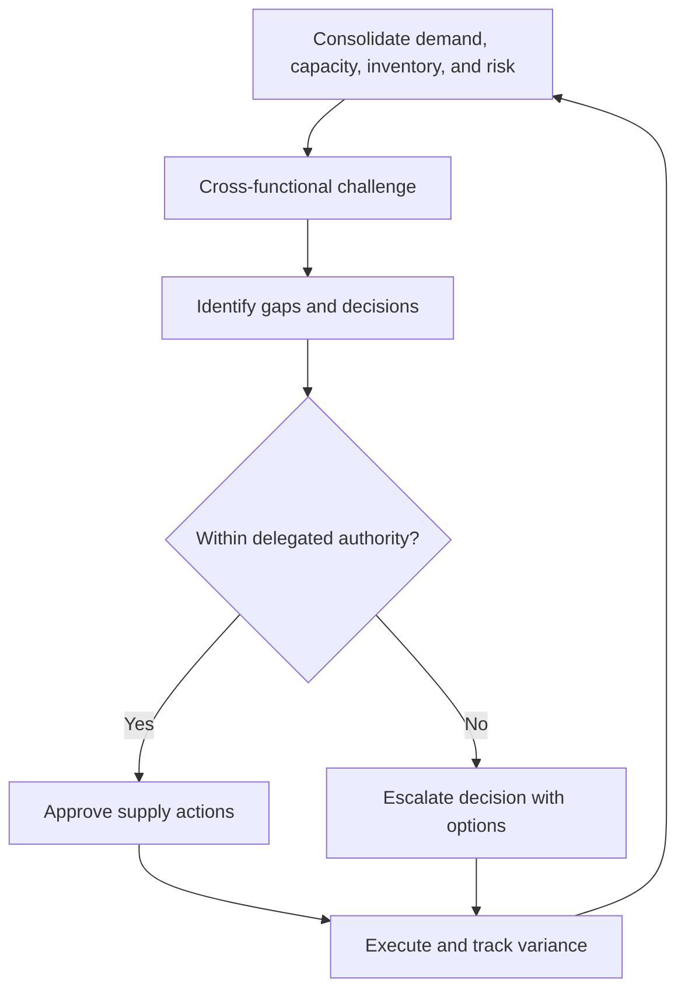

# 1. Supply-Plan Governance

## Learning objectives

After this topic, you should be able to:

- align supply plans with enterprise priorities;
- balance central leverage with local knowledge;
- test plans for growth and disruption;

## Concept in plain English

A sourcing supply plan defines how external capacity, categories, relationships, locations, and contingencies will support the business. Governance keeps the plan aligned as demand, markets, and risks change.

## Why it matters

An optimized plan can still fail if it conflicts with service commitments, culture, regulatory duties, or local operating realities.

## Decision model and workflow

### Evidence retained through the workflow

| Stage | Required evidence or output |
|---|---|
| **1. Confirm strategy and demand** | Strategy, demand, service, risk appetite, and policy assumptions |
| **2. Compare feasible plan options** | Feasible supply options with capacity, cost, timing, and constraint evidence |
| **3. Assess risk and mission fit** | Mission-fit and risk comparison across categories, sites, and demand segments |
| **4. Assign central and local decisions** | Decision-right matrix for enterprise, category, site, and transaction levels |
| **5. Approve, monitor, and refresh** | Approved plan with owners, thresholds, exception paths, and refresh cadence |

## Practical process flow

## Realistic example — Rivermark Climate Systems

Rivermark centralizes semiconductor and compressor strategies but permits plants to source low-risk maintenance supplies locally within approved controls. Capacity and continuity assumptions are reviewed quarterly.

**Decision insight.** The governance model concentrates scarce specialist attention on constrained categories while preserving plant responsiveness for routine needs.

All names and values in this example are fictional and independently selected for learning purposes.

## Applied decision artifact — governance decision log

A useful governance meeting ends with decisions, not presentation notes. Maintain a log containing decision statement, alternatives considered, evidence date, accountable owner, due date, financial/service exposure, and escalation trigger. Link every action to the specific demand-capacity gap it resolves.

Use a two-horizon agenda: near-term exceptions that threaten customer or production commitments, and structural actions such as capacity reservations, qualification, inventory policy, or redesign. Close the loop by comparing the approved assumption with actual demand, delivery, and cost at the next review. Repeated variance should change the model or policy, not merely create another action.

## Decision logic

- Centralize scarce, high-spend, or high-risk categories.
- Delegate decisions requiring fast local response when enterprise risk is low.
- Define escalation triggers rather than relying on informal exceptions.

## Trade-offs

| Choice tension | Decision implication |
|---|---|
| Centralization builds leverage and control | Centralize standards, strategic categories, and aggregated market decisions; localize time-sensitive low-risk execution within explicit limits. |
| Autonomy improves speed and local fit but can fragment spend | Measure local autonomy through compliance, service, and total-value outcomes so speed does not become uncontrolled fragmentation. |

## Commonly confused with

A supply plan sets the external-supply design. A purchase plan schedules specific expected orders.

## Common mistakes

- Calling current suppliers the future supply plan.
- Ignoring growth and sensitivity scenarios.
- Assigning local autonomy without common data and policy.

## Original knowledge check

**Question.** Which category is the strongest candidate for centralized governance?

A. Low-value office refreshments

B. Plant-specific emergency plumbing

C. A scarce controller used across every product family

D. Occasional local landscaping

Answer and rationale

### Correct answer

**C. A scarce controller used across every product family**

### Why it is correct

Enterprise demand aggregation, scarcity, and cross-product impact justify central strategy and risk control.

### Why the other answers are wrong

A, B, and D are generally low-risk or locally specific.

## Practitioner perspective

Governance should clarify who decides, who contributes evidence, and what event forces reconsideration.

## Related concepts

- [Module 3 overview](../README.md)
- [Section overview](./README.md)
- [Category Architecture and Strategy](./02-category-architecture.md)
- [Strategic Sourcing from Demand](../section-a-sourcing-alignment-and-total-cost/01-strategic-sourcing-from-demand.md)

---

[Section overview](./README.md) · [Next: Category Architecture and Strategy](./02-category-architecture.md)
