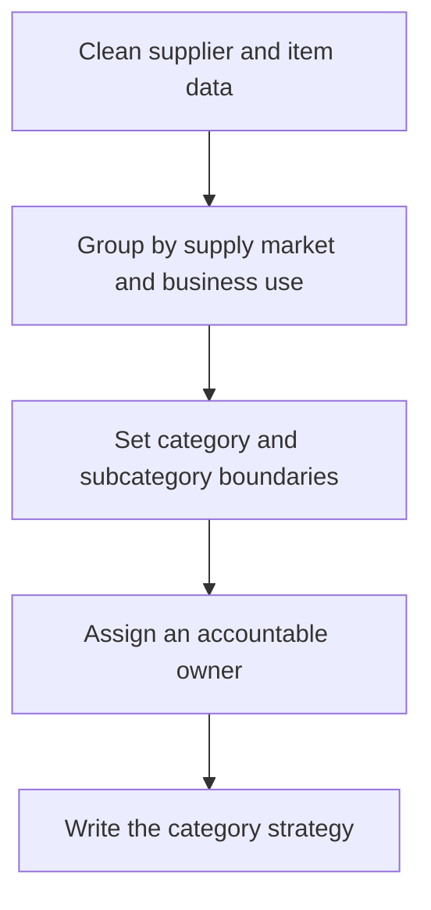

# 2. Category Architecture and Strategy

## Learning objectives

After this topic, you should be able to:

- create useful sourcing categories;
- define category ownership;
- translate classification into action;

## Concept in plain English

A category groups related external spend that can be managed through a common market, capability, demand, or risk strategy. The hierarchy should support decisions, not merely mirror accounting codes.

## Why it matters

Poor categories split leverage, combine unrelated markets, and hide ownership. Useful categories allow common demand forecasting, market research, supplier strategy, and performance review.

## How it works

1. **Clean supplier and item data.** Confirm the decision boundary, inputs, and accountable owner before analysis begins.
2. **Group by supply market and business use.** Use comparable evidence and keep assumptions visible as the decision develops.
3. **Set category and subcategory boundaries.** Use comparable evidence and keep assumptions visible as the decision develops.
4. **Assign an accountable owner.** Use comparable evidence and keep assumptions visible as the decision develops.
5. **Write the category strategy.** Record the result, evidence, residual risk, and next review trigger.

## Realistic example — Rivermark Climate Systems

Rivermark separates electronic controls from electrical commodities. Control boards, firmware-related services, and test fixtures share a constrained technical market; wire and standard connectors follow a broader competitive market.

All names and values in this example are fictional and independently selected for learning purposes.

## Decision logic

- Group spend only when suppliers, drivers, and actions are meaningfully shared.
- Keep hierarchy stable enough for trend analysis.
- Allow controlled cross-category views for risk and sustainability.

## Trade-offs

| Choice tension | Decision implication |
|---|---|
| Broad categories improve leverage but may hide technical differences | Quantify the benefit and the exposure using the same scope and horizon. |
| Narrow categories improve precision but increase administrative effort | Set a guardrail, owner, and review trigger instead of assuming one permanent answer. |

## Commonly confused with

A product family groups what the company sells. A sourcing category groups what the company buys or contracts.

## Common mistakes

- Using supplier name as the category.
- Creating categories so narrow that no strategy is possible.
- Changing the hierarchy without remapping history.

## Original knowledge check

**Question.** What is the best basis for combining purchases into one category?

A. They use the same general ledger account

B. They come from the same incumbent

C. They share a supply market, cost drivers, and sourcing actions

D. They were ordered in the same month

Answer and rationale

### Correct answer

**C. They share a supply market, cost drivers, and sourcing actions**

### Why it is correct

A category exists to enable common market analysis and decisions.

### Why the other answers are wrong

A, B, and D may be convenient reporting attributes but do not prove strategic similarity.

## Practitioner perspective

If one strategy cannot sensibly apply to the grouped spend, the category boundary is probably wrong.

## Related concepts

- [Module 3 overview](../README.md)
- [Section B overview](./README.md)
- [Sourcing and procurement formula sheet](../../calculations/sourcing-procurement/formula-sheet.md)

---

[Previous: Supply-Plan Governance](./01-supply-plan-governance.md) · [Next: Category Portfolio Analysis](./03-portfolio-analysis.md)
