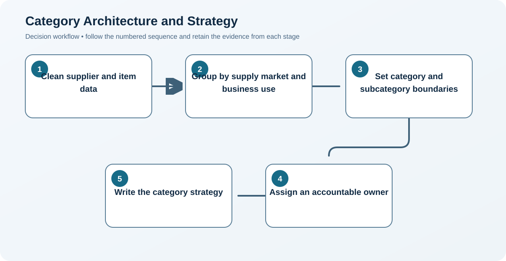
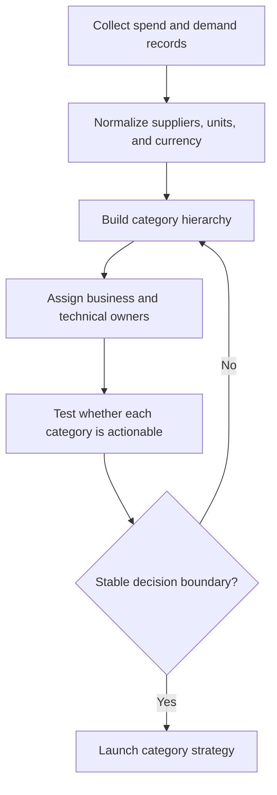

# 2. Category Architecture and Strategy

## Learning objectives

After this topic, you should be able to:

- create useful sourcing categories;
- define category ownership;
- translate classification into action;

## Concept in plain English

A category groups related external spend that can be managed through a common market, capability, demand, or risk strategy. The hierarchy should support decisions, not merely mirror accounting codes.

## Why it matters

Poor categories split leverage, combine unrelated markets, and hide ownership. Useful categories allow common demand forecasting, market research, supplier strategy, and performance review.

## Decision model and workflow

### Evidence retained through the workflow

| Stage | Required evidence or output |
|---|---|
| **1. Clean supplier and item data** | Clean item, supplier, legal-entity, currency, unit, and organizational data |
| **2. Group by supply market and business use** | Category groupings aligned to common supply markets and demand characteristics |
| **3. Set category and subcategory boundaries** | Documented category boundaries, exclusions, subcategories, and ownership rules |
| **4. Assign an accountable owner** | Named category owner with cross-functional contributors and decision authority |
| **5. Write the category strategy** | Category strategy stating baseline, objectives, levers, risks, actions, and measures |

## Practical process flow

## Realistic example — Rivermark Climate Systems

Rivermark separates electronic controls from electrical commodities. Control boards, firmware-related services, and test fixtures share a constrained technical market; wire and standard connectors follow a broader competitive market.

**Decision insight.** Separating control electronics from electrical commodities prevents a high-leverage cable strategy from obscuring constrained firmware and test dependencies.

All names and values in this example are fictional and independently selected for learning purposes.

## Applied decision artifact — category boundary test

A category is useful when its demand shares meaningful cost drivers, supplier markets, specifications, and decision owners. Test each proposed node against those four dimensions. If two items have different qualification rules or supply markets, do not combine them merely because accounting assigned the same commodity code.

Document a category charter with inclusions, exclusions, parent-child hierarchy, spend owner, technical owner, geography, and refresh rule. Reconcile supplier legal entities to parent groups before measuring concentration. The [category-spend dataset](../../assets/data/module-3/section-b/category-spend.csv) illustrates why: 41 supplier records for electronic controls become 29 legal suppliers and 24 parent groups, three materially different measures of source breadth.

## Decision logic

- Group spend only when suppliers, drivers, and actions are meaningfully shared.
- Keep hierarchy stable enough for trend analysis.
- Allow controlled cross-category views for risk and sustainability.

## Trade-offs

| Choice tension | Decision implication |
|---|---|
| Broad categories improve leverage but may hide technical differences | Combine spend only when suppliers, cost drivers, specifications, and negotiation levers are sufficiently similar to support one strategy. |
| Narrow categories improve precision but increase administrative effort | Split a category when technical or market differences change the sourcing approach—not simply to mirror internal organizational charts. |

## Commonly confused with

A product family groups what the company sells. A sourcing category groups what the company buys or contracts.

## Common mistakes

- Using supplier name as the category.
- Creating categories so narrow that no strategy is possible.
- Changing the hierarchy without remapping history.

## Original knowledge check

**Question.** What is the best basis for combining purchases into one category?

A. They use the same general ledger account

B. They come from the same incumbent

C. They share a supply market, cost drivers, and sourcing actions

D. They were ordered in the same month

Answer and rationale

### Correct answer

**C. They share a supply market, cost drivers, and sourcing actions**

### Why it is correct

A category exists to enable common market analysis and decisions.

### Why the other answers are wrong

A, B, and D may be convenient reporting attributes but do not prove strategic similarity.

## Practitioner perspective

If one strategy cannot sensibly apply to the grouped spend, the category boundary is probably wrong.

## Related concepts

- [Module 3 overview](../README.md)
- [Section overview](./README.md)
- [Category-spend dataset](../../assets/data/module-3/section-b/category-spend.csv)
- [Spend Analysis and Supply-Market Intelligence](./06-spend-analysis-and-market-intelligence.md)

---

[Previous: Supply-Plan Governance](./01-supply-plan-governance.md) · [Next: Category Portfolio Analysis](./03-portfolio-analysis.md)
