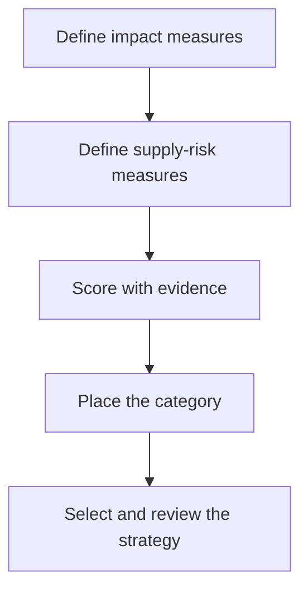

# 3. Category Portfolio Analysis

## Learning objectives

After this topic, you should be able to:

- classify categories by business impact and supply risk;
- select differentiated category actions;
- avoid static quadrant thinking;

## Concept in plain English

Portfolio analysis positions a category using two dimensions: consequence to the business and difficulty of securing supply. The result guides attention, competition, collaboration, continuity, and investment.

## Why it matters

Treating every category alike wastes scarce management capacity. Routine spend should be efficient; constrained and strategically important supply needs deliberate protection.

## How it works

1. **Define impact measures.** Confirm the decision boundary, inputs, and accountable owner before analysis begins.
2. **Define supply-risk measures.** Use comparable evidence and keep assumptions visible as the decision develops.
3. **Score with evidence.** Use comparable evidence and keep assumptions visible as the decision develops.
4. **Place the category.** Use comparable evidence and keep assumptions visible as the decision develops.
5. **Select and review the strategy.** Record the result, evidence, residual risk, and next review trigger.

## Realistic example — Rivermark Climate Systems

Rivermark classifies fasteners as routine, sheet metal as leverage, refrigerant sensors as bottleneck, and compressor assemblies as strategic. The actions differ: automate fasteners, compete sheet metal, secure sensors, and co-plan compressors.

All names and values in this example are fictional and independently selected for learning purposes.

## Decision logic

- Use multiple evidence points rather than one opinion.
- Document why a category sits near a boundary.
- Reassess after design, market, or demand changes.

## Trade-offs

| Choice tension | Decision implication |
|---|---|
| A simple matrix improves focus but compresses nuance | Quantify the benefit and the exposure using the same scope and horizon. |
| Scoring improves consistency but can conceal weak evidence | Set a guardrail, owner, and review trigger instead of assuming one permanent answer. |

## Commonly confused with

High spend does not automatically mean strategic. A low-cost component can be a bottleneck if its absence stops shipment.

## Common mistakes

- Using purchase price as the only impact measure.
- Assuming many suppliers means low risk without qualification checks.
- Keeping the classification unchanged after redesign.

## Original knowledge check

**Question.** A low-cost sensor has one qualified source and stops final shipment when unavailable. How should it be treated?

A. Routine

B. Leverage

C. Bottleneck

D. Ignore because spend is low

Answer and rationale

### Correct answer

**C. Bottleneck**

### Why it is correct

Its financial spend is low, but supply difficulty and operational consequence demand continuity attention.

### Why the other answers are wrong

A and B understate scarcity; D confuses spend with business impact.

## Practitioner perspective

The debate behind the placement is often more valuable than the quadrant label. Record the evidence and uncertainty.

## Related concepts

- [Module 3 overview](../README.md)
- [Section B overview](./README.md)
- [Sourcing and procurement formula sheet](../../calculations/sourcing-procurement/formula-sheet.md)

---

[Previous: Category Architecture and Strategy](./02-category-architecture.md) · [Next: Supplier Attractiveness and Segmentation](./04-supplier-attractiveness-and-segmentation.md)
