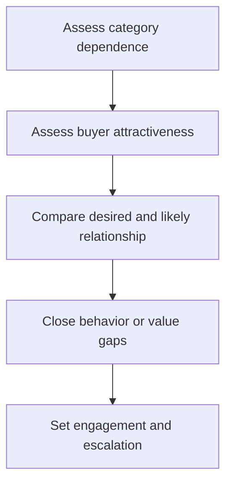

# 4. Supplier Attractiveness and Segmentation

## Learning objectives

After this topic, you should be able to:

- evaluate how a supplier views the buying organization;
- combine category need with customer attractiveness;
- choose realistic engagement tactics;

## Concept in plain English

Supplier segmentation asks both how much the buyer needs the supplier and how attractive the buyer is to that supplier. Volume, growth, strategic fit, behavior, profitability, innovation, and payment reliability shape attention.

## Why it matters

A buyer may label a supplier strategic while remaining a minor, difficult, or unprofitable account. The desired relationship must match mutual incentives.

## How it works

1. **Assess category dependence.** Confirm the decision boundary, inputs, and accountable owner before analysis begins.
2. **Assess buyer attractiveness.** Use comparable evidence and keep assumptions visible as the decision develops.
3. **Compare desired and likely relationship.** Use comparable evidence and keep assumptions visible as the decision develops.
4. **Close behavior or value gaps.** Use comparable evidence and keep assumptions visible as the decision develops.
5. **Set engagement and escalation.** Record the result, evidence, residual risk, and next review trigger.

## Realistic example — Rivermark Climate Systems

Rivermark is a small share of a compressor supplier's revenue but offers entry to an energy-efficient product platform. It earns development attention by sharing a credible three-year roadmap, paying predictably, and reducing engineering-change churn.

All names and values in this example are fictional and independently selected for learning purposes.

## Decision logic

- Use the supplier's perspective, not only internal labels.
- Improve attractiveness through forecast quality, governance, and efficient interaction.
- Avoid demanding strategic behavior under transactional economics.

## Trade-offs

| Choice tension | Decision implication |
|---|---|
| Greater commitment can win attention but reduce flexibility | Quantify the benefit and the exposure using the same scope and horizon. |
| Sharing plans improves coordination but requires data and confidentiality controls | Set a guardrail, owner, and review trigger instead of assuming one permanent answer. |

## Commonly confused with

Category portfolio analysis evaluates what is being sourced. Supplier segmentation evaluates a specific relationship within that category.

## Common mistakes

- Equating high spend with supplier commitment.
- Ignoring poor buyer behavior.
- Calling too many suppliers strategic.

## Original knowledge check

**Question.** What most improves attractiveness to a capacity-constrained supplier?

A. Frequent urgent changes

B. A credible roadmap and reliable commercial behavior

C. Threatening a reverse auction

D. Long approval delays

Answer and rationale

### Correct answer

**B. A credible roadmap and reliable commercial behavior**

### Why it is correct

Predictable value and low friction improve the supplier's economics and confidence.

### Why the other answers are wrong

A, C, and D make the account harder or less reliable.

## Practitioner perspective

Measure the buyer experience. Forecast churn, late approvals, disputes, and delayed payment can destroy leverage that volume alone appears to create.

## Related concepts

- [Module 3 overview](../README.md)
- [Section B overview](./README.md)
- [Sourcing and procurement formula sheet](../../calculations/sourcing-procurement/formula-sheet.md)

---

[Previous: Category Portfolio Analysis](./03-portfolio-analysis.md) · [Next: Supplier Relationship Models](./05-relationship-models.md)
