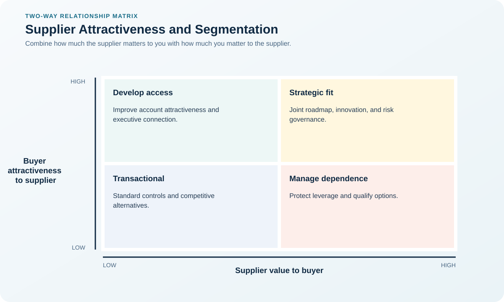
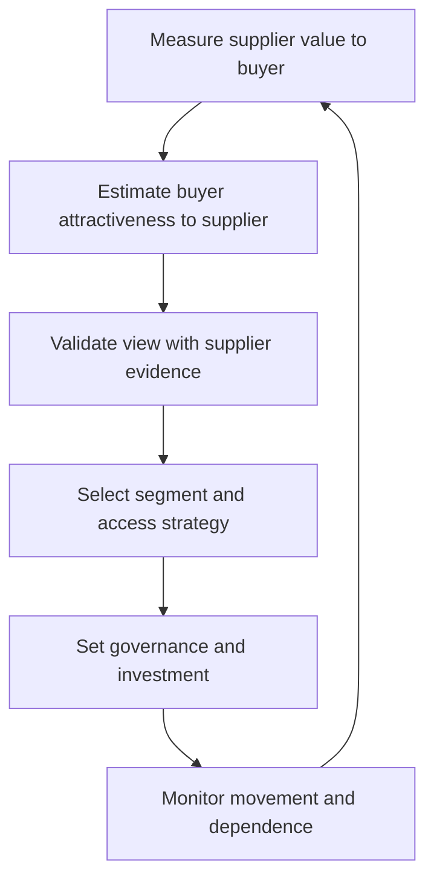

# 4. Supplier Attractiveness and Segmentation

## Learning objectives

After this topic, you should be able to:

- evaluate how a supplier views the buying organization;
- combine category need with customer attractiveness;
- choose realistic engagement tactics;

## Concept in plain English

Supplier segmentation asks both how much the buyer needs the supplier and how attractive the buyer is to that supplier. Volume, growth, strategic fit, behavior, profitability, innovation, and payment reliability shape attention.

## Why it matters

A buyer may label a supplier strategic while remaining a minor, difficult, or unprofitable account. The desired relationship must match mutual incentives.

## Decision model and workflow

### Evidence retained through the workflow

| Stage | Required evidence or output |
|---|---|
| **1. Assess category dependence** | Buyer dependence assessment based on switching time, uniqueness, capacity, and consequence |
| **2. Assess buyer attractiveness** | Supplier view of revenue, growth, profitability, fit, reputation, and ease of doing business |
| **3. Compare desired and likely relationship** | Realistic relationship position compared with the relationship the category requires |
| **4. Close behavior or value gaps** | Improvement actions that increase mutual value or reduce unhealthy dependence |
| **5. Set engagement and escalation** | Engagement model with governance level, information rights, escalation, and review |

## Practical process flow

## Realistic example — Rivermark Climate Systems

Rivermark is a small share of a compressor supplier's revenue but offers entry to an energy-efficient product platform. It earns development attention by sharing a credible three-year roadmap, paying predictably, and reducing engineering-change churn.

**Decision insight.** Rivermark improves its position by making the account easier to serve and strategically relevant, rather than assuming purchase volume alone earns priority.

All names and values in this example are fictional and independently selected for learning purposes.

## Applied decision artifact — two-way segmentation evidence

Build two scores separately. Supplier importance may reflect switching time, technical uniqueness, spend at risk, and customer consequence. Buyer attractiveness may reflect profitable growth, strategic fit, payment behavior, innovation access, and ease of doing business. Do not infer the second score from your own spend alone.

Validate the supplier’s perspective through account plans, executive conversations, capacity-allocation behavior, and comparative growth opportunities. Then prescribe a segment-specific action. A critical supplier that sees the buyer as unattractive needs an access plan; calling the relationship “strategic” does not create attention or capacity. Reassess after acquisitions, volume shifts, payment deterioration, or technology change.

## Decision logic

- Use the supplier's perspective, not only internal labels.
- Improve attractiveness through forecast quality, governance, and efficient interaction.
- Avoid demanding strategic behavior under transactional economics.

## Trade-offs

| Choice tension | Decision implication |
|---|---|
| Greater commitment can win attention but reduce flexibility | Offer credible volume, access, learning, or efficiency benefits in exchange for attention without creating commitments the forecast cannot support. |
| Sharing plans improves coordination but requires data and confidentiality controls | Use staged disclosure, clean-team rules, access controls, and confidentiality terms for roadmap and cost information. |

## Commonly confused with

Category portfolio analysis evaluates what is being sourced. Supplier segmentation evaluates a specific relationship within that category.

## Common mistakes

- Equating high spend with supplier commitment.
- Ignoring poor buyer behavior.
- Calling too many suppliers strategic.

## Original knowledge check

**Question.** What most improves attractiveness to a capacity-constrained supplier?

A. Frequent urgent changes

B. A credible roadmap and reliable commercial behavior

C. Threatening a reverse auction

D. Long approval delays

Answer and rationale

### Correct answer

**B. A credible roadmap and reliable commercial behavior**

### Why it is correct

Predictable value and low friction improve the supplier's economics and confidence.

### Why the other answers are wrong

A, C, and D make the account harder or less reliable.

## Practitioner perspective

Measure the buyer experience. Forecast churn, late approvals, disputes, and delayed payment can destroy leverage that volume alone appears to create.

## Related concepts

- [Module 3 overview](../README.md)
- [Section overview](./README.md)
- [Supplier Relationship Models](./05-relationship-models.md)
- [Principled Negotiation and BATNA](../section-d-supplier-selection-contracting-and-procurement/04-principled-negotiation-and-batna.md)

---

[Previous: Category Portfolio Analysis](./03-portfolio-analysis.md) · [Next: Supplier Relationship Models](./05-relationship-models.md)
