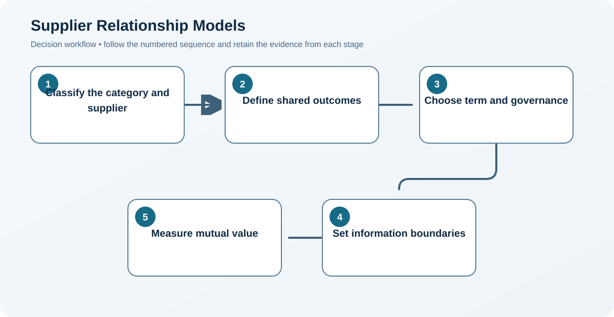

# 5. Supplier Relationship Models

## Learning objectives

After this topic, you should be able to:

- match relationship intensity to need;
- distinguish transactional, preferred, collaborative, and ownership models;
- define information and governance accordingly;

## Concept in plain English

Supplier relationships range from efficient transactions to preferred arrangements, long-term collaboration, joint investment, and ownership. More integration is justified only when mutual value exceeds added governance and dependency.

## Why it matters

Over-collaborating with routine suppliers wastes effort; under-collaborating with strategic suppliers leaves design, capacity, risk, and innovation unmanaged.

## Decision model and workflow

### Evidence retained through the workflow

| Stage | Required evidence or output |
|---|---|
| **1. Classify the category and supplier** | Category and supplier segment supported by dependency and value evidence |
| **2. Define shared outcomes** | Shared outcome statement covering cost, service, innovation, quality, and resilience |
| **3. Choose term and governance** | Commercial term, governance cadence, participants, and escalation matched to need |
| **4. Set information boundaries** | Information-sharing boundary defining purpose, access, retention, and confidentiality |
| **5. Measure mutual value** | Balanced scorecard showing value created and obligations met by both parties |

## Realistic example — Rivermark Climate Systems

Rivermark buys standard fasteners through catalog automation, manages sheet-metal partners as preferred sources, and holds quarterly executive reviews and joint capacity planning with its compressor partner.

**Decision insight.** The three relationship models deliberately match governance cost to business need instead of labeling every major supplier strategic.

All names and values in this example are fictional and independently selected for learning purposes.

## Decision logic

- Match meeting cadence and data sharing to relationship purpose.
- Set exit paths even in collaborative relationships.
- Review whether the relationship still creates mutual value.

## Trade-offs

| Choice tension | Decision implication |
|---|---|
| Closer relationships improve coordination but increase switching cost | Reserve intensive governance for relationships where coordination value exceeds switching and management cost. |
| Transactional competition lowers search cost but may limit innovation | Use competition for comparable supply, but create structured collaboration where joint learning or interdependence drives value. |

## Commonly confused with

A preferred supplier has earned recurring business. A strategic supplier participates in outcomes and decisions that materially affect both parties.

## Common mistakes

- Using strategic as a courtesy label.
- Sharing sensitive information without purpose or controls.
- Maintaining intensive governance after value disappears.

## Original knowledge check

**Question.** Which practice best fits a strategic relationship?

A. Award each order to the lowest bidder

B. Share a governed capacity roadmap and pursue joint improvements

C. Avoid discussing future demand

D. Change suppliers each quarter

Answer and rationale

### Correct answer

**B. Share a governed capacity roadmap and pursue joint improvements**

### Why it is correct

Strategic relationships coordinate longer-term outcomes, information, and improvement.

### Why the other answers are wrong

A and D are transactional behaviors; C prevents coordinated planning.

## Practitioner perspective

Relationship depth should be visible in specific behaviors, decision rights, measures, and investments—not adjectives in a supplier master record.

## Related concepts

- [Module 3 overview](../README.md)
- [Section B overview](./README.md)
- [Sourcing and procurement formula sheet](../../calculations/sourcing-procurement/formula-sheet.md)

---

[Previous: Supplier Attractiveness and Segmentation](./04-supplier-attractiveness-and-segmentation.md) · [Next: Spend Analysis and Supply-Market Intelligence](./06-spend-analysis-and-market-intelligence.md)
