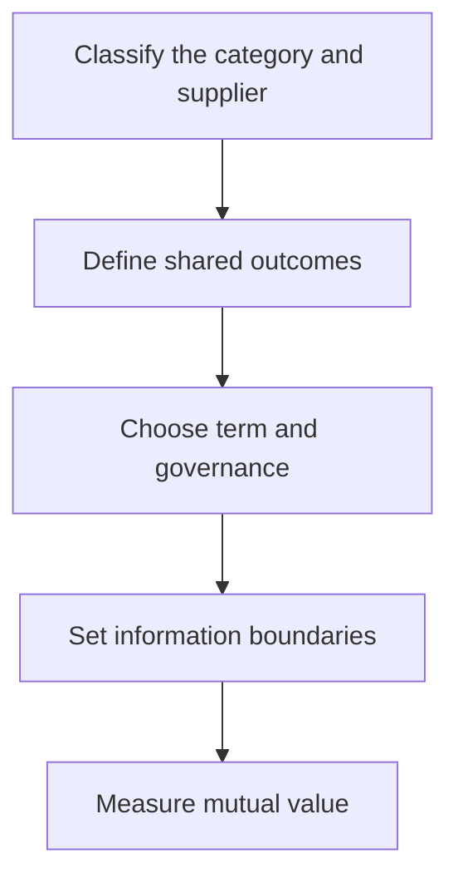

# 5. Supplier Relationship Models

## Learning objectives

After this topic, you should be able to:

- match relationship intensity to need;
- distinguish transactional, preferred, collaborative, and ownership models;
- define information and governance accordingly;

## Concept in plain English

Supplier relationships range from efficient transactions to preferred arrangements, long-term collaboration, joint investment, and ownership. More integration is justified only when mutual value exceeds added governance and dependency.

## Why it matters

Over-collaborating with routine suppliers wastes effort; under-collaborating with strategic suppliers leaves design, capacity, risk, and innovation unmanaged.

## How it works

1. **Classify the category and supplier.** Confirm the decision boundary, inputs, and accountable owner before analysis begins.
2. **Define shared outcomes.** Use comparable evidence and keep assumptions visible as the decision develops.
3. **Choose term and governance.** Use comparable evidence and keep assumptions visible as the decision develops.
4. **Set information boundaries.** Use comparable evidence and keep assumptions visible as the decision develops.
5. **Measure mutual value.** Record the result, evidence, residual risk, and next review trigger.

## Realistic example — Rivermark Climate Systems

Rivermark buys standard fasteners through catalog automation, manages sheet-metal partners as preferred sources, and holds quarterly executive reviews and joint capacity planning with its compressor partner.

All names and values in this example are fictional and independently selected for learning purposes.

## Decision logic

- Match meeting cadence and data sharing to relationship purpose.
- Set exit paths even in collaborative relationships.
- Review whether the relationship still creates mutual value.

## Trade-offs

| Choice tension | Decision implication |
|---|---|
| Closer relationships improve coordination but increase switching cost | Quantify the benefit and the exposure using the same scope and horizon. |
| Transactional competition lowers search cost but may limit innovation | Set a guardrail, owner, and review trigger instead of assuming one permanent answer. |

## Commonly confused with

A preferred supplier has earned recurring business. A strategic supplier participates in outcomes and decisions that materially affect both parties.

## Common mistakes

- Using strategic as a courtesy label.
- Sharing sensitive information without purpose or controls.
- Maintaining intensive governance after value disappears.

## Original knowledge check

**Question.** Which practice best fits a strategic relationship?

A. Award each order to the lowest bidder

B. Share a governed capacity roadmap and pursue joint improvements

C. Avoid discussing future demand

D. Change suppliers each quarter

Answer and rationale

### Correct answer

**B. Share a governed capacity roadmap and pursue joint improvements**

### Why it is correct

Strategic relationships coordinate longer-term outcomes, information, and improvement.

### Why the other answers are wrong

A and D are transactional behaviors; C prevents coordinated planning.

## Practitioner perspective

Relationship depth should be visible in specific behaviors, decision rights, measures, and investments—not adjectives in a supplier master record.

## Related concepts

- [Module 3 overview](../README.md)
- [Section B overview](./README.md)
- [Sourcing and procurement formula sheet](../../calculations/sourcing-procurement/formula-sheet.md)

---

[Previous: Supplier Attractiveness and Segmentation](./04-supplier-attractiveness-and-segmentation.md) · [Next: Spend Analysis and Supply-Market Intelligence](./06-spend-analysis-and-market-intelligence.md)
