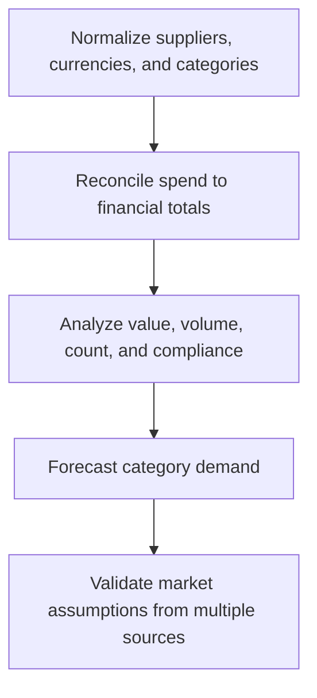

# 6. Spend Analysis and Supply-Market Intelligence

## Learning objectives

After this topic, you should be able to:

- prepare reliable spend data;
- identify concentration and value opportunities;
- combine internal demand with external market evidence;

## Concept in plain English

Spend analysis explains what was bought, from whom, by whom, at what total value, and under which category. Market intelligence adds supplier capacity, cost drivers, technology, regulation, and competitive conditions.

## Why it matters

Unclean supplier names, duplicate records, inconsistent units, and missing categories can create false leverage or hide dependence. Historical spend alone cannot describe future demand or market change.

## How it works

1. **Normalize suppliers, currencies, and categories.** Confirm the decision boundary, inputs, and accountable owner before analysis begins.
2. **Reconcile spend to financial totals.** Use comparable evidence and keep assumptions visible as the decision develops.
3. **Analyze value, volume, count, and compliance.** Use comparable evidence and keep assumptions visible as the decision develops.
4. **Forecast category demand.** Use comparable evidence and keep assumptions visible as the decision develops.
5. **Validate market assumptions from multiple sources.** Record the result, evidence, residual risk, and next review trigger.

## Realistic example — Rivermark Climate Systems

Rivermark initially appears to have 41 electronics suppliers. Entity matching shows 29 legal suppliers, while six names belong to one corporate group. That correction reveals greater concentration in control components than the raw report suggested.

All names and values in this example are fictional and independently selected for learning purposes.

## Decision logic

- Preserve an audit trail from source transaction to analysis.
- Separate legal entity, parent group, and manufacturing site.
- Pair backward-looking spend with forward demand and capacity.

## Trade-offs

| Choice tension | Decision implication |
|---|---|
| More data improves insight but can delay action | Quantify the benefit and the exposure using the same scope and horizon. |
| External intelligence reduces uncertainty but may be costly or time-sensitive | Set a guardrail, owner, and review trigger instead of assuming one permanent answer. |

## Commonly confused with

Spend analysis describes the buyer's transactions. Supply-market analysis describes the external market that could meet future requirements.

## Common mistakes

- Using invoice value without unit or quantity context.
- Counting duplicate supplier records as diversification.
- Treating one market forecast as fact.

## Original knowledge check

**Question.** Why should supplier records be linked to parent companies?

A. To make the supplier count larger

B. To reveal hidden economic and continuity concentration

C. To eliminate category ownership

D. To avoid reconciling spend

Answer and rationale

### Correct answer

**B. To reveal hidden economic and continuity concentration**

### Why it is correct

Several legal entities or sites may share one parent and common risks.

### Why the other answers are wrong

A misstates the goal, while C and D weaken governance.

## Practitioner perspective

Publish data-confidence notes with every spend dashboard. Decision makers need to know which conclusions are robust and which need investigation.

## Related concepts

- [Module 3 overview](../README.md)
- [Section B overview](./README.md)
- [Sourcing and procurement formula sheet](../../calculations/sourcing-procurement/formula-sheet.md)

---

[Previous: Supplier Relationship Models](./05-relationship-models.md) · [Next: Supply-Base Right-Sizing](./07-supply-base-right-sizing.md)
