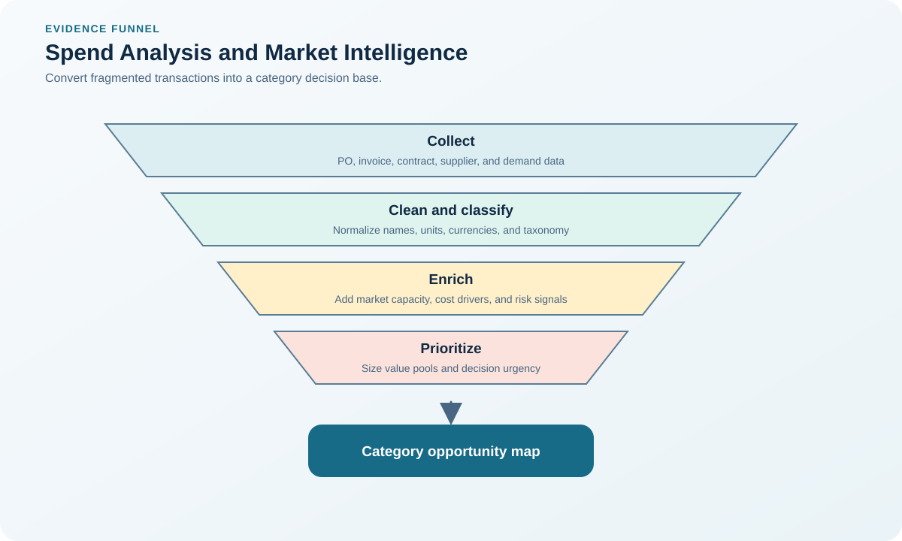
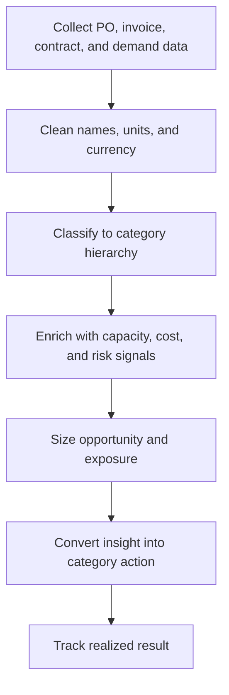

# 6. Spend Analysis and Supply-Market Intelligence

## Learning objectives

After this topic, you should be able to:

- prepare reliable spend data;
- identify concentration and value opportunities;
- combine internal demand with external market evidence;

## Concept in plain English

Spend analysis explains what was bought, from whom, by whom, at what total value, and under which category. Market intelligence adds supplier capacity, cost drivers, technology, regulation, and competitive conditions.

## Why it matters

Unclean supplier names, duplicate records, inconsistent units, and missing categories can create false leverage or hide dependence. Historical spend alone cannot describe future demand or market change.

## Decision model and workflow

### Evidence retained through the workflow

| Stage | Required evidence or output |
|---|---|
| **1. Normalize suppliers, currencies, and categories** | Normalized supplier hierarchy, category, currency, unit, and organizational records |
| **2. Reconcile spend to financial totals** | Reconciliation to accounts payable and general-ledger totals with exclusions explained |
| **3. Analyze value, volume, count, and compliance** | Views of spend, volume, price variance, transaction count, concentration, and compliance |
| **4. Forecast category demand** | Forward demand profile including design changes, projects, growth, and service obligations |
| **5. Validate market assumptions from multiple sources** | Market fact base triangulated across suppliers, indices, public data, and internal experts |

## Practical process flow

## Realistic example — Rivermark Climate Systems

Rivermark initially appears to have 41 electronics suppliers. Entity matching shows 29 legal suppliers, while six names belong to one corporate group. That correction reveals greater concentration in control components than the raw report suggested.

**Decision insight.** Entity resolution changes the risk conclusion: nominal supplier count falls, corporate concentration rises, and continuity actions move ahead of price negotiations.

All names and values in this example are fictional and independently selected for learning purposes.

## Worked decision — spend concentration baseline

From the [category-spend dataset](../../assets/data/module-3/section-b/category-spend.csv), total annual spend is:

`$8.40m + $6.20m + $4.10m + $0.98m + $0.42m + $0.76m = $20.86m`

Compressor assemblies therefore represent `$8.40m ÷ $20.86m = 40.27%` of covered spend. That concentration is an inquiry trigger, not an automatic savings target. Enrich it with capacity, cost drivers, qualification lead time, and parent-company exposure.

The analysis output should name the decision it enables—for example, capacity reservation, specification harmonization, competitive event, index formula, or risk mitigation—and a baseline against which finance can verify realized value. A dashboard without an action owner remains descriptive reporting.

## Decision logic

- Preserve an audit trail from source transaction to analysis.
- Separate legal entity, parent group, and manufacturing site.
- Pair backward-looking spend with forward demand and capacity.

## Trade-offs

| Choice tension | Decision implication |
|---|---|
| More data improves insight but can delay action | Begin decisions once data is decision-fit, while tracking unresolved gaps by materiality instead of waiting for impossible perfection. |
| External intelligence reduces uncertainty but may be costly or time-sensitive | Time-stamp market intelligence, identify its source and confidence, and retest it before irreversible commitments. |

## Commonly confused with

Spend analysis describes the buyer's transactions. Supply-market analysis describes the external market that could meet future requirements.

## Common mistakes

- Using invoice value without unit or quantity context.
- Counting duplicate supplier records as diversification.
- Treating one market forecast as fact.

## Original knowledge check

**Question.** Why should supplier records be linked to parent companies?

A. To make the supplier count larger

B. To reveal hidden economic and continuity concentration

C. To eliminate category ownership

D. To avoid reconciling spend

Answer and rationale

### Correct answer

**B. To reveal hidden economic and continuity concentration**

### Why it is correct

Several legal entities or sites may share one parent and common risks.

### Why the other answers are wrong

A misstates the goal, while C and D weaken governance.

## Practitioner perspective

Publish data-confidence notes with every spend dashboard. Decision makers need to know which conclusions are robust and which need investigation.

## Related concepts

- [Module 3 overview](../README.md)
- [Section overview](./README.md)
- [Category-spend dataset](../../assets/data/module-3/section-b/category-spend.csv)
- [Category Architecture and Strategy](./02-category-architecture.md)
- [Sourcing and procurement formula sheet](../../calculations/sourcing-procurement/formula-sheet.md)

---

[Previous: Supplier Relationship Models](./05-relationship-models.md) · [Next: Supply-Base Right-Sizing](./07-supply-base-right-sizing.md)
