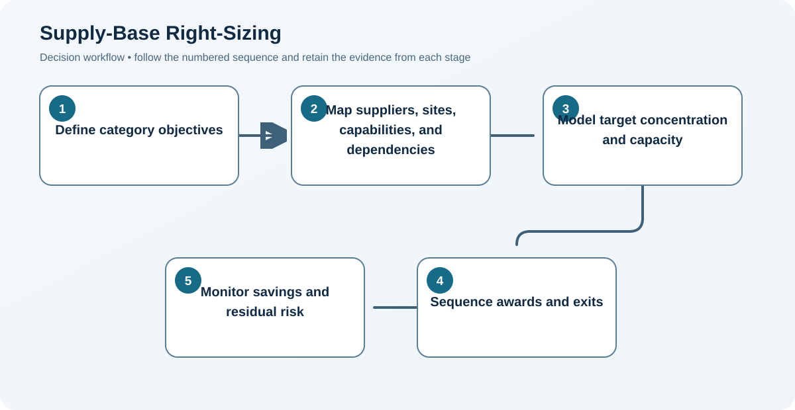

# 7. Supply-Base Right-Sizing

## Learning objectives

After this topic, you should be able to:

- determine an appropriate supplier count;
- balance efficiency with continuity and competition;
- sequence consolidation responsibly;

## Concept in plain English

Right-sizing seeks the supplier base that best supports cost, capacity, innovation, resilience, and governance. It may consolidate fragmented spend, add alternate sources, or replace weak sources.

## Why it matters

Fewer suppliers can reduce transaction cost and increase leverage, but excessive consolidation creates capacity, bargaining, geographic, and recovery risk.

## Decision workflow

### Evidence retained at each stage

| Stage | Required evidence or output |
|---|---|
| **1. Define category objectives** | Category objectives for cost, innovation, capacity, service, resilience, and administration |
| **2. Map suppliers, sites, capabilities, and dependencies** | Supplier-site network including ownership, common subtiers, tooling, technology, and geography |
| **3. Model target concentration and capacity** | Target award shares tested against capacity, dependency, qualification, and failure scenarios |
| **4. Sequence awards and exits** | Sequenced award, development, qualification, transition, and exit plan |
| **5. Monitor savings and residual risk** | Benefits and risk dashboard covering concentration, utilization, switching readiness, and health |

## Realistic example — Rivermark Climate Systems

Rivermark reduces fabricated-enclosure suppliers from nine to five but keeps two qualified geographic regions and no supplier above 45% of category volume. For the single-source sensor, right-sizing means adding—not removing—a second qualified source.

**Decision insight.** The five-supplier design reduces administrative load while the regional and share caps prevent savings from creating a single failure point.

All names and values in this example are fictional and independently selected for learning purposes.

## Decision logic

- Set target counts by category rather than enterprise slogan.
- Measure concentration at parent, site, material, and tooling levels.
- Retain competition and recovery capacity where consequences justify it.

## Trade-offs

| Choice tension | Decision implication |
|---|---|
| Consolidation lowers administrative cost but increases exposure | Consolidate only after modeling the loss of a supplier, site, region, or shared subtier at the proposed award shares. |
| Dual sourcing improves continuity but divides learning and volume | Use dual sourcing when independent qualified capacity justifies its cost; otherwise maintain a credible alternate process or recovery plan. |

## Commonly confused with

Rationalization does not always mean reduction. The correct size may be larger when resilience is inadequate.

## Common mistakes

- Applying an arbitrary percentage-reduction target.
- Dropping small suppliers without capability review.
- Claiming savings before transition cost and volume commitments are secured.

## Original knowledge check

**Question.** When can adding a supplier be a right-sizing action?

A. Never

B. When one qualified source creates unacceptable continuity risk

C. Whenever a buyer wants more quotations

D. Only when spend increases

Answer and rationale

### Correct answer

**B. When one qualified source creates unacceptable continuity risk**

### Why it is correct

Right-sizing optimizes the supply base; it is not synonymous with shrinking it.

### Why the other answers are wrong

A is false, while C and D do not establish a strategic need.

## Practitioner perspective

Track residual risk after consolidation. Savings are incomplete if the organization quietly accepts a recovery exposure it cannot tolerate.

## Related concepts

- [Module 3 overview](../README.md)
- [Section B overview](./README.md)
- [Sourcing and procurement formula sheet](../../calculations/sourcing-procurement/formula-sheet.md)

---

[Previous: Spend Analysis and Supply-Market Intelligence](./06-spend-analysis-and-market-intelligence.md) · [Section review](./08-section-b-review.md)
