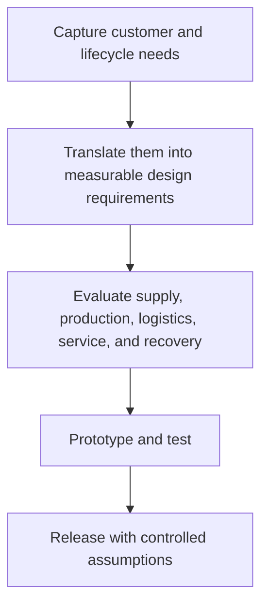

# 1. Product Design as a Supply-Chain Lever

## Learning objectives

After this topic, you should be able to:

- connect early design choices to lifecycle performance;
- identify supply-chain design requirements;
- use decision gates before cost is locked;

## Concept in plain English

Product design determines materials, parts, tolerances, tooling, process choices, packaging, serviceability, customization, and end-of-life options. These choices shape cost and responsiveness long before purchase orders are issued.

## Why it matters

Late sourcing pressure cannot fully overcome an expensive or fragile design. The earlier the team changes complexity, material choice, or architecture, the lower the disruption and rework cost.

## How it works

1. **Capture customer and lifecycle needs.** Confirm the decision boundary, inputs, and accountable owner before analysis begins.
2. **Translate them into measurable design requirements.** Use comparable evidence and keep assumptions visible as the decision develops.
3. **Evaluate supply, production, logistics, service, and recovery.** Use comparable evidence and keep assumptions visible as the decision develops.
4. **Prototype and test.** Use comparable evidence and keep assumptions visible as the decision develops.
5. **Release with controlled assumptions.** Record the result, evidence, residual risk, and next review trigger.

## Realistic example — Rivermark Climate Systems

Rivermark's first heat-pump enclosure used a custom depth that reduced container utilization and required unique packaging. A 30 mm design change preserves performance while improving pallet density and eliminating one packaging size.

All names and values in this example are fictional and independently selected for learning purposes.

## Decision logic

- Make supply-chain acceptance criteria part of design gates.
- Compare lifecycle outcome, not engineering cost alone.
- Record deliberate exceptions and their operating consequences.

## Trade-offs

| Choice tension | Decision implication |
|---|---|
| Early cross-functional work lengthens discovery but reduces downstream loops | Quantify the benefit and the exposure using the same scope and horizon. |
| Common designs improve scale but can limit differentiation | Set a guardrail, owner, and review trigger instead of assuming one permanent answer. |

## Commonly confused with

Design cost is the expense of creating the design. Cost committed by design is the much larger downstream consequence of design choices.

## Common mistakes

- Inviting supply-chain functions after drawings are frozen.
- Optimizing product function without service and return needs.
- Treating packaging as a post-design task.

## Original knowledge check

**Question.** When is a logistics-driven design change usually cheapest?

A. After full-rate production

B. After customer returns rise

C. Before architecture and tooling are frozen

D. After the supplier contract expires

Answer and rationale

### Correct answer

**C. Before architecture and tooling are frozen**

### Why it is correct

Early design stages retain options and avoid tooling, inventory, and qualification rework.

### Why the other answers are wrong

A, B, and D occur after significant cost and constraints have accumulated.

## Practitioner perspective

Add one question to every gate: what operating burden does this design create for the next ten years?

## Related concepts

- [Module 3 overview](../README.md)
- [Section C overview](./README.md)
- [Sourcing and procurement formula sheet](../../calculations/sourcing-procurement/formula-sheet.md)

---

[Section overview](./README.md) · [Next: Collaborative Design and Early Involvement](./02-collaborative-design-and-early-involvement.md)
