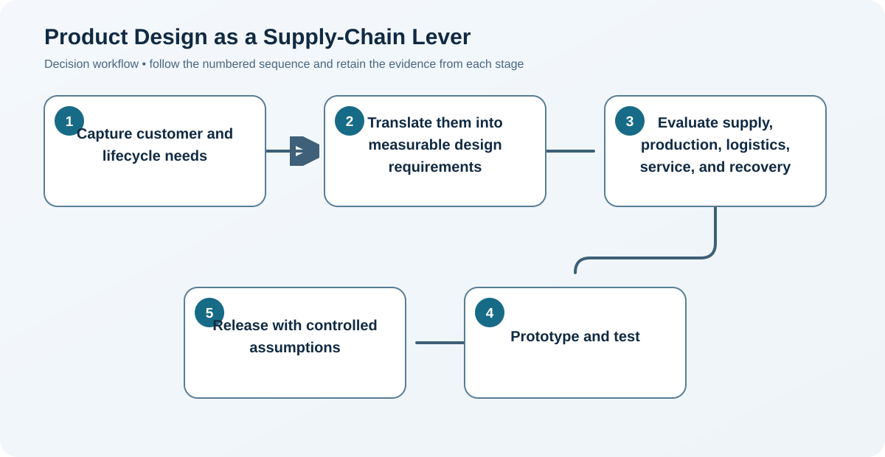
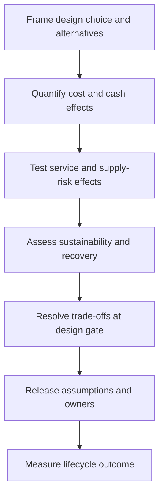

# 1. Product Design as a Supply-Chain Lever

## Learning objectives

After this topic, you should be able to:

- connect early design choices to lifecycle performance;
- identify supply-chain design requirements;
- use decision gates before cost is locked;

## Concept in plain English

Product design determines materials, parts, tolerances, tooling, process choices, packaging, serviceability, customization, and end-of-life options. These choices shape cost and responsiveness long before purchase orders are issued.

## Why it matters

Late sourcing pressure cannot fully overcome an expensive or fragile design. The earlier the team changes complexity, material choice, or architecture, the lower the disruption and rework cost.

## Decision model and workflow

### Evidence retained through the workflow

| Stage | Required evidence or output |
|---|---|
| **1. Capture customer and lifecycle needs** | Prioritized customer, safety, regulatory, service, and lifecycle needs |
| **2. Translate them into measurable design requirements** | Measurable design requirements with targets, tolerance, and verification methods |
| **3. Evaluate supply, production, logistics, service, and recovery** | Cross-functional lifecycle assessment of supply, production, logistics, use, service, and recovery |
| **4. Prototype and test** | Prototype evidence showing performance, manufacturability, handling, and failure behavior |
| **5. Release with controlled assumptions** | Released design baseline with assumptions, residual risks, owners, and change controls |

## Practical process flow

## Realistic example — Rivermark Climate Systems

Rivermark's first heat-pump enclosure used a custom depth that reduced container utilization and required unique packaging. A 30 mm design change preserves performance while improving pallet density and eliminating one packaging size.

**Decision insight.** A small dimensional change creates recurring logistics and packaging savings because it is made before tooling and qualification lock the geometry.

All names and values in this example are fictional and independently selected for learning purposes.

## Applied decision artifact — lifecycle design scorecard

At each architecture gate, compare alternatives using the same demand, service, and lifecycle horizon. The scorecard should show unit material and conversion cost, inventory and working-capital effect, source options, lead time, service labor, field failure, packaging and transport, energy, and end-of-life route.

Keep cash, risk, and environmental measures separate rather than forcing them into one opaque score. Record the design owner for every assumption and the evidence needed before release. A choice that saves recurring cost but creates a large conversion expense or validation risk should display payback and milestone risk explicitly. The [design-alternatives dataset](../../assets/data/module-3/section-c/design-alternatives.csv) provides that trade-off rather than a uniformly dominant option.

## Decision logic

- Make supply-chain acceptance criteria part of design gates.
- Compare lifecycle outcome, not engineering cost alone.
- Record deliberate exceptions and their operating consequences.

## Trade-offs

| Choice tension | Decision implication |
|---|---|
| Early cross-functional work lengthens discovery but reduces downstream loops | Invest more analysis before architecture freeze, when alternatives are inexpensive and lifecycle commitments are still reversible. |
| Common designs improve scale but can limit differentiation | Standardize hidden interfaces and non-differentiating elements while protecting features customers actually value. |

## Commonly confused with

Design cost is the expense of creating the design. Cost committed by design is the much larger downstream consequence of design choices.

## Common mistakes

- Inviting supply-chain functions after drawings are frozen.
- Optimizing product function without service and return needs.
- Treating packaging as a post-design task.

## Original knowledge check

**Question.** When is a logistics-driven design change usually cheapest?

A. After full-rate production

B. After customer returns rise

C. Before architecture and tooling are frozen

D. After the supplier contract expires

Answer and rationale

### Correct answer

**C. Before architecture and tooling are frozen**

### Why it is correct

Early design stages retain options and avoid tooling, inventory, and qualification rework.

### Why the other answers are wrong

A, B, and D occur after significant cost and constraints have accumulated.

## Practitioner perspective

Add one question to every gate: what operating burden does this design create for the next ten years?

## Related concepts

- [Module 3 overview](../README.md)
- [Section overview](./README.md)
- [Design-alternatives dataset](../../assets/data/module-3/section-c/design-alternatives.csv)
- [Landed Cost and Total Cost of Ownership](../section-a-sourcing-alignment-and-total-cost/06-landed-cost-and-total-cost-of-ownership.md)

---

[Section overview](./README.md) · [Next: Collaborative Design and Early Involvement](./02-collaborative-design-and-early-involvement.md)
