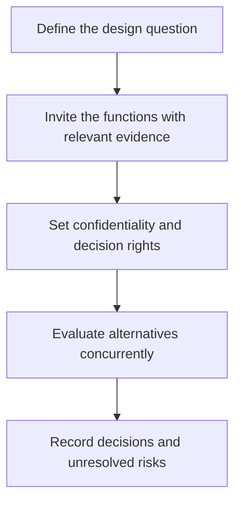
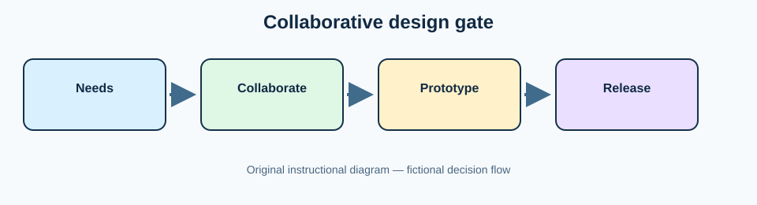

# 2. Collaborative Design and Early Involvement

## Learning objectives

After this topic, you should be able to:

- replace sequential handoffs with concurrent decisions;
- choose appropriate supplier and customer involvement;
- protect decision ownership and information;

## Concept in plain English

Collaborative design brings engineering, commercial, quality, operations, sourcing, logistics, service, customers, and selected suppliers into the design process at the decisions they can improve.

## Why it matters

Sequential handoffs discover unavailable materials, impractical tolerances, packaging waste, and service problems after change becomes expensive.

## How it works

1. **Define the design question.** Confirm the decision boundary, inputs, and accountable owner before analysis begins.
2. **Invite the functions with relevant evidence.** Use comparable evidence and keep assumptions visible as the decision develops.
3. **Set confidentiality and decision rights.** Use comparable evidence and keep assumptions visible as the decision develops.
4. **Evaluate alternatives concurrently.** Use comparable evidence and keep assumptions visible as the decision develops.
5. **Record decisions and unresolved risks.** Record the result, evidence, residual risk, and next review trigger.

## Original diagram

## Realistic example — Rivermark Climate Systems

A Rivermark valve supplier identifies that a specified alloy creates a 22-week lead time. Engineering, quality, sourcing, and the supplier qualify an equivalent grade before prototype freeze, reducing lead time without weakening corrosion performance.

All names and values in this example are fictional and independently selected for learning purposes.

## Decision logic

- Involve partners according to capability and category importance.
- Retain final design accountability with the brand owner.
- Separate idea access from unrestricted data access.

## Trade-offs

| Choice tension | Decision implication |
|---|---|
| More voices improve feasibility but can slow decisions without clear ownership | Quantify the benefit and the exposure using the same scope and horizon. |
| Supplier involvement adds expertise but may create lock-in | Set a guardrail, owner, and review trigger instead of assuming one permanent answer. |

## Commonly confused with

Early supplier involvement is focused participation in design. Supplier selection is the broader evaluation and award decision.

## Common mistakes

- Inviting everyone to every meeting.
- Allowing an incumbent to define proprietary interfaces unnecessarily.
- Rewarding functions only for local design metrics.

## Original knowledge check

**Question.** What control is most important when a supplier joins design work?

A. Give the supplier final design authority

B. Define scope, information access, deliverables, and decision rights

C. Avoid documenting discussions

D. Guarantee the production award

Answer and rationale

### Correct answer

**B. Define scope, information access, deliverables, and decision rights**

### Why it is correct

Governed collaboration captures expertise without surrendering accountability or creating hidden commitments.

### Why the other answers are wrong

A and D create inappropriate dependence; C weakens traceability.

## Practitioner perspective

Invite expertise before commitment, but keep interfaces, requirements, and ownership explicit.

## Related concepts

- [Module 3 overview](../README.md)
- [Section C overview](./README.md)
- [Sourcing and procurement formula sheet](../../calculations/sourcing-procurement/formula-sheet.md)

---

[Previous: Product Design as a Supply-Chain Lever](./01-design-as-economic-lever.md) · [Next: Design for Supply Chain and Logistics](./03-design-for-supply-chain-and-logistics.md)
