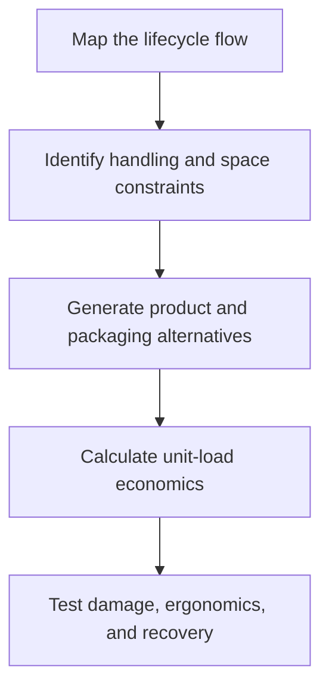

# 3. Design for Supply Chain and Logistics

## Learning objectives

After this topic, you should be able to:

- design products and flows together;
- reduce handling, storage, and transport burden;
- recognize cube-versus-weight trade-offs;

## Concept in plain English

Design for supply chain evaluates how a product will be sourced, made, moved, stored, sold, serviced, returned, and recovered. Design for logistics focuses particularly on packaging, unitization, handling, transport, and storage.

## Why it matters

A small dimensional, weight, labeling, or packaging choice can change pallet density, handling equipment, damage, mode, warehouse capacity, and reverse-flow cost.

## How it works

1. **Map the lifecycle flow.** Confirm the decision boundary, inputs, and accountable owner before analysis begins.
2. **Identify handling and space constraints.** Use comparable evidence and keep assumptions visible as the decision develops.
3. **Generate product and packaging alternatives.** Use comparable evidence and keep assumptions visible as the decision develops.
4. **Calculate unit-load economics.** Use comparable evidence and keep assumptions visible as the decision develops.
5. **Test damage, ergonomics, and recovery.** Record the result, evidence, residual risk, and next review trigger.

## Realistic example — Rivermark Climate Systems

Rivermark redesigns service kits so four kits fit one standard tote instead of three. Annual outbound cartons fall by 6,400, but the team validates that extra density does not exceed manual-handling limits.

All names and values in this example are fictional and independently selected for learning purposes.

## Decision logic

- Optimize the complete unit load, not the product alone.
- Check both volume-limited and weight-limited lanes.
- Include return, spare-part, and field-service flows.

## Trade-offs

| Choice tension | Decision implication |
|---|---|
| Higher density lowers freight but may increase damage or ergonomic risk | Quantify the benefit and the exposure using the same scope and horizon. |
| Reusable packaging reduces waste but needs return-loop control | Set a guardrail, owner, and review trigger instead of assuming one permanent answer. |

## Commonly confused with

Unitization combines items into a handled load. Standardization reduces unnecessary variation in products, parts, or processes.

## Common mistakes

- Calculating freight only after dimensions are frozen.
- Maximizing pallet count without checking weight.
- Ignoring empty-return cost for reusable packaging.

## Original knowledge check

**Question.** A truck reaches its legal weight before its volume is full. Which constraint dominates?

A. Cube

B. Weight

C. Supplier count

D. Forecast bias

Answer and rationale

### Correct answer

**B. Weight**

### Why it is correct

The lane is weight-limited, so additional density cannot add payload without exceeding the limit.

### Why the other answers are wrong

A describes a volume-limited move; C and D are unrelated.

## Practitioner perspective

Put a pallet, container, service van, and return box into the virtual design room—not just the product model.

## Related concepts

- [Module 3 overview](../README.md)
- [Section C overview](./README.md)
- [Sourcing and procurement formula sheet](../../calculations/sourcing-procurement/formula-sheet.md)

---

[Previous: Collaborative Design and Early Involvement](./02-collaborative-design-and-early-involvement.md) · [Next: Standardization, Commonality, and Universality](./04-standardization-commonality-and-universality.md)
