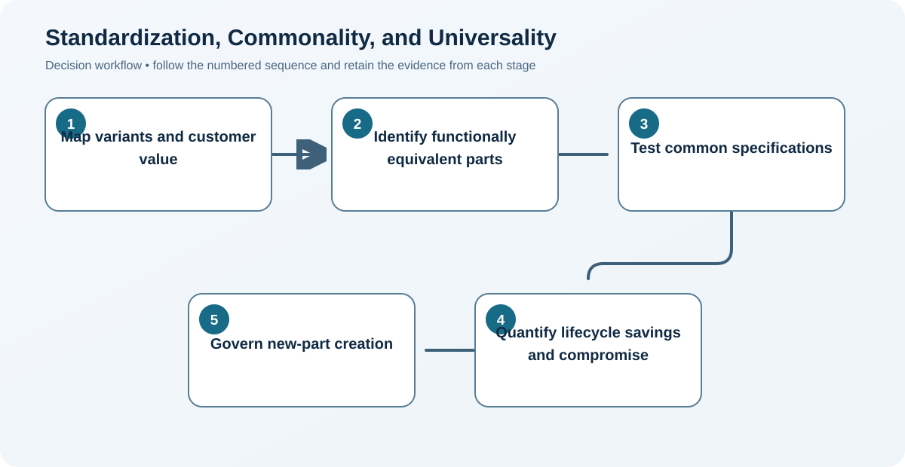

# 4. Standardization, Commonality, and Universality

## Learning objectives

After this topic, you should be able to:

- distinguish three forms of reuse;
- quantify variety reduction;
- preserve customer value while removing complexity;

## Concept in plain English

Standardization establishes common specifications. Component commonality uses one part across multiple applications. Universality designs an offering or component for several markets with minimal adaptation.

## Why it matters

Fewer unique items increase volume leverage, forecast pooling, interchangeability, learning, and service availability while reducing setup, inventory, and error.

## Decision workflow

### Evidence retained at each stage

| Stage | Required evidence or output |
|---|---|
| **1. Map variants and customer value** | Variant-to-customer-value map showing which differences earn value and which are historical |
| **2. Identify functionally equivalent parts** | Functionally equivalent parts and specifications identified across products and regions |
| **3. Test common specifications** | Common design tested for performance, regulation, environment, interfaces, and failure consequence |
| **4. Quantify lifecycle savings and compromise** | Lifecycle business case covering scale, inventory, tooling, service, qualification, and compromise |
| **5. Govern new-part creation** | Part-creation governance with reuse search, approval authority, ownership, and retirement rules |

## Realistic example — Rivermark Climate Systems

Rivermark replaces five low-voltage connectors with two keyed families and selects a universal power-input module. The change removes 14 stocked service combinations while preserving regional cable differences.

**Decision insight.** The design removes 14 service combinations without pretending regional cable and regulatory differences can be eliminated.

All names and values in this example are fictional and independently selected for learning purposes.

## Decision logic

- Standardize invisible complexity before visible customer differentiation.
- Use total lifecycle savings, including inventory and service.
- Allow exceptions when performance or regulation truly requires them.

## Trade-offs

| Choice tension | Decision implication |
|---|---|
| Commonality improves scale but a common failure can affect more products | Reduce the blast radius of common failures through qualification, traceability, controlled change, and alternate-compatible designs. |
| Universality expands reach but may be suboptimal in individual markets | Accept a universal design only when lifecycle simplification outweighs efficiency, cost, or performance compromises in individual markets. |

## Commonly confused with

Standardization defines common rules; commonality is reuse of a specific component; universality extends usability across markets.

## Common mistakes

- Standardizing around an obsolete design.
- Counting part-number reduction without conversion cost.
- Assuming customers value every existing variation.

## Original knowledge check

**Question.** What is the strongest candidate for component commonality?

A. A visible feature customers use to differentiate models

B. Two hidden brackets with the same functional load and interface

C. A country-specific safety label

D. A patented premium control algorithm

Answer and rationale

### Correct answer

**B. Two hidden brackets with the same functional load and interface**

### Why it is correct

Functionally equivalent, non-differentiating parts offer reuse with little customer compromise.

### Why the other answers are wrong

A and D may create differentiation; C must reflect local requirements.

## Practitioner perspective

Make the cost of variety visible at every new-part approval: engineering, qualification, procurement, planning, inventory, service, and disposal.

## Related concepts

- [Module 3 overview](../README.md)
- [Section C overview](./README.md)
- [Sourcing and procurement formula sheet](../../calculations/sourcing-procurement/formula-sheet.md)

---

[Previous: Design for Supply Chain and Logistics](./03-design-for-supply-chain-and-logistics.md) · [Next: Modular versus Integral Design](./05-modular-versus-integral-design.md)
