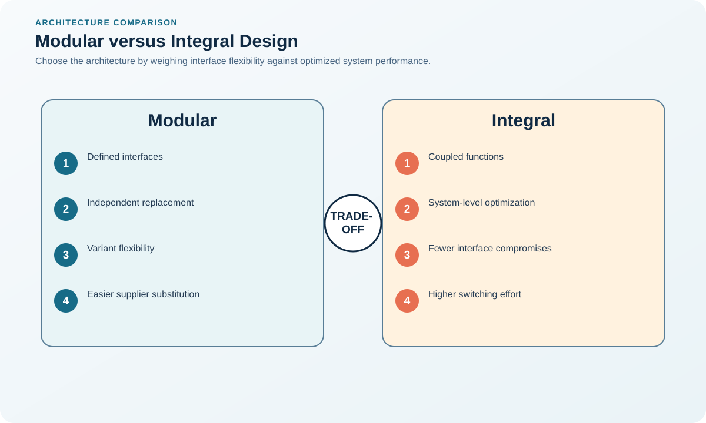

# 5. Modular versus Integral Design

## Learning objectives

After this topic, you should be able to:

- compare modular and integral architectures;
- select stable interfaces;
- connect modularity to customization and sourcing;

## Concept in plain English

Modular design creates defined interfaces so components can be reused, configured, upgraded, or supplied with relative independence. Integral design optimizes tightly coupled components as one system.

## Why it matters

Modularity can delay differentiation and broaden sourcing options; integral design can achieve superior compactness, performance, appearance, or user experience.

## Decision model and workflow

### Evidence retained through the workflow

| Stage | Required evidence or output |
|---|---|
| **1. Identify customer variation and technical coupling** | Customer-variation map and technical-coupling analysis across functions and components |
| **2. Define stable interfaces** | Stable mechanical, electrical, software, data, and service interface specifications |
| **3. Allocate functions to modules** | Function-to-module allocation with ownership, sourcing, testing, and change boundaries |
| **4. Test configuration and failure interactions** | Configuration, tolerance-stack, failure-interaction, performance, and safety test evidence |
| **5. Govern interface changes** | Interface governance controlling versions, compatibility, deviations, and release timing |

## Realistic example — Rivermark Climate Systems

Rivermark creates common compressor, control, and enclosure interfaces across three capacities. The acoustic treatment remains integral because its geometry depends on each enclosure and performance tier.

**Decision insight.** Rivermark modularizes interfaces that support scale and configuration but keeps acoustics integral where geometry and performance are inseparable.

All names and values in this example are fictional and independently selected for learning purposes.

## Decision logic

- Modularize where variation, upgrade, service, or sourcing flexibility creates value.
- Use integral design where tight coupling materially improves performance.
- Protect interface ownership and compatibility testing.

## Trade-offs

| Choice tension | Decision implication |
|---|---|
| Modules accelerate variety but can add size, connectors, and unit cost | Use modularity where variety, replacement, parallel development, or postponement value exceeds connector, space, and interface cost. |
| Integral systems optimize performance but increase change propagation and dependence | Keep tightly coupled performance elements integral while protecting supply and service through knowledge, tooling, and recovery controls. |

## Commonly confused with

A module is not simply an assembly. It needs a purposeful boundary and interface that support reuse or controlled substitution.

## Common mistakes

- Calling every subassembly modular.
- Changing interfaces without backward-compatibility analysis.
- Assuming modular automatically means multi-source.

## Original knowledge check

**Question.** Which condition most favors modular architecture?

A. Functions are inseparable and space is extremely constrained

B. Customers value configurable combinations and field upgrades

C. One optimized geometry drives all performance

D. Interfaces change every project

Answer and rationale

### Correct answer

**B. Customers value configurable combinations and field upgrades**

### Why it is correct

Stable modules enable configuration, postponement, and upgrade without redesigning the full system.

### Why the other answers are wrong

A and C favor integration; D undermines modular reuse.

## Practitioner perspective

The interface is the strategic asset. Weak interface governance turns modularity into compatibility risk.

## Related concepts

- [Module 3 overview](../README.md)
- [Section C overview](./README.md)
- [Sourcing and procurement formula sheet](../../calculations/sourcing-procurement/formula-sheet.md)

---

[Previous: Standardization, Commonality, and Universality](./04-standardization-commonality-and-universality.md) · [Next: Simplification, DFMA, and Serviceability](./06-simplification-dfma-and-serviceability.md)
