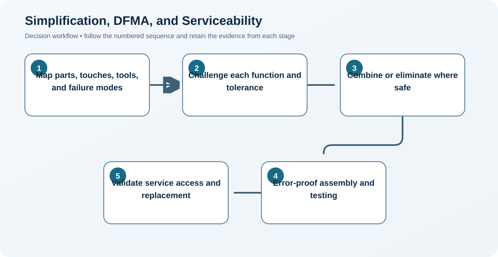

# 6. Simplification, DFMA, and Serviceability

## Learning objectives

After this topic, you should be able to:

- remove non-value complexity;
- apply design-for-manufacture-and-assembly reasoning;
- design for safe and fast service;

## Concept in plain English

Simplification removes unnecessary parts, steps, adjustments, and choices. Design for manufacture and assembly makes production and assembly easy and repeatable. Serviceability extends that thinking through maintenance, diagnosis, access, and replacement.

## Why it matters

Complexity increases touches, training, defects, setup, tools, spare parts, and repair time. A part removed cannot be purchased incorrectly, installed backward, fail, or require service.

## Decision model and workflow

### Evidence retained through the workflow

| Stage | Required evidence or output |
|---|---|
| **1. Map parts, touches, tools, and failure modes** | Baseline part count, touches, motions, orientations, tools, tests, access paths, and failure modes |
| **2. Challenge each function and tolerance** | Function and tolerance challenge showing why every part and operation exists |
| **3. Combine or eliminate where safe** | Concepts that eliminate, combine, standardize, self-locate, or relax features safely |
| **4. Error-proof assembly and testing** | Assembly and test design using clear orientation, error proofing, access, and verification |
| **5. Validate service access and replacement** | Service trial measuring diagnosis, isolation, access, replacement, reassembly, and confirmation |

## Realistic example — Rivermark Climate Systems

Rivermark combines two brackets, makes fasteners accessible from one side, adds keyed connectors, and positions the filter behind a tool-less panel. Assembly time drops from 46 to 34 minutes and scheduled filter service from 18 to 7 minutes.

**Decision insight.** The redesign improves both assembly and field service because it removes parts and ambiguous connections instead of merely asking operators to work faster.

All names and values in this example are fictional and independently selected for learning purposes.

## Decision logic

- Use measured customer and process needs to protect essential features.
- Prefer clear orientation and common tools.
- Test with actual operators and service technicians.

## Trade-offs

| Choice tension | Decision implication |
|---|---|
| Simplification lowers burden but can remove valued flexibility | Remove options and features only after confirming their customer, regulatory, manufacturing, and service purpose. |
| Easy access may compete with sealing, safety, or appearance | Resolve service access against sealing and safety through controlled panels, interlocks, gaskets, and verified reassembly—not compromise by assumption. |

## Commonly confused with

DFMA focuses production and assembly; design for service focuses operation, diagnosis, maintenance, and repair after sale.

## Common mistakes

- Simplifying by transferring work to the customer without consent.
- Relaxing tolerances without testing function.
- Measuring assembly labor but not service lifecycle.

## Original knowledge check

**Question.** Which change most directly improves both assembly and quality?

A. Add another inspection step

B. Use keyed connectors that cannot be reversed

C. Increase model variety

D. Hide fasteners behind two panels

Answer and rationale

### Correct answer

**B. Use keyed connectors that cannot be reversed**

### Why it is correct

Error-proof orientation reduces mistakes and rework at the source.

### Why the other answers are wrong

A detects rather than prevents, while C and D add complexity.

## Practitioner perspective

Observe the work. Drawings rarely reveal awkward reach, tool changes, unclear orientation, or the real diagnostic sequence.

## Related concepts

- [Module 3 overview](../README.md)
- [Section C overview](./README.md)
- [Sourcing and procurement formula sheet](../../calculations/sourcing-procurement/formula-sheet.md)

---

[Previous: Modular versus Integral Design](./05-modular-versus-integral-design.md) · [Next: Quality, Customer Translation, and Robust Design](./07-quality-qfd-and-robust-design.md)
